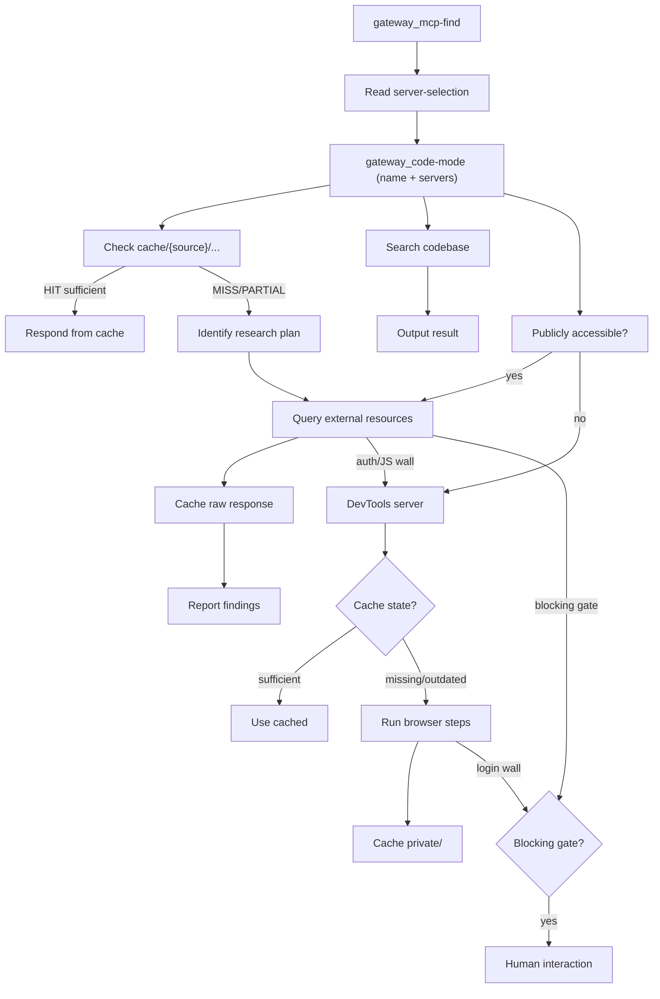

# Context Gathering

Ground your responses, decisions, and code changes with external and internal context.

> Every gateway tool follows the standard `gateway_` prefix—e.g., `gateway_mcp-find`, `gateway_code-mode`, `gateway_mcp-exec`—and Docker MCP gateway hosts them.

## When Not to Use This Skill

Do not use this skill for:
- Pure local implementation/editing tasks with no research component.
- Tasks already covered by a more specific skill.

## Context Sources

- External — web pages, documentation, repositories; reliable knowledge beyond pre-trained assumptions.
- Internal — existing code, files, and dependencies; what exists and what a change might affect.
- Cache — transient research cache (`cache/{source}/...`) and synthesis; for persistent typed memory delegate to serena-memory.

## Minimal Workflow

- Read the relevant recipes for the task (see the flowchart below).
- `gateway_mcp-find` → `gateway_code-mode` (initialize sandbox with name+servers) → `gateway_mcp-exec` (synchronous JS chain).

### Gateway pre-flight (MANDATORY)

```bash
gateway_mcp-find query="serena"  // or "tavily", "fetch", "github" — finds SERVERS not answers
gateway_code-mode '{"name":"<unique>","servers":["serena"]}' // BOTH name+servers same call
# GOOD: '{"name":"serena-recall","servers":["serena"]}'
# BAD: '{"servers":["serena"]}' // missing name → silent fail
# BAD: gateway_mcp-find query="pydantic-ai docs" // topic not server
```

- [Sandbox activation details](./workflows/setup.md) — see SKILL.md § Gateway pre-flight for template
- [Script rules and error handling](./workflows/scripting-workflow.md)

## Context Gathering Flows

Three entry points share one preamble (`gateway_mcp-find` → server-selection → `gateway_code-mode`).


## Principles

- **Delegate persistent memory to serena-memory:** for typed, gated, disclosure-budgeted writes, Call serena-memory via Skill tool on serena-memory/SKILL.md — do not store persistent memories via context-gathering.
- **Find servers, not answers:** gateway_mcp-find discovers gateway servers/capabilities — serena, tavily, fetch, github, context7, deepwiki, devtools — never topics, libraries, or questions. Query server keywords; query the world inside gateway_mcp-exec.
- **Minimize round trips**: Chain steps in one `gateway_mcp-exec` call; keep top-level calls synchronous.
- **Trust server authentication**: Servers are credentialed; only devtools may need a login-wall probe.
- **Verify every write**: After any cache/file write read it back and confirm before reporting success.
- **Start with the lightest server**: Pick the default per category; escalate only on documented failure.
- **Cache external context**: Check `cache/{source}/...` before fetch; on miss store raw response with `mem:` refs.
- **Budget tool outputs**: Truncate every return to ≤2 KB in-script; read-backs ≤700 chars.
- **Batch execution gate**: ≤5 exec calls per batch → ≤2 entities per batch; checkpoint after each batch.
- **Output truncation gate**: Cap returns at 2 KB; do not return oversized outputs.
- **Smoke‑test extractors**: Validate on first entity before applying to batch.
- **Explicit negative constraints**: Include positive (“Use ONLY A”) and negative (“Do NOT use X,Y,Z”) instructions.

## Common Issues

- **Never read Serena files directly**: Use gateway via serena server.
- **Always set name and servers**: Every gateway_code-mode needs both.
- **gateway_mcp-find finds servers, not answers:** query server keywords (`tavily`, `fetch`, `github`), never topic names (`react`, `pydantic-ai`). Query the world inside gateway_mcp-exec; activate with gateway_code-mode after find.
- **Top-level calls must be synchronous**: Async only inside devtools sandbox.
- **Write plain DOM JS**: No require/process/Buffer in browser realm.
- **Correct payload shape**: {"name":"<tool>","arguments":{"script":"<js>"}} — no flatten.

## Research decision tree

Pick one branch; for server choice see [references/server-selection.md](./references/server-selection.md).

- **Need persistent memory?** → Call serena-memory via Skill tool on serena-memory/SKILL.md first (recall/store), then context-gathering. _Example: "remember Alice's editor theme" → serena-memory preferences/editor/theme, then context-gathering to verify._
- **Need external fetch & cache verbatim?** → [recipes/external-content-caching.md](./recipes/external-content-caching.md) (tavily_extract). _Example: "cache <https://example.com/guide> verbatim" → cache/fetch/example-com/guide._
- **Need synthesis/research with mem: refs?** → [recipes/research-with-caching.md](./recipes/research-with-caching.md) (cache-check → fetch → synthesize). _Example: "research vector DB options" → researches/vector-db with mem: refs._
- **Need filesystem/codebase exploration?** → [recipes/filesystem-access.md](./recipes/filesystem-access.md) / [recipes/codebase-exploration.md](./recipes/codebase-exploration.md). _Example: "where is edge_agent defined?" → serena find_symbol._

## Task Routing Table

Every file appears here; pick the row that matches your task. The tree above decides the branch; this table resolves the file.

| I want to... | File |
|---|---|
| Choose which MCP server to use | [references/server-selection.md](./references/server-selection.md) |
| First time using the skill or need different MCP servers | [workflows/setup.md](./workflows/setup.md) |
| Write code-mode scripts | [workflows/scripting-workflow.md](./workflows/scripting-workflow.md) |
| No ready-made recipe exists | [workflows/refinement-discovery.md](./workflows/refinement-discovery.md) |
| Explore local codebase | [recipes/codebase-exploration.md](./recipes/codebase-exploration.md) |
| Fetch & cache external content verbatim | [recipes/external-content-caching.md](./recipes/external-content-caching.md) |
| Synthesize research with mem: refs (cache-check → fetch → synthesize) | [recipes/research-with-caching.md](./recipes/research-with-caching.md) |
| Read/list/search/write files via gateway | [recipes/filesystem-access.md](./recipes/filesystem-access.md) |
| Understand a GitHub repository | [recipes/github-insights.md](./recipes/github-insights.md) |
| Automate a browser via devtools MCP | [workflows/browser-automation-devtools.md](./workflows/browser-automation-devtools.md) |
| Batch research tasks (5+ entities) | [recipes/batch-browser-automation.md](./recipes/batch-browser-automation.md) |
| Devtools tool facts | [references/devtools-known-issues.md](./references/devtools-known-issues.md) |
| Content fetch API formats | [references/content-fetch-api.md](./references/content-fetch-api.md) |
| Filesystem server API formats | [references/filesystem-server-api.md](./references/filesystem-server-api.md) |
| Truncation/budget examples | [references/truncation-examples.md](./references/truncation-examples.md) |
| Browser automation snippets | [references/snippets.md](./references/snippets.md) |
| Cache rulebook — budgets, key scheme, status lines | [references/caching-rules.md](./references/caching-rules.md) |
| Store/recall persistent memory — typed, gated, disclosure | [serena-memory/SKILL.md](../serena-memory/SKILL.md) |

## ADR-002 Invariants

- **Preserve invariants**: Single-source, domain/about, and verify-every-write extend to serena-memory — see serena-memory for typed-scope and gating details.
## Related Skills

- `serena-memory` — typed, gated persistent memory; Call serena-memory via Skill tool on serena-memory/SKILL.md for typed/gated persistent writes.
- `docker-mcp-gateway` — operates the gateway that hosts the `gateway_*` servers.
