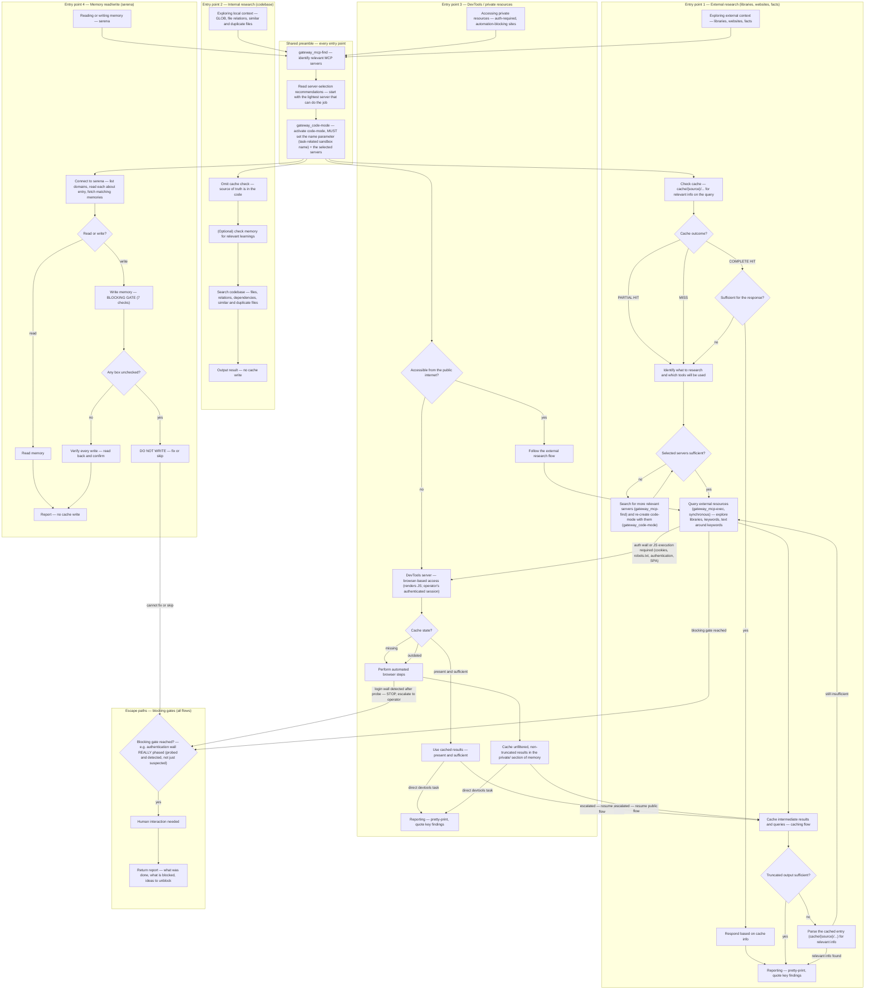

# Context Gathering

Ground your responses, decisions, code changes, library selection with external, memory and internal context.

> Every gateway tool follows the standard `gateway_` prefix—e.g., `gateway_mcp-find`, `gateway_code-mode`, `gateway_mcp-exec`—and Docker MCP gateway hosts them.

## When Not to Use This Skill

Do not use this skill for:
- Pure local implementation/editing tasks with no research component — there is no external context to gather.
- Tasks already covered by a more specific skill.

## Context Sources

Leverage these context sources for grounding on any task:

- Memory — lessons learned and task-related memories; cached external knowledge; draw on past experience.
- External — web pages, documentation, repositories; reliable knowledge beyond pre-trained assumptions.
- Internal — existing code, files, and dependencies; what exists and what a change might affect.

## Minimal Workflow

- Read the relevant recipes for the task (see the flowchart below).
- `gateway_mcp-find` (discover servers by keywords) → `gateway_code-mode` (initialize a sandbox with the name and servers) → `gateway_mcp-exec` (run a synchronous JS script that chains the tools).

### `gateway_code-mode` Pre-flight Checklist (MANDATORY)

Pre-flight before EVERY `gateway_code-mode` call:
1. Input top-level MUST contain BOTH `name` (task-related sandbox name, e.g., `<task>`) and `servers` (the list of discovered server names, e.g., `["devtools"]`) — in the SAME call. An empty `{}` or missing `servers` is a malformed activation.
2. The `servers` list must carry the exact server name(s) returned by `gateway_mcp-find`.
3. NEVER dispatch an activation whose payload has not passed this checklist.

- [Sandbox activation details](./workflows/setup.md)
- [Script rules and error handling](./workflows/scripting-workflow.md).

## Context Gathering Flows

The diagram below models the skill's four entry-point modes — external research, internal research, DevTools/private resources, and memory read/write — sharing one preamble (`gateway_mcp-find` → read server-selection → `gateway_code-mode`, the Minimal Workflow Example pipeline above) plus cross-cutting escape paths for blocking gates.

Use the diagram to identify which flow matches the current task, then load only the matching recipe file(s) and activate the sandbox with only the relevant servers.

## Principles

- **Minimize round trips**: Chain steps in one script (single `gateway_mcp-exec` call) instead of many sandboxes. Handle errors inside the script and return error messages rather than crashing. Keep top‑level calls synchronous (`globalThis` for hyphenated tools). See full rules.

- **Trust server authentication**: Every server is already credentialed; treat credential requests as informational. Only devtools sessions may need a login‑wall probe before scraping – a probe, not a full re‑auth.

- **Recall memories first**: Run `collect-relevant-memories` before answering. List domains, read each `about` entry, then fetch matching memories.

- **Verify every write**: After any write (memory, cache, file) read it back and confirm the content before reporting success. Apply this to all recipes (Serena memory, cache, filesystem).

- **Store research output in memory**: Write cache and memory through the Serena server; treat them as research output, not project‑file changes. Stop writes only when the operator explicitly forbids a specific store or all stores.

- **Start with the lightest server**: Choose the default server per category (lightest that can do the job). Escalate to a heavier server only after a documented failure (error shape, empty result, auth/JS wall). Use devtools last, unless the task requires interactive browser actions or the operator requests it.

- **Cache external context**: Look in `cache/{source}/...` before each fetch. On a miss, store the full raw response and cite it with `mem:` refs. Follow budget, key‑scheme, and status‑report rules.

- **Budget tool outputs**: Truncate every tool return inside the script to ≤2 KB; read‑backs return only header, length, and ≤700‑character excerpt. See truncation examples.

- **Batch execution gate**: For batch browser visits, use two `gateway_mcp_exec` calls per entity (NAVIGATE then EXTRACTION), ≤5 exec calls per batch → ≤2 entities per batch, chunk as needed. Write a checkpoint after each batch.

- **Cache‑before‑fetch gate**: Perform a cache lookup before any web fetch. If the cache server is unavailable, proceed; otherwise, do not fetch without checking cache first.

- **Output truncation gate**: Cap tool returns at 2 KB; truncate or summarize longer outputs. Do not return oversized outputs.

- **Smoke‑test extractors**: Validate an extraction script on the first entity of a batch. Confirm non‑empty fields and iterate until accurate before applying to the rest.

- **Explicit negative constraints in research prompts**: When limiting data sources, include both a positive instruction (“Use ONLY A”) and a negative one (“Do NOT use X, Y, Z”) at the start of the prompt. Example: “Use ONLY LinkedIn company pages. Do NOT use third‑party data sources (Revelio Labs, StockAnalysis, Apollo, ZoomInfo).”

## Common Issues

Follow the rule of thumb below to avoid common issues:

- **Never read Serena memory files directly**: Access memories only via the Serena MCP server (`gateway_mcp-find` → `gateway_code-mode` → `gateway_mcp-exec`). Direct file reads are denied and waste a round trip.

- **Always set `name` and `servers` in `gateway_code-mode`**: Each call must include a descriptive sandbox name and the required servers. The following `gateway_mcp-exec` relies on the returned sandbox name.

- **`gateway_mcp-find` only discovers servers**: It does not activate them or search the web/codebase. Use it to find a server, then activate with `gateway_code-mode`.

- **Top‑level calls must be synchronous**: Async `evaluate_script` calls are allowed only inside the devtools sandbox, which already awaits them.

- **Write plain DOM/Web‑API JavaScript**: `require()`, `process`, `Buffer` are undefined in the browser realm. Use the snippets in the reference docs.

- **Correct `gateway_mcp-exec` payload shape**: Provide exactly `{"name": "<sandbox-tool>", "arguments": {"script": "<js>"}}`. Avoid flattening or missing keys.

- **Escape JSON correctly**: Double‑quote characters inside the script must be escaped (`\"`). Prefer building queries without inner double quotes, single‑quote JS strings, or use `JSON.stringify`.

- **Never forget the sandbox name in `gateway_code-mode`**: Omitting `name` creates a nameless sandbox and breaks routing. Set it in the same call as `servers`.

- **Recover from activation failures**: If `gateway_code-mode` aborts, resend a corrected payload with `name` and `servers`. Report only when the gateway is unreachable.

- **Use gateway tools for broad research**: For wide context, prefer gateway_* tools over `read` or `grep`.

- **Read recipes before scripting**: Recipes contain full workflows, error handling, and caching rules. Follow them step‑by‑step.

- **Avoid workarounds that bypass the gateway**: Do not use curl, git clones, or external scripts. Use the optimized gateway tools instead.

## Task Routing Table

Scan the routing table below to match the current task to one file. Each file contains a specific workflow or recipe; load only the file the matching row names — leave the others unread.

| Triggers | Actions | Recipe |
|---|---|---|
| Choose which MCP server to use — web search, URL fetch, docs Q&A, GitHub, browser, memory, local files, YouTube transcripts — and when to escalate | Start with cache/memory (serena), pick the default server per category, escalate only on a concrete failure signal; devtools is the heaviest — reach it last | [references/server-selection.md](./references/server-selection.md) |
| Store or update a memory — gate first, then quality, abstraction, discoverability | Run the BLOCKING GATE (7 checks, canonical in [references/memory-management-checklist.md](./references/memory-management-checklist.md)) before ANY `write_memory` — unchecked box = DO NOT WRITE; public vs private namespace split (private/ is gitignored) | [references/memory-management-checklist.md](./references/memory-management-checklist.md) |
| First time using the skill or need different MCP servers | Discover servers, review tools, activate code-mode sandbox | [workflows/setup.md](./workflows/setup.md) |
| Writing code-mode scripts — sync JS patterns, error handling | Structure scripts, handle errors, combine tool calls | [workflows/scripting-workflow.md](./workflows/scripting-workflow.md) |
| No ready-made recipe exists — design a new approach | Map capabilities, hypothesize tool chains, test, capture as recipe | [workflows/refinement-discovery.md](./workflows/refinement-discovery.md) |
| Explore local codebase — find symbols, references, patterns | Find referencing symbols, analyze file structure, search patterns | [recipes/codebase-exploration.md](./recipes/codebase-exploration.md) |
| Fetch & cache external content — web-search results, library docs, YouTube transcripts — without flooding the model context | Harvest → verify → fetch full content → write cache/about + cache/{source}/{scope}/{descriptor} memories → return per-op status report | [recipes/external-content-caching.md](./recipes/external-content-caching.md) |
| Research a topic — answer questions from deepwiki, check known GitHub issues, fetch docs — cache tool responses first | Cache-check → per-tool fetch+cache → synthesize researches/{topic} with mem: refs → return per-op status report (required even for research-only tasks) | [recipes/research-with-caching.md](./recipes/research-with-caching.md) |
| Read, list, search, or write files on disk through the gateway — restricted to the filesystem server's allowed directories | Verify allowed dirs, then read/list/search/tree/info files; writes need planned cleanup (no delete tool) | [recipes/filesystem-access.md](./recipes/filesystem-access.md) |
| Understand a GitHub repository — codebase, issues, docs | Semantic Q&A on repo code; search and analyze repository issues | [recipes/github-insights.md](./recipes/github-insights.md) |
| Automate a browser / drive Chrome via devtools MCP (extract, navigate, SPA click-through) | Activate devtools sandbox, verify session (login-wall check), extract minimally, cache + memorize selectors, recover from drift | [workflows/browser-automation-devtools.md](./workflows/browser-automation-devtools.md) |
| Batch research tasks — visiting multiple entities (5+) on a site | Chunk into batches of ≤2 entities; smoke-test the extractor on the first entity before the batch; use batch-browser-automation recipe for page visits with the fallback ladder | [recipes/batch-browser-automation.md](./recipes/batch-browser-automation.md) |
| Devtools tool facts — return formats, quoting rules, known gotchas | Look up the favorite-tools table and known issues | [references/devtools-known-issues.md](./references/devtools-known-issues.md) |
| Persist project knowledge — document modules, APIs, decisions | Write single/multiple memories with hierarchical, self-describing names, cross-references | [recipes/store-memories.md](./recipes/store-memories.md) |
| Resuming work on a topic — recall what's known | List, read, aggregate memories by topic; follow cross-references | [recipes/collect-relevant-memories.md](./recipes/collect-relevant-memories.md) |
| Update, reorganize, or clean up existing memories | Edit content (literal/regex), rename, delete memories | [recipes/manage-memories.md](./recipes/manage-memories.md) |
| Understand the memory convention — domain/about pattern with self-describing names | Read the memory convention guide; about files define scope and boundaries | [references/memory-convention.md](./references/memory-convention.md) |
| Tool call/response formats for tavily, youtube-transcript, deepwiki, github, fetch (search, extract, transcripts, issue reads) | Look up tool signatures, params, and JSON vs plain-text return shapes | [references/content-fetch-api.md](./references/content-fetch-api.md) |
| Serena memory tool formats — list/read/write/delete names, return shapes, case sensitivity | Look up the serena API details; don't re-derive formats | [references/serena-memory-api.md](./references/serena-memory-api.md) |
| Filesystem server tool formats — read/search/tree/info/write signatures and returns | Look up the filesystem API details | [references/filesystem-server-api.md](./references/filesystem-server-api.md) |
| Worked JS truncation/budget snippets — ≤2 KB snapshot, ≤700-char read-back, ≤3 KB aggregate, 2× retry cap, pacing | Copy the worked JS examples; every snippet implements an existing prose rule | [references/truncation-examples.md](./references/truncation-examples.md) |
| The cache rulebook — budgets, one entry per fetched URL, key scheme, per-op status lines | Read the canonical cache rules; the root Principles carry one pointer line | [references/caching-rules.md](./references/caching-rules.md) |

## Related Skills

- `docker-mcp-gateway` — operates the gateway that hosts the `gateway_*` servers this skill uses.
