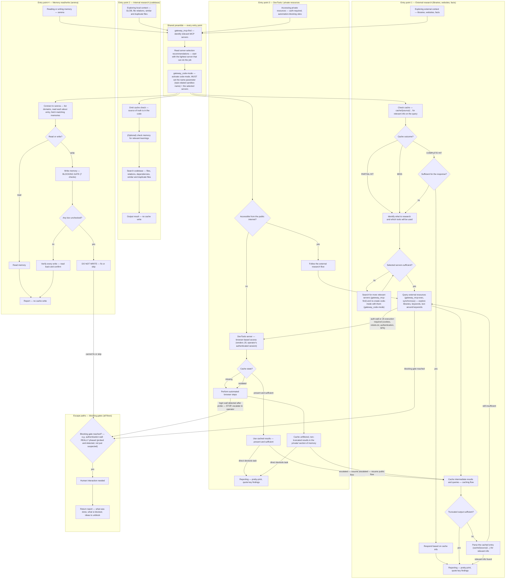

# Context Gathering

Ground your responses, decisions, code changes, library selection with external, memory and internal context.

> Every gateway tool follows the standard `gateway_` prefix—e.g., `gateway_mcp-find`, `gateway_code-mode`, `gateway_mcp-exec`—and Docker MCP gateway hosts them.

## When Not to Use This Skill

Do not use this skill for:
- Pure local implementation/editing tasks with no research component — there is no external context to gather.
- Tasks already covered by a more specific skill.

## Context Sources

Leverage these context sources for grounding on any task:

- Memory — lessons learned and task-related memories; cached external knowledge; draw on past experience.
- External — web pages, documentation, repositories; reliable knowledge beyond pre-trained assumptions.
- Internal — existing code, files, and dependencies; what exists and what a change might affect.

## Minimal Workflow

- Read the relevant recipes for the task (see the flowchart below).
- `gateway_mcp-find` (discover servers by keywords) → `gateway_code-mode` (initialize a sandbox with the name and servers) → `gateway_mcp-exec` (run a synchronous JS script that chains the tools).

### `gateway_code-mode` Pre-flight Checklist (MANDATORY)

Pre-flight before EVERY `gateway_code-mode` call:
1. Input MUST contain BOTH `name` (task-related sandbox name, e.g., `<task>`) and `servers` (the list of discovered server names, e.g., `["devtools"]`) — in the SAME call. An empty `{}` or missing `servers` is a malformed activation.
2. The `servers` list must carry the exact server name(s) returned by `gateway_mcp-find`.
3. NEVER dispatch an activation whose payload has not passed this checklist.

- [Sandbox activation details](./workflows/setup.md)
- [Script rules and error handling](./workflows/scripting-workflow.md).

## Context Gathering Flows

The diagram below models the skill's four entry-point modes — external research, internal research, DevTools/private resources, and memory read/write — sharing one preamble (`gateway_mcp-find` → read server-selection → `gateway_code-mode`, the Minimal Workflow Example pipeline above) plus cross-cutting escape paths for blocking gates.

Use the diagram to identify which flow matches the current task, then load only the matching recipe file(s) and activate the sandbox with only the relevant servers.

## Principles

- **Least round trips:** Chain steps in one script(one gateway_mcp-exec call) instead of running a fleet of sandboxes. Handle errors in-script and return error messages instead of crashing. Keep top-level calls synchronous (`globalThis` for hyphenated tools). Full rules: [workflows/scripting-workflow.md](./workflows/scripting-workflow.md).
- **Trust the gateway's authentication:** every server is already credentialed — treat credential requirements in responses as informational. One carve-out: devtools server sessions may need a login-wall reachability probe before scraping ([workflows/browser-automation-devtools.md](./workflows/browser-automation-devtools.md)) — a probe, not re-authentication.
- **Recall existing memories first:** before answering from memory, run [collect-relevant-memories](./recipes/collect-relevant-memories.md) — list domains, read each `about` entry, then fetch the matching memories.
- **Verify every write:** after any write — memory, cache entry, file, or other store — read it back and confirm the content is present and correct before you report success, single script can do read after write. Apply this to every recipe: serena memory writes, cache entries, filesystem writes — not just caching.
- **Store research output in memory, not files:** write cache and memory entries through the serena server — they are research output, not project-file modifications. Keep the cache-first pipeline unchanged for research-only or "do not modify project files" tasks (cache/memory writes via serena are not project-file modifications). Stop the writes only on an explicit operator instruction that forbids them: one naming a single store (memory, cache, or files) stops only that store; a general "don't write anything" stops all three.
- **Start with the lightest server:** pick the default server per category in [references/server-selection.md](./references/server-selection.md) — the lightest one that can do the job. Escalate to a heavier server only on a concrete failure signal — a documented error shape, an empty or insufficient result, or an auth/JS wall; never escalate speculatively (full rules: [references/server-selection.md](./references/server-selection.md)). Reach devtools, the heaviest, last — unless the task is an interactive browser task (SPA click-through, pagination, form submission, login-gated flows) or the operator explicitly chose devtools; see server-selection routing precedence.
- **Cache external context:** check `cache/{source}/...` before every research fetch; store the full raw response on miss; cite entries with `mem:` refs. Follow the budget, key-scheme, and status-report rules in [references/caching-rules.md](./references/caching-rules.md).
- **Budget Tools Outputs:** truncate every tool return in-script — snapshots ≤2 KB; read-backs return only header, length, and ≤700-char excerpt. Copy the worked JS: [references/truncation-examples.md](./references/truncation-examples.md).
- **Batch execution gate:** batch browser visits follow the batch recipe: 2 `gateway_mcp_exec` calls per entity (NAVIGATE then EXTRACTION), ≤5 exec calls per batch → ≤2 entities per batch, chunked as needed; checkpoint written at each batch boundary. This prevents excessive round trips and respects the "least round trips" principle.
- **Cache-before-fetch gate:** run a cache lookup (`cache/{source}/...`) before any web fetch; skip only if the cache server is unavailable. This is a BLOCKING gate — do not proceed with a fetch without checking cache first. Reference: [references/caching-rules.md](./references/caching-rules.md).
- **Output truncation gate:** cap tool returns at 2 KB; truncate or summarize longer outputs. This is a BLOCKING gate — do not return oversized outputs. Reference: [references/truncation-examples.md](./references/truncation-examples.md).
- **Smoke-test extractors before batch use:** validate an extraction script on the FIRST entity of a batch — confirm non-empty fields, iterate until accurate — before applying it to the rest ([recipes/batch-browser-automation.md](./recipes/batch-browser-automation.md)).
- **Explicit negative constraints in research prompts:** when writing prompts for research tasks that have data-source restrictions, always include both a positive instruction ("Use ONLY A") and an explicit negative constraint ("Do NOT use X, Y, Z"). Subagents mix in excluded sources without negative constraints — the positive instruction alone is insufficient. Place the constraint at the start of the prompt. Example: "Use ONLY LinkedIn company pages. Do NOT use third-party data sources (Revelio Labs, StockAnalysis, Apollo, ZoomInfo)." Full pattern: [recipes/research-with-caching.md §Single-Source Constraint](./recipes/research-with-caching.md#single-source-constraint).

## Common Issues

- **Accessing the Serena memory store directly**: NEVER read `.serena/memories/*` with `read`, `grep`, `glob`, `ls`, or shell tools — direct access is DENIED by permission and wastes a round. Project memories are accessible ONLY through the `serena` MCP server via `gateway_mcp-find` → `gateway_code-mode` → `gateway_mcp-exec` (recipes: store-memories, collect-relevant-memories).
- **Failures to setup the code-mode sandbox**: every `gateway_code-mode` call MUST set the `name` parameter (task-related sandbox name) and the `servers` parameter (only the servers you need). Following `gateway_mcp-exec` call relies on the returned sandbox name.
- **Missunderstanding of MCP-find function**: `gateway_mcp-find` discovers servers, but does not activate them. It also does not search the web or codebase. Use it to find a server by keywords and then activate it with `gateway_code-mode` (recipes: setup, server-selection).
- **Using async / `evaluate_script`**: all top level tool calls must be synchronous; the devtools `evaluate_script`(nested level) tool awaits async functions — see [references/devtools-known-issues.md](./references/devtools-known-issues.md).
- **Node.js imports in page scripts**: `evaluate_script` runs in the browser realm — `require()`, `process`, `Buffer` are undefined and throw `ReferenceError: require is not defined` or `Invalid or unexpected token`. Write plain DOM/Web-API JS; reuse the battle-tested snippets and helpers in [references/snippets.md](./references/snippets.md) (devtools-known-issues #23).
- **gateway_mcp-exec call shape**: `gateway_mcp-exec` REQUIRES `{"name": "<returned-sandbox-tool>", "arguments": {"script": "<js>"}}` — `name` and `arguments` are sibling top-level keys, and the JS lives under `arguments.script`. Flattening (`{"name", "script"}`) or putting `script` at top level fails with "name parameter is required" or a JSON parse error. Pre-flight before every exec: (1) top-level keys are exactly `name` + `arguments`; (2) `arguments.script` is a string; (3) the payload parses as valid JSON.
- **gateway_mcp-exec messed escape**: the JS script is a JSON string whose own string literals are quoted again — a double quote meant for a query must appear as `\"` in the payload, and a stray `"` breaks JSON ("Expected '}'"). Avoid it by (a) building query strings with NO inner double quotes (single-word/single-phrase queries, no `"..."` operators), (b) single-quoting JS strings, and (c) using `JSON.stringify` instead of hand-escaping. On a "JSON Parse error" from exec, re-emit a corrected payload — never retry the same malformed string.
- **Forgetting the sandbox name in `gateway_code-mode`**: every activation call REQUIRES the `name` parameter — the sandbox name (descriptive, task-related, e.g., `code-mode-<task>`). Omitting it, or passing arbitrary text, creates a nameless or misnamed sandbox and breaks the `gateway_mcp-exec` routing that depends on the returned prefixed tool name. Set the `name` in the SAME call as `servers`; never invent or reuse a name later. Run the [pre-flight checklist](#gateway_code-mode-pre-flight-checklist-mandatory) before dispatch.
- **Aborted or errored `gateway_code-mode` activation**: if the activation is aborted ("Tool execution aborted") or fails, re-emit a corrected payload with `name` + `servers` set — never go idle silently. Report only when fully blocked (e.g., the gateway is unreachable). No further step can proceed without a valid sandbox, so recover before moving on.
- **Using `read` and `grep` for other research**: fine to read exact files; for broader context gathering the gateway_* tools are more token-efficient. For disk access through the gateway (allowed-dir only), see [recipes/filesystem-access.md](./recipes/filesystem-access.md).
- **Jumping to execution without reading any recipes**: the recipes contain the full workflow and error-handling rules; read them before running any scripts. The flowchart above shows the entry points, but each recipe contains the step-by-step instructions, including tool call shapes, error handling, and caching rules.
- **Get context without gateway**: Trying curl, curl in python scripts - is overcomplication. Use optimized tools from servers available via the gateweay.

## Task Routing Table

Scan the routing table below to match the current task to one file. Each file contains a specific workflow or recipe; load only the file the matching row names — leave the others unread.

| Triggers | Actions | Recipe |
|---|---|---|
| Choose which MCP server to use — web search, URL fetch, docs Q&A, GitHub, browser, memory, local files, YouTube transcripts — and when to escalate | Start with cache/memory (serena), pick the default server per category, escalate only on a concrete failure signal; devtools is the heaviest — reach it last | [references/server-selection.md](./references/server-selection.md) |
| Store or update a memory — gate first, then quality, abstraction, discoverability | Run the BLOCKING GATE (7 checks, canonical in [references/memory-management-checklist.md](./references/memory-management-checklist.md)) before ANY `write_memory` — unchecked box = DO NOT WRITE; public vs private namespace split (private/ is gitignored) | [references/memory-management-checklist.md](./references/memory-management-checklist.md) |
| First time using the skill or need different MCP servers | Discover servers, review tools, activate code-mode sandbox | [workflows/setup.md](./workflows/setup.md) |
| Writing code-mode scripts — sync JS patterns, error handling | Structure scripts, handle errors, combine tool calls | [workflows/scripting-workflow.md](./workflows/scripting-workflow.md) |
| No ready-made recipe exists — design a new approach | Map capabilities, hypothesize tool chains, test, capture as recipe | [workflows/refinement-discovery.md](./workflows/refinement-discovery.md) |
| Explore local codebase — find symbols, references, patterns | Find referencing symbols, analyze file structure, search patterns | [recipes/codebase-exploration.md](./recipes/codebase-exploration.md) |
| Fetch & cache external content — web-search results, library docs, YouTube transcripts — without flooding the model context | Harvest → verify → fetch full content → write cache/about + cache/{source}/{scope}/{descriptor} memories → return per-op status report | [recipes/external-content-caching.md](./recipes/external-content-caching.md) |
| Research a topic — answer questions from deepwiki, check known GitHub issues, fetch docs — cache tool responses first | Cache-check → per-tool fetch+cache → synthesize researches/{topic} with mem: refs → return per-op status report (required even for research-only tasks) | [recipes/research-with-caching.md](./recipes/research-with-caching.md) |
| Read, list, search, or write files on disk through the gateway — restricted to the filesystem server's allowed directories | Verify allowed dirs, then read/list/search/tree/info files; writes need planned cleanup (no delete tool) | [recipes/filesystem-access.md](./recipes/filesystem-access.md) |
| Understand a GitHub repository — codebase, issues, docs | Semantic Q&A on repo code; search and analyze repository issues | [recipes/github-insights.md](./recipes/github-insights.md) |
| Automate a browser / drive Chrome via devtools MCP (extract, navigate, SPA click-through) | Activate devtools sandbox, verify session (login-wall check), extract minimally, cache + memorize selectors, recover from drift | [workflows/browser-automation-devtools.md](./workflows/browser-automation-devtools.md) |
| Batch research tasks — visiting multiple entities (5+) on a site | Chunk into batches of ≤2 entities; smoke-test the extractor on the first entity before the batch; use batch-browser-automation recipe for page visits with the fallback ladder | [recipes/batch-browser-automation.md](./recipes/batch-browser-automation.md) |
| Devtools tool facts — return formats, quoting rules, known gotchas | Look up the favorite-tools table and known issues | [references/devtools-known-issues.md](./references/devtools-known-issues.md) |
| Persist project knowledge — document modules, APIs, decisions | Write single/multiple memories with hierarchical, self-describing names, cross-references | [recipes/store-memories.md](./recipes/store-memories.md) |
| Resuming work on a topic — recall what's known | List, read, aggregate memories by topic; follow cross-references | [recipes/collect-relevant-memories.md](./recipes/collect-relevant-memories.md) |
| Update, reorganize, or clean up existing memories | Edit content (literal/regex), rename, delete memories | [recipes/manage-memories.md](./recipes/manage-memories.md) |
| Understand the memory convention — domain/about pattern with self-describing names | Read the memory convention guide; about files define scope and boundaries | [references/memory-convention.md](./references/memory-convention.md) |
| Tool call/response formats for tavily, youtube-transcript, deepwiki, github, fetch (search, extract, transcripts, issue reads) | Look up tool signatures, params, and JSON vs plain-text return shapes | [references/content-fetch-api.md](./references/content-fetch-api.md) |
| Serena memory tool formats — list/read/write/delete names, return shapes, case sensitivity | Look up the serena API details; don't re-derive formats | [references/serena-memory-api.md](./references/serena-memory-api.md) |
| Filesystem server tool formats — read/search/tree/info/write signatures and returns | Look up the filesystem API details | [references/filesystem-server-api.md](./references/filesystem-server-api.md) |
| Worked JS truncation/budget snippets — ≤2 KB snapshot, ≤700-char read-back, ≤3 KB aggregate, 2× retry cap, pacing | Copy the worked JS examples; every snippet implements an existing prose rule | [references/truncation-examples.md](./references/truncation-examples.md) |
| The cache rulebook — budgets, one entry per fetched URL, key scheme, per-op status lines | Read the canonical cache rules; the root Principles carry one pointer line | [references/caching-rules.md](./references/caching-rules.md) |

## Related Skills

- `docker-mcp-gateway` — operates the gateway that hosts the `gateway_*` servers this skill uses.
