tool: fetch raw
url: https://www.agentic-patterns.com/patterns/self-identity-accumulation
date: 2026-08-06
source: fetch

Content type text/html; charset=utf-8 cannot be simplified to markdown, but here is the raw content:
Contents of https://www.agentic-patterns.com/patterns/self-identity-accumulation:
<!DOCTYPE html><html lang="en"> <head><meta charset="utf-8"><meta name="viewport" content="width=device-width"><link rel="canonical" href="https://agentic-patterns.com/patterns/self-identity-accumulation/"><link rel="icon" type="image/svg+xml" href="/favicon.svg"><!-- Primary Meta Tags --><title>Self-Identity Accumulation - Pattern</title><meta name="title" content="Self-Identity Accumulation - Pattern"><meta name="description" content="Reference entry for Self-Identity Accumulation."><!-- Open Graph / Facebook --><meta property="og:type" content="article"><meta property="og:url" content="https://agentic-patterns.com/patterns/self-identity-accumulation/"><meta property="og:title" content="Self-Identity Accumulation - Pattern"><meta property="og:description" content="Reference entry for Self-Identity Accumulation."><meta property="og:image" content="https://agentic-patterns.com/og-image.svg"><!-- Twitter --><meta property="twitter:card" content="summary_large_image"><meta property="twitter:url" content="https://agentic-patterns.com/patterns/self-identity-accumulation/"><meta property="twitter:title" content="Self-Identity Accumulation - Pattern"><meta property="twitter:description" content="Reference entry for Self-Identity Accumulation."><meta property="twitter:image" content="https://agentic-patterns.com/og-image.svg"><!-- Theme Color --><meta name="theme-color" content="#c24331" media="(prefers-color-scheme: light)"><meta name="theme-color" content="#ec745f" media="(prefers-color-scheme: dark)"><link rel="preconnect" href="https://fonts.googleapis.com"><link rel="preconnect" href="https://fonts.gstatic.com" crossorigin><link rel="stylesheet" href="https://fonts.googleapis.com/css2?family=IBM+Plex+Mono:wght@400;500;600&family=IBM+Plex+Sans:wght@400;500;600;700&family=Space+Grotesk:wght@500;700&display=swap"><!-- Theme Initialization --><script>
  (function() {
    try {
      const stored = localStorage.getItem('theme');
      const prefersDark = window.matchMedia('(prefers-color-scheme: dark)').matches;
      const theme = stored || (prefersDark ? 'dark' : 'light');
      document.documentElement.setAttribute('data-theme', theme);
    } catch {
      const prefersDark = window.matchMedia('(prefers-color-scheme: dark)').matches;
      document.documentElement.setAttribute('data-theme', prefersDark ? 'dark' : 'light');
    }
  })();
</script><link rel="stylesheet" href="/_astro/BaseLayout.psfFluJ8.css">
<link rel="stylesheet" href="/_astro/_slug_@_@astro.B4PwnAvd.css">
<style>.pattern-card[data-astro-cid-oyphue5v]{position:relative;overflow:hidden;border-radius:var(--radius-lg);background:#fffaf2b8;border:1px solid rgba(182,164,143,.5);box-shadow:var(--shadow-sm);backdrop-filter:blur(12px)}.pattern-card[data-astro-cid-oyphue5v]:before{content:"";position:absolute;inset:0 auto auto 0;width:100%;height:4px;background:linear-gradient(90deg,var(--category-color),transparent 78%)}.pattern-card[data-astro-cid-oyphue5v]:hover{transform:translateY(-2px);border-color:var(--category-color);box-shadow:var(--shadow-md)}.pattern-card-link[data-astro-cid-oyphue5v]{display:block;padding:1.35rem;min-height:100%}.pattern-card-topline[data-astro-cid-oyphue5v]{display:flex;align-items:center;justify-content:space-between;gap:var(--spacing-sm);margin-bottom:var(--spacing-md)}.pattern-card-category[data-astro-cid-oyphue5v],.pattern-card-status[data-astro-cid-oyphue5v]{font-size:.72rem;font-weight:700;letter-spacing:.08em;text-transform:uppercase}.pattern-card-category[data-astro-cid-oyphue5v]{color:var(--category-color)}.pattern-card-status[data-astro-cid-oyphue5v]{color:var(--status-color);text-align:right}.pattern-card-title[data-astro-cid-oyphue5v]{font-size:clamp(1.2rem,2vw,1.45rem);line-height:1.1}.pattern-card-summary[data-astro-cid-oyphue5v]{margin:var(--spacing-md) 0 var(--spacing-lg);color:var(--color-text-muted);font-size:.94rem;line-height:1.65;display:-webkit-box;-webkit-line-clamp:4;-webkit-box-orient:vertical;overflow:hidden}.pattern-card-footer[data-astro-cid-oyphue5v]{display:flex;align-items:center;justify-content:space-between;gap:var(--spacing-md);margin-top:auto}.pattern-card-readmore[data-astro-cid-oyphue5v]{color:var(--color-text);font-weight:600}.pattern-card-tags[data-astro-cid-oyphue5v]{display:flex;gap:var(--spacing-xs);flex-wrap:wrap;justify-content:flex-end}.pattern-card-tag[data-astro-cid-oyphue5v]{padding:.18rem .5rem;border-radius:999px;background:#325d9614;color:var(--color-text-muted);font-size:.74rem}:root[data-theme=dark] .pattern-card[data-astro-cid-oyphue5v]{background:#241d18f0;border-color:#685445eb}:root[data-theme=dark] .pattern-card-summary[data-astro-cid-oyphue5v],:root[data-theme=dark] .pattern-card-tag[data-astro-cid-oyphue5v]{color:#d4c9bb}:root[data-theme=dark] .pattern-card-tag[data-astro-cid-oyphue5v]{background:#77a0d729}@media(prefers-color-scheme:dark){:root:not([data-theme]) .pattern-card[data-astro-cid-oyphue5v]{background:#241d18f0;border-color:#685445eb}:root:not([data-theme]) .pattern-card-summary[data-astro-cid-oyphue5v],:root:not([data-theme]) .pattern-card-tag[data-astro-cid-oyphue5v]{color:#d4c9bb}:root:not([data-theme]) .pattern-card-tag[data-astro-cid-oyphue5v]{background:#77a0d729}}@media(max-width:640px){.pattern-card-footer[data-astro-cid-oyphue5v],.pattern-card-topline[data-astro-cid-oyphue5v]{flex-direction:column;align-items:flex-start}.pattern-card-tags[data-astro-cid-oyphue5v]{justify-content:flex-start}}
</style>
<link rel="stylesheet" href="/_astro/NewsletterCTA.nA16pq9O.css"></head> <body> <!-- Skip Navigation for Keyboard Users --> <a href="#main-content" class="skip-link">Skip to main content</a> <header class="header" data-astro-cid-3ef6ksr2> <div class="header-container" data-astro-cid-3ef6ksr2> <a href="/" class="logo" data-astro-cid-3ef6ksr2> <svg width="32" height="32" viewBox="0 0 32 32" fill="none" xmlns="http://www.w3.org/2000/svg" aria-hidden="true" data-astro-cid-3ef6ksr2> <rect width="32" height="32" rx="6" fill="currentColor" data-astro-cid-3ef6ksr2></rect> <path d="M10 16L14 12L18 16L22 12" stroke="white" stroke-width="2" stroke-linecap="round" stroke-linejoin="round" data-astro-cid-3ef6ksr2></path> <path d="M10 22L14 18L18 22L22 18" stroke="white" stroke-width="2" stroke-linecap="round" stroke-linejoin="round" data-astro-cid-3ef6ksr2></path> </svg> <span data-astro-cid-3ef6ksr2>Agentic Patterns</span> </a> <nav class="nav" aria-label="Main navigation" data-astro-cid-3ef6ksr2> <ul class="nav-list" data-astro-cid-3ef6ksr2> <li class="nav-item" data-astro-cid-3ef6ksr2> <a href="/" class="nav-link" data-astro-cid-3ef6ksr2> Home </a> </li><li class="nav-item" data-astro-cid-3ef6ksr2> <a href="/patterns" class="nav-link" data-astro-cid-3ef6ksr2> Patterns </a> </li><li class="nav-item" data-astro-cid-3ef6ksr2> <a href="/graph" class="nav-link" data-astro-cid-3ef6ksr2> Graph </a> </li><li class="nav-item" data-astro-cid-3ef6ksr2> <a href="/guides" class="nav-link" data-astro-cid-3ef6ksr2> Guides </a> </li> </ul> </nav> <div class="header-actions" data-astro-cid-3ef6ksr2> <a class="repo-link" href="https://github.com/nibzard/awesome-agentic-patterns" target="_blank" rel="noreferrer" aria-label="Open GitHub repository" data-astro-cid-3ef6ksr2> <svg width="18" height="18" viewBox="0 0 64 64" fill="currentColor" aria-hidden="true" data-astro-cid-3ef6ksr2><path d="M32.029,8.345c-13.27,0 -24.029,10.759 -24.029,24.033c0,10.617 6.885,19.624 16.435,22.803c1.202,0.22 1.64,-0.522 1.64,-1.16c0,-0.569 -0.02,-2.081 -0.032,-4.086c-6.685,1.452 -8.095,-3.222 -8.095,-3.222c-1.093,-2.775 -2.669,-3.514 -2.669,-3.514c-2.182,-1.492 0.165,-1.462 0.165,-1.462c2.412,0.171 3.681,2.477 3.681,2.477c2.144,3.672 5.625,2.611 6.994,1.997c0.219,-1.553 0.838,-2.612 1.526,-3.213c-5.336,-0.606 -10.947,-2.669 -10.947,-11.877c0,-2.623 0.937,-4.769 2.474,-6.449c-0.247,-0.608 -1.072,-3.051 0.235,-6.36c0,0 2.018,-0.646 6.609,2.464c1.917,-0.533 3.973,-0.8 6.016,-0.809c2.041,0.009 4.097,0.276 6.017,0.809c4.588,-3.11 6.602,-2.464 6.602,-2.464c1.311,3.309 0.486,5.752 0.239,6.36c1.54,1.68 2.471,3.826 2.471,6.449c0,9.232 -5.62,11.263 -10.974,11.858c0.864,0.742 1.632,2.208 1.632,4.451c0,3.212 -0.029,5.804 -0.029,6.591c0,0.644 0.432,1.392 1.652,1.157c9.542,-3.185 16.421,-12.186 16.421,-22.8c0,-13.274 -10.76,-24.033 -24.034,-24.033" data-astro-cid-3ef6ksr2></path></svg> <span class="repo-link-count" aria-label="4.8K GitHub stars" data-astro-cid-3ef6ksr2> 4.8K </span> </a> <button id="search-toggle" class="search-toggle" aria-label="Search" data-astro-cid-3ef6ksr2> <svg width="20" height="20" viewBox="0 0 20 20" fill="none" xmlns="http://www.w3.org/2000/svg" data-astro-cid-3ef6ksr2> <path d="M9 17A8 8 0 1 0 9 1A8 8 0 0 0 9 17Z" stroke="currentColor" stroke-width="2" stroke-linecap="round" stroke-linejoin="round" data-astro-cid-3ef6ksr2></path> <path d="M19 19L13.5 13.5" stroke="currentColor" stroke-width="2" stroke-linecap="round" stroke-linejoin="round" data-astro-cid-3ef6ksr2></path> </svg> <span data-astro-cid-3ef6ksr2>Search</span> </button> <button id="theme-toggle" class="theme-toggle" aria-label="Toggle theme" type="button" data-astro-cid-x3pjskd3> <svg class="sun-icon" width="20" height="20" viewBox="0 0 20 20" fill="none" xmlns="http://www.w3.org/2000/svg" data-astro-cid-x3pjskd3> <circle cx="10" cy="10" r="4" stroke="currentColor" stroke-width="2" data-astro-cid-x3pjskd3></circle> <path d="M10 2V4M10 16V18M18 10H16M4 10H2M15.66 15.66L14.24 14.24M5.76 5.76L4.34 4.34M15.66 4.34L14.24 5.76M5.76 14.24L4.34 15.66" stroke="currentColor" stroke-width="2" stroke-linecap="round" data-astro-cid-x3pjskd3></path> </svg> <svg class="moon-icon" width="20" height="20" viewBox="0 0 20 20" fill="none" xmlns="http://www.w3.org/2000/svg" data-astro-cid-x3pjskd3> <path d="M17.293 13.293A8 8 0 1 1 6.707 2.707a8.001 8.001 0 0 0 10.586 10.586Z" stroke="currentColor" stroke-width="2" stroke-linecap="round" stroke-linejoin="round" data-astro-cid-x3pjskd3></path> </svg> </button>  <script type="module">const l=document.getElementById("theme-toggle"),t=document.querySelector(".sun-icon"),o=document.querySelector(".moon-icon");function n(){if(typeof localStorage<"u"){const e=localStorage.getItem("theme");if(e)return e}return window.matchMedia("(prefers-color-scheme: dark)").matches?"dark":"light"}function c(e){typeof localStorage<"u"&&localStorage.setItem("theme",e),document.documentElement.setAttribute("data-theme",e),s(e)}function s(e){e==="dark"?(t?.style.setProperty("display","block"),o?.style.setProperty("display","none")):(t?.style.setProperty("display","none"),o?.style.setProperty("display","block"))}c(n());l?.addEventListener("click",()=>{const r=(document.documentElement.getAttribute("data-theme")||n())==="dark"?"light":"dark";c(r)});</script> </div> <!-- Mobile Menu Toggle --> <button id="mobile-menu-toggle" class="mobile-menu-toggle" aria-label="Open navigation menu" aria-expanded="false" aria-controls="mobile-menu" data-astro-cid-3ef6ksr2> <span class="hamburger" data-astro-cid-3ef6ksr2> <span class="hamburger-line" data-astro-cid-3ef6ksr2></span> <span class="hamburger-line" data-astro-cid-3ef6ksr2></span> <span class="hamburger-line" data-astro-cid-3ef6ksr2></span> </span> </button> <!-- Search Modal --> <div id="search-modal" class="search-modal" hidden inert aria-hidden="true" role="dialog" aria-modal="true" aria-label="Search patterns" data-astro-cid-3ef6ksr2> <div class="search-backdrop" data-astro-cid-3ef6ksr2></div> <div class="search-container" data-astro-cid-3ef6ksr2> <button type="button" class="search-close" aria-label="Close search" data-astro-cid-3ef6ksr2> <svg width="16" height="16" viewBox="0 0 16 16" fill="none" xmlns="http://www.w3.org/2000/svg" data-astro-cid-3ef6ksr2> <path d="M3 3L13 13M13 3L3 13" stroke="currentColor" stroke-width="2" stroke-linecap="round" data-astro-cid-3ef6ksr2></path> </svg> </button> <div class="search-input-wrapper" data-astro-cid-3ef6ksr2> <svg width="20" height="20" viewBox="0 0 20 20" fill="none" xmlns="http://www.w3.org/2000/svg" class="search-icon" data-astro-cid-3ef6ksr2> <path d="M9 17A8 8 0 1 0 9 1A8 8 0 0 0 9 17Z" stroke="currentColor" stroke-width="2" stroke-linecap="round" stroke-linejoin="round" data-astro-cid-3ef6ksr2></path> <path d="M19 19L13.5 13.5" stroke="currentColor" stroke-width="2" stroke-linecap="round" stroke-linejoin="round" data-astro-cid-3ef6ksr2></path> </svg> <input id="search-input" type="text" placeholder="Search patterns..." autocomplete="off" aria-label="Search patterns" aria-describedby="search-instructions" role="searchbox" aria-autocomplete="list" data-astro-cid-3ef6ksr2> <kbd id="search-shortcut" data-astro-cid-3ef6ksr2>⌘K</kbd> </div> <div id="search-results" class="search-results" role="region" aria-live="polite" aria-atomic="true" data-astro-cid-3ef6ksr2></div> <div class="search-footer" id="search-instructions" data-astro-cid-3ef6ksr2> <span data-astro-cid-3ef6ksr2>Use <kbd data-astro-cid-3ef6ksr2>↑</kbd> <kbd data-astro-cid-3ef6ksr2>↓</kbd> to navigate</span> <span data-astro-cid-3ef6ksr2><kbd data-astro-cid-3ef6ksr2>↵</kbd> to select</span> <span data-astro-cid-3ef6ksr2><kbd data-astro-cid-3ef6ksr2>esc</kbd> to close</span> </div> </div> </div> <script type="module" src="/_astro/Header.astro_astro_type_script_index_0_lang.B9QDizEs.js"></script> </div> <!-- Mobile Menu --> <div id="mobile-menu" class="mobile-menu" hidden aria-hidden="true" role="dialog" aria-modal="true" aria-label="Navigation menu" data-astro-cid-3ef6ksr2> <div class="mobile-menu-backdrop" data-astro-cid-3ef6ksr2></div> <div class="mobile-menu-container" data-astro-cid-3ef6ksr2> <nav class="mobile-menu-nav" aria-label="Mobile navigation" data-astro-cid-3ef6ksr2> <ul class="mobile-menu-list" data-astro-cid-3ef6ksr2> <li data-astro-cid-3ef6ksr2> <a href="/" class="mobile-menu-link" data-astro-cid-3ef6ksr2> Home </a> </li><li data-astro-cid-3ef6ksr2> <a href="/patterns" class="mobile-menu-link" data-astro-cid-3ef6ksr2> Patterns </a> </li><li data-astro-cid-3ef6ksr2> <a href="/graph" class="mobile-menu-link" data-astro-cid-3ef6ksr2> Graph </a> </li><li data-astro-cid-3ef6ksr2> <a href="/guides" class="mobile-menu-link" data-astro-cid-3ef6ksr2> Guides </a> </li> </ul> </nav> <div class="mobile-menu-footer" data-astro-cid-3ef6ksr2> <a class="repo-link repo-link--mobile" href="https://github.com/nibzard/awesome-agentic-patterns" target="_blank" rel="noreferrer" aria-label="Open GitHub repository" data-astro-cid-3ef6ksr2> <svg width="18" height="18" viewBox="0 0 64 64" fill="currentColor" aria-hidden="true" data-astro-cid-3ef6ksr2><path d="M32.029,8.345c-13.27,0 -24.029,10.759 -24.029,24.033c0,10.617 6.885,19.624 16.435,22.803c1.202,0.22 1.64,-0.522 1.64,-1.16c0,-0.569 -0.02,-2.081 -0.032,-4.086c-6.685,1.452 -8.095,-3.222 -8.095,-3.222c-1.093,-2.775 -2.669,-3.514 -2.669,-3.514c-2.182,-1.492 0.165,-1.462 0.165,-1.462c2.412,0.171 3.681,2.477 3.681,2.477c2.144,3.672 5.625,2.611 6.994,1.997c0.219,-1.553 0.838,-2.612 1.526,-3.213c-5.336,-0.606 -10.947,-2.669 -10.947,-11.877c0,-2.623 0.937,-4.769 2.474,-6.449c-0.247,-0.608 -1.072,-3.051 0.235,-6.36c0,0 2.018,-0.646 6.609,2.464c1.917,-0.533 3.973,-0.8 6.016,-0.809c2.041,0.009 4.097,0.276 6.017,0.809c4.588,-3.11 6.602,-2.464 6.602,-2.464c1.311,3.309 0.486,5.752 0.239,6.36c1.54,1.68 2.471,3.826 2.471,6.449c0,9.232 -5.62,11.263 -10.974,11.858c0.864,0.742 1.632,2.208 1.632,4.451c0,3.212 -0.029,5.804 -0.029,6.591c0,0.644 0.432,1.392 1.652,1.157c9.542,-3.185 16.421,-12.186 16.421,-22.8c0,-13.274 -10.76,-24.033 -24.034,-24.033" data-astro-cid-3ef6ksr2></path></svg> <span class="repo-link-count" aria-label="4.8K GitHub stars" data-astro-cid-3ef6ksr2> 4.8K </span> <span aria-hidden="true" data-astro-cid-3ef6ksr2>↗</span> </a> </div> </div> </div> </header> <main id="main-content" tabindex="-1">  <div class="pattern-page" data-astro-cid-pjne7374> <section class="pattern-hero" data-astro-cid-pjne7374> <div class="pattern-hero-main" data-astro-cid-pjne7374> <div class="pattern-meta" data-astro-cid-pjne7374> <span class="section-label" data-astro-cid-pjne7374>Pattern Reference</span> <span class="pattern-pill pattern-pill--category" data-astro-cid-pjne7374>Context &amp; Memory</span> <span class="pattern-pill pattern-pill--status" data-astro-cid-pjne7374>emerging</span>   </div> <h1 data-astro-cid-pjne7374>Self-Identity Accumulation</h1>  <div class="pattern-authors" data-astro-cid-pjne7374> <span class="pattern-authors-label" data-astro-cid-pjne7374>By</span> <span class="author" data-astro-cid-pjne7374>Nikola Balic (@nibzard)</span> </div> <div class="pattern-actions" data-astro-cid-3u5a4cme> <button class="action-button" data-copy="markdown" data-content="# Self-Identity Accumulation

**Status:** emerging
**Category:** Context &#38; Memory
**Authors:** Nikola Balic (@nibzard)
**Tags:** self-identity, persona, session-hooks, familiarity, cross-session, profile, soul-document, agent-personality
**Source:** https://docs.anthropic.com/en/docs/claude-code/hooks


## Problem

AI agents lack continuous memory across sessions. Each conversation starts from zero, causing:

- **Lost familiarity**: The agent doesn't remember user preferences, goals, or working patterns
- **Repetitive explanations**: Users must re-explain context and preferences each session
- **Shallow relationships**: Agent cannot build deeper understanding of user's needs over time
- **Generic responses**: Without accumulated context, agents default to generic behaviors

While episodic memory systems store past *experiences*, they don't address the need for an evolving *self-identity*—who the agent is in relation to the user.

## Solution

Implement **dual-hook architecture** for self-identity accumulation:

1. **SessionStart Hook**: Inject accumulated identity/profile at session start
2. **SessionEnd Hook**: Extract new insights and refine the profile after each session
3. **Identity Document**: A persistent file (e.g., WHO_AM_I.md, SOUL.md) that evolves over time

```mermaid
sequenceDiagram
    participant SessionStart
    participant IdentityFile as WHO_AM_I.md
    participant Agent
    participant User
    participant SessionEnd

    Note over SessionStart: New session begins
    SessionStart->>IdentityFile: Read profile
    IdentityFile-->>SessionStart: Return accumulated familiarity
    SessionStart->>Agent: Inject as context

    Agent->>User: &#34;Hello! I remember...&#34;

    Note over Agent,User: Conversation proceeds
    User->>Agent: Work together
    Agent->>User: Learn preferences

    Note over SessionEnd: Session terminates
    SessionEnd->>Agent: Extract insights from conversation
    Agent->>IdentityFile: Update with new insights
    IdentityFile-->>SessionEnd: Saved for next session
```



**Core mechanism:**

```python
# SessionStart: Inject accumulated identity
def session_start_hook():
    profile = read_file(&#34;WHO_AM_I.md&#34;)
    inject_context(profile)

# SessionEnd: Refine identity with new insights
def session_end_hook(conversation):
    new_insights = extract_insights(conversation)
    current_profile = read_file(&#34;WHO_AM_I.md&#34;)
    updated_profile = merge_insights(current_profile, new_insights)
    write_file(&#34;WHO_AM_I.md&#34;, updated_profile)
```

**Profile structure typically includes:**

- **Project Goals**: Evolving list of priorities and focus areas
- **Preferences**: Coding opinions, tool choices, architectural preferences
- **Communication Style**: Tone preferences, formatting conventions
- **Workflow Patterns**: Research practices, decision-making patterns
- **Boundaries**: What the agent should/shouldn't do

## Evidence

- **Evidence Grade:** `medium`
- **Most Valuable Findings:**
  - Reflexion (Shinn et al., 2023) achieved 91% pass rate on HumanEval vs 80% baseline through episodic memory with self-reflection
  - MemGPT (Packer et al., 2023) demonstrates hierarchical memory systems with virtual context management in production
  - Cursor AI's 10x-MCP persistent memory reported 26% improvement over OpenAI Memory with 90% token reduction (forum validation)
- **Unverified / Unclear:** Long-term identity accumulation studies (multi-month) and conflict resolution mechanisms for contradictory identity statements

## How to use it

**Implementation:**

1. Create identity document with initial structure
2. Configure SessionStart hook to read and inject it
3. Configure SessionEnd hook to refine it with new insights
4. Include instructions for when/how to update

**Example SessionStart hook (Claude Code):**

```python
#!/usr/bin/env python3
import json
from pathlib import Path

whoami_path = Path.cwd() / &#34;WHO_AM_I.md&#34;

if whoami_path.exists():
    with open(whoami_path) as f:
        profile = f.read()

    print(json.dumps({
        &#34;hookSpecificOutput&#34;: {
            &#34;additionalContext&#34;: profile
        }
    }))
```

**Example SessionEnd hook (Claude Code):**

```python
#!/usr/bin/env python3
import subprocess

PROMPT = &#34;&#34;&#34;
Read WHO_AM_I.md and update it based on our conversation:
1. Extract NEW insights about the user
2. UPDATE each section (add new insights, keep existing)
3. Write updated content back
4. Update 'modified' date in frontmatter
&#34;&#34;&#34;

subprocess.run([
    &#34;claude&#34;, &#34;--continue&#34;, &#34;-p&#34;, PROMPT,
    &#34;--dangerously-skip-permissions&#34;
])
```

**Prompting for self-refinement:**

The SessionEnd hook uses `--continue` to resume the conversation with a refinement prompt, allowing the agent to update its own identity document intelligently rather than through parsing.

## Trade-offs

**Pros:**

- **Continuous familiarity**: Agent &#34;remembers&#34; user across sessions
- **Deepening relationship**: Understanding accumulates over time
- **Reduced friction**: Less repetitive explanation of preferences
- **Personalized behavior**: Agent adapts to user's specific style
- **Transparent**: Identity is visible and editable by user

**Cons:**

- **Staleness risk**: Profile may become outdated if not updated
- **Overfitting**: Agent may become too specialized to one user
- **Context overhead**: Profile consumes tokens each session
- **Extraction noise**: SessionEnd may extract irrelevant &#34;insights&#34;
- **Requires hooks**: Needs lifecycle hook infrastructure

**Operational considerations:**

- Review and prune profile periodically
- Include metadata (created/modified dates) to track evolution
- Consider version control for profile changes
- Design prompts to avoid noise in insight extraction
- Balance specificity (more personalized) vs generality (more flexible)

## Example: WHO_AM_I Structure

```markdown
---
type: familiarity
created: 2025-01-24
modified: 2026-01-26
---

# Who Am I

This document accumulates familiarity across sessions.

## Project Goals

- [Evolving list of priorities, focus areas, and objectives]

## Preferences

- [Coding opinions, tool choices, architectural preferences]
- [Communication style and formatting conventions]
- [Workflow patterns and decision-making approaches]

## Boundaries

- [What the agent should always ask about before doing]
- [Privacy boundaries and ethical red lines]
```

## References

* Based on my personal bot WHO_AM_I system
* Related: [Dynamic Context Injection](dynamic-context-injection.md), [Episodic Memory Retrieval &#38; Injection](episodic-memory-retrieval-injection.md), [Filesystem-Based Agent State](filesystem-based-agent-state.md)

- [Generative Agents: Interactive Simulacra of Human Behavior](https://arxiv.org/abs/2304.03442) - Park et al. (Stanford, 2023)
- [MemGPT: Towards LLMs as Operating Systems](https://arxiv.org/abs/2310.08560) - Packer et al. (UC Berkeley, 2023)
- [Claude Code Hooks Documentation](https://docs.anthropic.com/en/docs/claude-code/hooks)
" aria-label="Copy as Markdown" data-astro-cid-3u5a4cme> <svg xmlns="http://www.w3.org/2000/svg" width="16" height="16" viewBox="0 0 24 24" fill="none" stroke="currentColor" stroke-width="2" stroke-linecap="round" stroke-linejoin="round" data-astro-cid-3u5a4cme> <path d="M14 2H6a2 2 0 0 0-2 2v16a2 2 0 0 0 2 2h12a2 2 0 0 0 2-2V8z" data-astro-cid-3u5a4cme></path> <polyline points="14 2 14 8 20 8" data-astro-cid-3u5a4cme></polyline> <line x1="16" y1="13" x2="8" y2="13" data-astro-cid-3u5a4cme></line> <line x1="16" y1="17" x2="8" y2="17" data-astro-cid-3u5a4cme></line> <polyline points="10 9 9 9 8 9" data-astro-cid-3u5a4cme></polyline> </svg>
Copy as Markdown
</button> <button class="action-button" data-copy="json" data-content="{
  &#34;id&#34;: &#34;self-identity-accumulation&#34;,
  &#34;slug&#34;: &#34;self-identity-accumulation&#34;,
  &#34;title&#34;: &#34;Self-Identity Accumulation&#34;,
  &#34;status&#34;: &#34;emerging&#34;,
  &#34;authors&#34;: [
    &#34;Nikola Balic (@nibzard)&#34;
  ],
  &#34;based_on&#34;: [
    &#34;Claude Code Hooks System&#34;
  ],
  &#34;category&#34;: &#34;Context &#38; Memory&#34;,
  &#34;source&#34;: &#34;https://docs.anthropic.com/en/docs/claude-code/hooks&#34;,
  &#34;tags&#34;: [
    &#34;self-identity&#34;,
    &#34;persona&#34;,
    &#34;session-hooks&#34;,
    &#34;familiarity&#34;,
    &#34;cross-session&#34;,
    &#34;profile&#34;,
    &#34;soul-document&#34;,
    &#34;agent-personality&#34;
  ],
  &#34;body&#34;: &#34;\n## Problem\n\nAI agents lack continuous memory across sessions. Each conversation starts from zero, causing:\n\n- **Lost familiarity**: The agent doesn't remember user preferences, goals, or working patterns\n- **Repetitive explanations**: Users must re-explain context and preferences each session\n- **Shallow relationships**: Agent cannot build deeper understanding of user's needs over time\n- **Generic responses**: Without accumulated context, agents default to generic behaviors\n\nWhile episodic memory systems store past *experiences*, they don't address the need for an evolving *self-identity*—who the agent is in relation to the user.\n\n## Solution\n\nImplement **dual-hook architecture** for self-identity accumulation:\n\n1. **SessionStart Hook**: Inject accumulated identity/profile at session start\n2. **SessionEnd Hook**: Extract new insights and refine the profile after each session\n3. **Identity Document**: A persistent file (e.g., WHO_AM_I.md, SOUL.md) that evolves over time\n\n```mermaid\nsequenceDiagram\n    participant SessionStart\n    participant IdentityFile as WHO_AM_I.md\n    participant Agent\n    participant User\n    participant SessionEnd\n\n    Note over SessionStart: New session begins\n    SessionStart->>IdentityFile: Read profile\n    IdentityFile-->>SessionStart: Return accumulated familiarity\n    SessionStart->>Agent: Inject as context\n\n    Agent->>User: \&#34;Hello! I remember...\&#34;\n\n    Note over Agent,User: Conversation proceeds\n    User->>Agent: Work together\n    Agent->>User: Learn preferences\n\n    Note over SessionEnd: Session terminates\n    SessionEnd->>Agent: Extract insights from conversation\n    Agent->>IdentityFile: Update with new insights\n    IdentityFile-->>SessionEnd: Saved for next session\n```\n\n**Core mechanism:**\n\n```python\n# SessionStart: Inject accumulated identity\ndef session_start_hook():\n    profile = read_file(\&#34;WHO_AM_I.md\&#34;)\n    inject_context(profile)\n\n# SessionEnd: Refine identity with new insights\ndef session_end_hook(conversation):\n    new_insights = extract_insights(conversation)\n    current_profile = read_file(\&#34;WHO_AM_I.md\&#34;)\n    updated_profile = merge_insights(current_profile, new_insights)\n    write_file(\&#34;WHO_AM_I.md\&#34;, updated_profile)\n```\n\n**Profile structure typically includes:**\n\n- **Project Goals**: Evolving list of priorities and focus areas\n- **Preferences**: Coding opinions, tool choices, architectural preferences\n- **Communication Style**: Tone preferences, formatting conventions\n- **Workflow Patterns**: Research practices, decision-making patterns\n- **Boundaries**: What the agent should/shouldn't do\n\n## Evidence\n\n- **Evidence Grade:** `medium`\n- **Most Valuable Findings:**\n  - Reflexion (Shinn et al., 2023) achieved 91% pass rate on HumanEval vs 80% baseline through episodic memory with self-reflection\n  - MemGPT (Packer et al., 2023) demonstrates hierarchical memory systems with virtual context management in production\n  - Cursor AI's 10x-MCP persistent memory reported 26% improvement over OpenAI Memory with 90% token reduction (forum validation)\n- **Unverified / Unclear:** Long-term identity accumulation studies (multi-month) and conflict resolution mechanisms for contradictory identity statements\n\n## How to use it\n\n**Implementation:**\n\n1. Create identity document with initial structure\n2. Configure SessionStart hook to read and inject it\n3. Configure SessionEnd hook to refine it with new insights\n4. Include instructions for when/how to update\n\n**Example SessionStart hook (Claude Code):**\n\n```python\n#!/usr/bin/env python3\nimport json\nfrom pathlib import Path\n\nwhoami_path = Path.cwd() / \&#34;WHO_AM_I.md\&#34;\n\nif whoami_path.exists():\n    with open(whoami_path) as f:\n        profile = f.read()\n\n    print(json.dumps({\n        \&#34;hookSpecificOutput\&#34;: {\n            \&#34;additionalContext\&#34;: profile\n        }\n    }))\n```\n\n**Example SessionEnd hook (Claude Code):**\n\n```python\n#!/usr/bin/env python3\nimport subprocess\n\nPROMPT = \&#34;\&#34;\&#34;\nRead WHO_AM_I.md and update it based on our conversation:\n1. Extract NEW insights about the user\n2. UPDATE each section (add new insights, keep existing)\n3. Write updated content back\n4. Update 'modified' date in frontmatter\n\&#34;\&#34;\&#34;\n\nsubprocess.run([\n    \&#34;claude\&#34;, \&#34;--continue\&#34;, \&#34;-p\&#34;, PROMPT,\n    \&#34;--dangerously-skip-permissions\&#34;\n])\n```\n\n**Prompting for self-refinement:**\n\nThe SessionEnd hook uses `--continue` to resume the conversation with a refinement prompt, allowing the agent to update its own identity document intelligently rather than through parsing.\n\n## Trade-offs\n\n**Pros:**\n\n- **Continuous familiarity**: Agent \&#34;remembers\&#34; user across sessions\n- **Deepening relationship**: Understanding accumulates over time\n- **Reduced friction**: Less repetitive explanation of preferences\n- **Personalized behavior**: Agent adapts to user's specific style\n- **Transparent**: Identity is visible and editable by user\n\n**Cons:**\n\n- **Staleness risk**: Profile may become outdated if not updated\n- **Overfitting**: Agent may become too specialized to one user\n- **Context overhead**: Profile consumes tokens each session\n- **Extraction noise**: SessionEnd may extract irrelevant \&#34;insights\&#34;\n- **Requires hooks**: Needs lifecycle hook infrastructure\n\n**Operational considerations:**\n\n- Review and prune profile periodically\n- Include metadata (created/modified dates) to track evolution\n- Consider version control for profile changes\n- Design prompts to avoid noise in insight extraction\n- Balance specificity (more personalized) vs generality (more flexible)\n\n## Example: WHO_AM_I Structure\n\n```markdown\n---\ntype: familiarity\ncreated: 2025-01-24\nmodified: 2026-01-26\n---\n\n# Who Am I\n\nThis document accumulates familiarity across sessions.\n\n## Project Goals\n\n- [Evolving list of priorities, focus areas, and objectives]\n\n## Preferences\n\n- [Coding opinions, tool choices, architectural preferences]\n- [Communication style and formatting conventions]\n- [Workflow patterns and decision-making approaches]\n\n## Boundaries\n\n- [What the agent should always ask about before doing]\n- [Privacy boundaries and ethical red lines]\n```\n\n## References\n\n* Based on my personal bot WHO_AM_I system\n* Related: [Dynamic Context Injection](dynamic-context-injection.md), [Episodic Memory Retrieval &#38; Injection](episodic-memory-retrieval-injection.md), [Filesystem-Based Agent State](filesystem-based-agent-state.md)\n\n- [Generative Agents: Interactive Simulacra of Human Behavior](https://arxiv.org/abs/2304.03442) - Park et al. (Stanford, 2023)\n- [MemGPT: Towards LLMs as Operating Systems](https://arxiv.org/abs/2310.08560) - Packer et al. (UC Berkeley, 2023)\n- [Claude Code Hooks Documentation](https://docs.anthropic.com/en/docs/claude-code/hooks)\n&#34;
}" aria-label="Copy as JSON" data-astro-cid-3u5a4cme> <svg xmlns="http://www.w3.org/2000/svg" width="16" height="16" viewBox="0 0 24 24" fill="none" stroke="currentColor" stroke-width="2" stroke-linecap="round" stroke-linejoin="round" data-astro-cid-3u5a4cme> <polyline points="16 18 22 12 16 6" data-astro-cid-3u5a4cme></polyline> <polyline points="8 6 2 12 8 18" data-astro-cid-3u5a4cme></polyline> </svg>
Copy as JSON
</button> <details class="pack-details" data-pack-action data-pattern-slug="self-identity-accumulation" data-pattern-title="Self-Identity Accumulation" data-astro-cid-3u5a4cme> <summary class="action-button" aria-label="Add this pattern to a pack" data-astro-cid-3u5a4cme>Add to Pack</summary> <div class="pack-panel" data-astro-cid-3u5a4cme> <div class="pack-row" data-astro-cid-3u5a4cme> <label class="pack-label" for="pack-select-self-identity-accumulation" data-astro-cid-3u5a4cme>Choose pack</label> <select class="pack-select" id="pack-select-self-identity-accumulation" aria-label="Select a pack" data-astro-cid-3u5a4cme> <option value="" data-astro-cid-3u5a4cme>No packs yet</option> </select> <button class="pack-add" type="button" data-pack-add data-astro-cid-3u5a4cme>Add</button> </div> <div class="pack-divider" data-astro-cid-3u5a4cme>or</div> <div class="pack-row" data-astro-cid-3u5a4cme> <label class="pack-label" for="pack-new-self-identity-accumulation" data-astro-cid-3u5a4cme>New pack</label> <input class="pack-input" id="pack-new-self-identity-accumulation" type="text" placeholder="Name your pack" data-astro-cid-3u5a4cme> <button class="pack-create" type="button" data-pack-create data-astro-cid-3u5a4cme>Create</button> </div> <p class="pack-hint" data-astro-cid-3u5a4cme>Saved locally in this browser for now.</p> <span class="pack-feedback" aria-live="polite" data-astro-cid-3u5a4cme></span> </div> </details> <details class="citation-details" data-astro-cid-3u5a4cme> <summary class="action-button" aria-label="Cite this pattern" data-astro-cid-3u5a4cme>Cite This Pattern</summary> <div class="citation-panel" data-astro-cid-3u5a4cme> <div class="citation-row" data-astro-cid-3u5a4cme> <div class="citation-header" data-astro-cid-3u5a4cme> <span class="citation-label" data-astro-cid-3u5a4cme>APA</span> <button class="copy-button" data-copy-content="Nikola Balic (@nibzard) (2026). Self-Identity Accumulation. In *Awesome Agentic Patterns*. Retrieved July 23, 2026, from https://agentic-patterns.com/patterns/self-identity-accumulation" aria-label="Copy APA citation" type="button" data-astro-cid-74lkg7sv> <svg class="copy-icon" width="16" height="16" viewBox="0 0 16 16" fill="none" xmlns="http://www.w3.org/2000/svg" data-astro-cid-74lkg7sv> <rect x="2" y="2" width="12" height="12" rx="2" stroke="currentColor" stroke-width="1.5" data-astro-cid-74lkg7sv></rect> <path d="M5 6H11M5 8H11M5 10H8" stroke="currentColor" stroke-width="1.5" stroke-linecap="round" data-astro-cid-74lkg7sv></path> </svg> <svg class="check-icon" width="16" height="16" viewBox="0 0 16 16" fill="none" xmlns="http://www.w3.org/2000/svg" data-astro-cid-74lkg7sv> <path d="M13 5L5.5 12.5L2 9" stroke="currentColor" stroke-width="2" stroke-linecap="round" stroke-linejoin="round" data-astro-cid-74lkg7sv></path> </svg> </button>  <script type="module">document.querySelectorAll(".copy-button").forEach(e=>{e.addEventListener("click",async()=>{const t=e.getAttribute("data-copy-content");if(t)try{await navigator.clipboard.writeText(t),e.classList.add("copied"),setTimeout(()=>{e.classList.remove("copied")},2e3)}catch(c){console.error("Failed to copy:",c)}})});</script> </div> <pre class="citation-text" data-astro-cid-3u5a4cme>Nikola Balic (@nibzard) (2026). Self-Identity Accumulation. In *Awesome Agentic Patterns*. Retrieved July 23, 2026, from https://agentic-patterns.com/patterns/self-identity-accumulation</pre> </div> <div class="citation-row" data-astro-cid-3u5a4cme> <div class="citation-header" data-astro-cid-3u5a4cme> <span class="citation-label" data-astro-cid-3u5a4cme>BibTeX</span> <button class="copy-button" data-copy-content="@misc{agentic_patterns_self-identity-accumulation,
  title = {Self-Identity Accumulation},
  author = {Nikola Balic (@nibzard)},
  year = {2026},
  howpublished = {\url{https://agentic-patterns.com/patterns/self-identity-accumulation}},
  note = {Awesome Agentic Patterns}
}" aria-label="Copy BibTeX citation" type="button" data-astro-cid-74lkg7sv> <svg class="copy-icon" width="16" height="16" viewBox="0 0 16 16" fill="none" xmlns="http://www.w3.org/2000/svg" data-astro-cid-74lkg7sv> <rect x="2" y="2" width="12" height="12" rx="2" stroke="currentColor" stroke-width="1.5" data-astro-cid-74lkg7sv></rect> <path d="M5 6H11M5 8H11M5 10H8" stroke="currentColor" stroke-width="1.5" stroke-linecap="round" data-astro-cid-74lkg7sv></path> </svg> <svg class="check-icon" width="16" height="16" viewBox="0 0 16 16" fill="none" xmlns="http://www.w3.org/2000/svg" data-astro-cid-74lkg7sv> <path d="M13 5L5.5 12.5L2 9" stroke="currentColor" stroke-width="2" stroke-linecap="round" stroke-linejoin="round" data-astro-cid-74lkg7sv></path> </svg> </button>   </div> <pre class="citation-text citation-text--code" data-astro-cid-3u5a4cme>@misc{agentic_patterns_self-identity-accumulation,
  title = {Self-Identity Accumulation},
  author = {Nikola Balic (@nibzard)},
  year = {2026},
  howpublished = {\url{https://agentic-patterns.com/patterns/self-identity-accumulation}},
  note = {Awesome Agentic Patterns}
}</pre> </div> </div> </details> <span class="copy-feedback" aria-live="polite" data-astro-cid-3u5a4cme></span> </div> <script type="module">const m=document.querySelectorAll("[data-copy]"),u=document.querySelector(".copy-feedback"),o=document.querySelector("[data-pack-action]"),k="aap:user-packs";m.forEach(t=>{t.addEventListener("click",async()=>{const e=t.getAttribute("data-content"),a=t.getAttribute("data-copy");if(e)try{await navigator.clipboard.writeText(e),u.textContent=`Copied as ${a}!`,setTimeout(()=>{u.textContent=""},2e3)}catch{u.textContent="Failed to copy",setTimeout(()=>{u.textContent=""},2e3)}})});const l=()=>{try{const t=localStorage.getItem(k),e=t?JSON.parse(t):[];return Array.isArray(e)?e.map(a=>({...a,patterns:Array.isArray(a.patterns)?a.patterns:[]})):[]}catch{return[]}},f=t=>{try{localStorage.setItem(k,JSON.stringify(t))}catch{s("Unable to save packs in this browser.",!0)}},s=(t,e=!1)=>{if(!o)return;const a=o.querySelector(".pack-feedback");a&&(a.textContent=t,a.classList.toggle("pack-feedback--error",e),setTimeout(()=>{a.textContent="",a.classList.remove("pack-feedback--error")},2400))},p=(t,e,a)=>{if(t){if(t.innerHTML="",a.length===0){const r=document.createElement("option");r.value="",r.textContent="No packs yet",t.appendChild(r),t.disabled=!0,e&&(e.disabled=!0);return}t.disabled=!1,e&&(e.disabled=!1),a.forEach(r=>{const n=document.createElement("option");n.value=r.id,n.textContent=`${r.name} (${r.patterns.length})`,t.appendChild(n)})}},g=()=>`pack-${Date.now().toString(36)}-${Math.random().toString(36).slice(2,7)}`,S=(t,e,a)=>{const r=t.find(n=>n.id===e);return r?r.patterns.includes(a)?{packs:t,status:"exists",pack:r}:(r.patterns.push(a),r.updatedAt=new Date().toISOString(),{packs:t,status:"added",pack:r}):{packs:t,status:"missing"}};if(o){const t=o.getAttribute("data-pattern-slug")||"",e=o.querySelector(".pack-select"),a=o.querySelector("[data-pack-add]"),r=o.querySelector("[data-pack-create]"),n=o.querySelector(".pack-input"),y=l();p(e,a,y),a?.addEventListener("click",()=>{const i=e?.value;if(!i){s("Create a pack first.",!0);return}const d=l(),c=S(d,i,t);if(c.status==="missing"){s("Pack not found.",!0);return}if(c.status==="exists"){s("Already in that pack.");return}f(c.packs),p(e,a,c.packs),s(`Added to ${c.pack.name}.`)}),r?.addEventListener("click",()=>{const i=n?.value.trim();if(!i){s("Add a pack name.",!0);return}const d=l(),c={id:g(),name:i,patterns:t?[t]:[],createdAt:new Date().toISOString(),updatedAt:new Date().toISOString()};d.unshift(c),f(d),p(e,a,d),e&&(e.value=c.id),n&&(n.value=""),s(`Created "${i}".`)})}</script> </div> <aside class="pattern-summary-panel surface-panel" data-astro-cid-pjne7374> <p class="pattern-kicker" data-astro-cid-pjne7374>At a glance</p> <div class="pattern-fact-grid" data-astro-cid-pjne7374> <div class="pattern-fact" data-astro-cid-pjne7374> <span class="pattern-fact-label" data-astro-cid-pjne7374>Category</span> <span class="pattern-fact-value" data-astro-cid-pjne7374>Context &amp; Memory</span> </div><div class="pattern-fact" data-astro-cid-pjne7374> <span class="pattern-fact-label" data-astro-cid-pjne7374>Status</span> <span class="pattern-fact-value" data-astro-cid-pjne7374>emerging</span> </div> </div> <div class="pattern-tag-cluster" data-astro-cid-pjne7374> <p class="pattern-kicker" data-astro-cid-pjne7374>Tags</p> <div class="pattern-tags" data-astro-cid-pjne7374> <span class="tag" data-astro-cid-pjne7374>self-identity</span><span class="tag" data-astro-cid-pjne7374>persona</span><span class="tag" data-astro-cid-pjne7374>session-hooks</span><span class="tag" data-astro-cid-pjne7374>familiarity</span><span class="tag" data-astro-cid-pjne7374>cross-session</span><span class="tag" data-astro-cid-pjne7374>profile</span><span class="tag" data-astro-cid-pjne7374>soul-document</span><span class="tag" data-astro-cid-pjne7374>agent-personality</span> </div> </div> </aside> </section> <section class="pattern-body-layout" data-astro-cid-pjne7374> <aside class="pattern-rail" data-astro-cid-pjne7374> <div class="pattern-nav surface-panel" data-astro-cid-pjne7374> <p class="pattern-kicker" data-astro-cid-pjne7374>On this page</p> <nav aria-label="Pattern sections" data-astro-cid-pjne7374> <a href="#problem" class="pattern-nav-link" data-astro-cid-pjne7374> <span class="pattern-nav-number" data-astro-cid-pjne7374>01</span> <span data-astro-cid-pjne7374>Problem</span> </a><a href="#solution" class="pattern-nav-link" data-astro-cid-pjne7374> <span class="pattern-nav-number" data-astro-cid-pjne7374>02</span> <span data-astro-cid-pjne7374>Solution</span> </a><a href="#how-to-use-it" class="pattern-nav-link" data-astro-cid-pjne7374> <span class="pattern-nav-number" data-astro-cid-pjne7374>03</span> <span data-astro-cid-pjne7374>How to use it</span> </a><a href="#tradeoffs" class="pattern-nav-link" data-astro-cid-pjne7374> <span class="pattern-nav-number" data-astro-cid-pjne7374>04</span> <span data-astro-cid-pjne7374>Trade-offs</span> </a><a href="#references" class="pattern-nav-link" data-astro-cid-pjne7374> <span class="pattern-nav-number" data-astro-cid-pjne7374>06</span> <span data-astro-cid-pjne7374>References</span> </a> </nav> </div> <div class="pattern-rail-source" data-astro-cid-pjne7374> <div class="pattern-source-block" data-astro-cid-7bmmsmqf><div class="pattern-source-header" data-astro-cid-7bmmsmqf><svg width="16" height="16" viewBox="0 0 16 16" fill="none" xmlns="http://www.w3.org/2000/svg" class="pattern-source-icon" data-astro-cid-7bmmsmqf><path d="M8 0L3 5V11C3 11.5523 3.44772 12 4 12H12C12.5523 12 13 11.5523 13 11V5L8 0Z" stroke="currentColor" stroke-width="1.5" stroke-linecap="round" stroke-linejoin="round" data-astro-cid-7bmmsmqf></path><path d="M6 16H10" stroke="currentColor" stroke-width="1.5" stroke-linecap="round" data-astro-cid-7bmmsmqf></path><path d="M8 12V16" stroke="currentColor" stroke-width="1.5" stroke-linecap="round" data-astro-cid-7bmmsmqf></path></svg><span class="pattern-source-label" data-astro-cid-7bmmsmqf>Source</span></div><a href="https://docs.anthropic.com/en/docs/claude-code/hooks" target="_blank" rel="noopener noreferrer" class="pattern-source-link" data-astro-cid-7bmmsmqf>https://docs.anthropic.com/en/docs/claude-code/hooks<svg width="12" height="12" viewBox="0 0 12 12" fill="none" xmlns="http://www.w3.org/2000/svg" class="external-link-icon" data-astro-cid-7bmmsmqf><path d="M1 6H11M6 1L11 6L6 11" stroke="currentColor" stroke-width="2" stroke-linecap="round" stroke-linejoin="round" data-astro-cid-7bmmsmqf></path></svg></a></div> </div> </aside> <article class="pattern-content" data-astro-cid-pjne7374> <section id="problem" class="pattern-section surface-panel" data-astro-cid-pjne7374> <div class="pattern-section-header" data-astro-cid-pjne7374> <span class="pattern-section-number" data-astro-cid-pjne7374>01</span> <h2 data-astro-cid-pjne7374>Problem</h2> </div> <div class="pattern-section-body" data-astro-cid-pjne7374><p>AI agents lack continuous memory across sessions. Each conversation starts from zero, causing:</p>
<ul>
<li><strong>Lost familiarity</strong>: The agent doesn't remember user preferences, goals, or working patterns</li>
<li><strong>Repetitive explanations</strong>: Users must re-explain context and preferences each session</li>
<li><strong>Shallow relationships</strong>: Agent cannot build deeper understanding of user's needs over time</li>
<li><strong>Generic responses</strong>: Without accumulated context, agents default to generic behaviors</li>
</ul>
<p>While episodic memory systems store past <em>experiences</em>, they don't address the need for an evolving <em>self-identity</em>—who the agent is in relation to the user.</p>
</div> </section><section id="solution" class="pattern-section surface-panel" data-astro-cid-pjne7374> <div class="pattern-section-header" data-astro-cid-pjne7374> <span class="pattern-section-number" data-astro-cid-pjne7374>02</span> <h2 data-astro-cid-pjne7374>Solution</h2> </div> <div class="pattern-section-body" data-astro-cid-pjne7374><p>Implement <strong>dual-hook architecture</strong> for self-identity accumulation:</p>
<ol>
<li><strong>SessionStart Hook</strong>: Inject accumulated identity/profile at session start</li>
<li><strong>SessionEnd Hook</strong>: Extract new insights and refine the profile after each session</li>
<li><strong>Identity Document</strong>: A persistent file (e.g., WHO_AM_I.md, <a href="http://SOUL.md">SOUL.md</a>) that evolves over time</li>
</ol>
<div class="mermaid">sequenceDiagram
    participant SessionStart
    participant IdentityFile as WHO_AM_I.md
    participant Agent
    participant User
    participant SessionEnd

    Note over SessionStart: New session begins
    SessionStart-&gt;&gt;IdentityFile: Read profile
    IdentityFile--&gt;&gt;SessionStart: Return accumulated familiarity
    SessionStart-&gt;&gt;Agent: Inject as context

    Agent-&gt;&gt;User: &quot;Hello! I remember...&quot;

    Note over Agent,User: Conversation proceeds
    User-&gt;&gt;Agent: Work together
    Agent-&gt;&gt;User: Learn preferences

    Note over SessionEnd: Session terminates
    SessionEnd-&gt;&gt;Agent: Extract insights from conversation
    Agent-&gt;&gt;IdentityFile: Update with new insights
    IdentityFile--&gt;&gt;SessionEnd: Saved for next session
</div><p><strong>Core mechanism:</strong></p>
<pre><code class="language-python"># SessionStart: Inject accumulated identity
def session_start_hook():
    profile = read_file(&quot;WHO_AM_I.md&quot;)
    inject_context(profile)

# SessionEnd: Refine identity with new insights
def session_end_hook(conversation):
    new_insights = extract_insights(conversation)
    current_profile = read_file(&quot;WHO_AM_I.md&quot;)
    updated_profile = merge_insights(current_profile, new_insights)
    write_file(&quot;WHO_AM_I.md&quot;, updated_profile)
</code></pre>
<p><strong>Profile structure typically includes:</strong></p>
<ul>
<li><strong>Project Goals</strong>: Evolving list of priorities and focus areas</li>
<li><strong>Preferences</strong>: Coding opinions, tool choices, architectural preferences</li>
<li><strong>Communication Style</strong>: Tone preferences, formatting conventions</li>
<li><strong>Workflow Patterns</strong>: Research practices, decision-making patterns</li>
<li><strong>Boundaries</strong>: What the agent should/shouldn't do</li>
</ul>
</div> </section><section id="how-to-use-it" class="pattern-section surface-panel" data-astro-cid-pjne7374> <div class="pattern-section-header" data-astro-cid-pjne7374> <span class="pattern-section-number" data-astro-cid-pjne7374>03</span> <h2 data-astro-cid-pjne7374>How to use it</h2> </div> <div class="pattern-section-body" data-astro-cid-pjne7374><p><strong>Implementation:</strong></p>
<ol>
<li>Create identity document with initial structure</li>
<li>Configure SessionStart hook to read and inject it</li>
<li>Configure SessionEnd hook to refine it with new insights</li>
<li>Include instructions for when/how to update</li>
</ol>
<p><strong>Example SessionStart hook (Claude Code):</strong></p>
<pre><code class="language-python">#!/usr/bin/env python3
import json
from pathlib import Path

whoami_path = Path.cwd() / &quot;WHO_AM_I.md&quot;

if whoami_path.exists():
    with open(whoami_path) as f:
        profile = f.read()

    print(json.dumps({
        &quot;hookSpecificOutput&quot;: {
            &quot;additionalContext&quot;: profile
        }
    }))
</code></pre>
<p><strong>Example SessionEnd hook (Claude Code):</strong></p>
<pre><code class="language-python">#!/usr/bin/env python3
import subprocess

PROMPT = &quot;&quot;&quot;
Read WHO_AM_I.md and update it based on our conversation:
1. Extract NEW insights about the user
2. UPDATE each section (add new insights, keep existing)
3. Write updated content back
4. Update 'modified' date in frontmatter
&quot;&quot;&quot;

subprocess.run([
    &quot;claude&quot;, &quot;--continue&quot;, &quot;-p&quot;, PROMPT,
    &quot;--dangerously-skip-permissions&quot;
])
</code></pre>
<p><strong>Prompting for self-refinement:</strong></p>
<p>The SessionEnd hook uses <code>--continue</code> to resume the conversation with a refinement prompt, allowing the agent to update its own identity document intelligently rather than through parsing.</p>
</div> </section><section id="tradeoffs" class="pattern-section surface-panel" data-astro-cid-pjne7374> <div class="pattern-section-header" data-astro-cid-pjne7374> <span class="pattern-section-number" data-astro-cid-pjne7374>04</span> <h2 data-astro-cid-pjne7374>Trade-offs</h2> </div> <div class="pattern-section-body" data-astro-cid-pjne7374><p><strong>Pros:</strong></p>
<ul>
<li><strong>Continuous familiarity</strong>: Agent &quot;remembers&quot; user across sessions</li>
<li><strong>Deepening relationship</strong>: Understanding accumulates over time</li>
<li><strong>Reduced friction</strong>: Less repetitive explanation of preferences</li>
<li><strong>Personalized behavior</strong>: Agent adapts to user's specific style</li>
<li><strong>Transparent</strong>: Identity is visible and editable by user</li>
</ul>
<p><strong>Cons:</strong></p>
<ul>
<li><strong>Staleness risk</strong>: Profile may become outdated if not updated</li>
<li><strong>Overfitting</strong>: Agent may become too specialized to one user</li>
<li><strong>Context overhead</strong>: Profile consumes tokens each session</li>
<li><strong>Extraction noise</strong>: SessionEnd may extract irrelevant &quot;insights&quot;</li>
<li><strong>Requires hooks</strong>: Needs lifecycle hook infrastructure</li>
</ul>
<p><strong>Operational considerations:</strong></p>
<ul>
<li>Review and prune profile periodically</li>
<li>Include metadata (created/modified dates) to track evolution</li>
<li>Consider version control for profile changes</li>
<li>Design prompts to avoid noise in insight extraction</li>
<li>Balance specificity (more personalized) vs generality (more flexible)</li>
</ul>
</div> </section><section id="references" class="pattern-section surface-panel" data-astro-cid-pjne7374> <div class="pattern-section-header" data-astro-cid-pjne7374> <span class="pattern-section-number" data-astro-cid-pjne7374>06</span> <h2 data-astro-cid-pjne7374>References</h2> </div> <div class="pattern-section-body" data-astro-cid-pjne7374><ul>
<li>Based on my personal bot WHO_AM_I system</li>
<li>Related: <a href="dynamic-context-injection.md">Dynamic Context Injection</a>, <a href="episodic-memory-retrieval-injection.md">Episodic Memory Retrieval &amp; Injection</a>, <a href="filesystem-based-agent-state.md">Filesystem-Based Agent State</a></li>
</ul>
<ul>
<li><a href="https://arxiv.org/abs/2304.03442">Generative Agents: Interactive Simulacra of Human Behavior</a> - Park et al. (Stanford, 2023)</li>
<li><a href="https://arxiv.org/abs/2310.08560">MemGPT: Towards LLMs as Operating Systems</a> - Packer et al. (UC Berkeley, 2023)</li>
<li><a href="https://docs.anthropic.com/en/docs/claude-code/hooks">Claude Code Hooks Documentation</a></li>
</ul>
</div> </section> </article> </section> <section class="pattern-dispatch" data-astro-cid-pjne7374> <div class="newsletter-cta newsletter-cta--default" data-astro-cid-6zkp5hrb> <div class="newsletter-cta-content" data-astro-cid-6zkp5hrb> <h3 class="newsletter-cta-title" data-astro-cid-6zkp5hrb>Follow the library as it sharpens</h3> <p class="newsletter-cta-description" data-astro-cid-6zkp5hrb>Get notified when this pattern improves or when related entries are added.</p> </div> <form class="newsletter-cta-form" data-newsletter-form data-nonce="g87c9" data-astro-cid-6zkp5hrb>  <div class="newsletter-cta-input-group" data-astro-cid-6zkp5hrb> <input type="email" name="email" placeholder="your@email.com" required class="newsletter-cta-input" aria-label="Email address" data-astro-cid-6zkp5hrb> <button type="submit" class="newsletter-cta-button" data-astro-cid-6zkp5hrb> <span class="newsletter-cta-button-text" data-astro-cid-6zkp5hrb>Subscribe</span> <svg class="newsletter-cta-spinner" width="16" height="16" viewBox="0 0 16 16" fill="none" xmlns="http://www.w3.org/2000/svg" data-astro-cid-6zkp5hrb> <circle cx="8" cy="8" r="6" stroke="currentColor" stroke-width="2" stroke-linecap="round" stroke-dasharray="16 10" stroke-dashoffset="0" class="spinner-circle" data-astro-cid-6zkp5hrb></circle> </svg> </button> </div> <div class="newsletter-cta-message" role="status" aria-live="polite" data-astro-cid-6zkp5hrb></div> </form> </div> <script type="module">async function b(r){try{return await r.json()}catch{return{}}}document.querySelectorAll("[data-newsletter-form]").forEach(r=>{const s=r,a=s.querySelector('input[type="email"]'),t=s.querySelector('button[type="submit"]'),n=t?.querySelector(".newsletter-cta-button-text"),o=t?.querySelector(".newsletter-cta-spinner"),e=s.querySelector(".newsletter-cta-message"),c=n?.textContent?.trim()||"Subscribe";s.addEventListener("submit",async d=>{d.preventDefault();const i=a?.value.trim();if(!(!i||!t||!n||!e)){e.textContent="",e.className="newsletter-cta-message",t.disabled=!0,n.textContent="Subscribing...",o?.classList.add("spinner-spinning");try{const l=await fetch("/api/subscribe",{method:"POST",headers:{"Content-Type":"application/json"},body:JSON.stringify({email:i})}),u=await b(l);l.ok?(e.textContent=u.message||"Thanks for subscribing.",e.classList.add("newsletter-cta-message--success"),a.value="",n.textContent="Subscribed"):(e.textContent=u.error||"Something went wrong. Please try again.",e.classList.add("newsletter-cta-message--error"),t.disabled=!1,n.textContent=c)}catch{e.textContent="Network error. Please check your connection and try again.",e.classList.add("newsletter-cta-message--error"),t.disabled=!1,n.textContent=c}finally{o?.classList.remove("spinner-spinning")}}})});</script> </section>  </div>  </main> <footer class="footer" data-astro-cid-sz7xmlte> <div class="footer-container" data-astro-cid-sz7xmlte> <div class="footer-intro" data-astro-cid-sz7xmlte> <h2 class="footer-headline" data-astro-cid-sz7xmlte>A reference surface for teams building agent products.</h2> <p class="footer-copy" data-astro-cid-sz7xmlte>
Browse patterns, compare trade-offs, and move from first prototype to production-grade agent
        systems with fewer blind spots.
</p> <div class="footer-actions" data-astro-cid-sz7xmlte> <a href="/patterns" class="button button--primary" data-astro-cid-sz7xmlte>Browse the Library</a> <a href="https://github.com/nibzard/awesome-agentic-patterns" target="_blank" rel="noreferrer" class="footer-inline-link" data-astro-cid-sz7xmlte>
View repository ↗
</a> </div> </div> <div class="footer-links" data-astro-cid-sz7xmlte> <div class="footer-section" data-astro-cid-sz7xmlte> <h3 class="footer-section-title" data-astro-cid-sz7xmlte>Library</h3> <ul class="footer-section-links" data-astro-cid-sz7xmlte> <li data-astro-cid-sz7xmlte> <a href="/patterns" class="footer-link" data-astro-cid-sz7xmlte> Browse Patterns </a> </li><li data-astro-cid-sz7xmlte> <a href="/graph" class="footer-link" data-astro-cid-sz7xmlte> Pattern Graph </a> </li><li data-astro-cid-sz7xmlte> <a href="/decision" class="footer-link" data-astro-cid-sz7xmlte> Decision Guide </a> </li><li data-astro-cid-sz7xmlte> <a href="/guides" class="footer-link" data-astro-cid-sz7xmlte> Guides </a> </li> </ul> </div><div class="footer-section" data-astro-cid-sz7xmlte> <h3 class="footer-section-title" data-astro-cid-sz7xmlte>Project</h3> <ul class="footer-section-links" data-astro-cid-sz7xmlte> <li data-astro-cid-sz7xmlte> <a href="/contribute" class="footer-link" data-astro-cid-sz7xmlte> Contribute </a> </li><li data-astro-cid-sz7xmlte> <a href="https://github.com/nibzard/awesome-agentic-patterns" class="footer-link" data-astro-cid-sz7xmlte> GitHub </a> </li><li data-astro-cid-sz7xmlte> <a href="https://x.com/nibzard" class="footer-link" data-astro-cid-sz7xmlte> Twitter </a> </li> </ul> </div><div class="footer-section" data-astro-cid-sz7xmlte> <h3 class="footer-section-title" data-astro-cid-sz7xmlte>Policy</h3> <ul class="footer-section-links" data-astro-cid-sz7xmlte> <li data-astro-cid-sz7xmlte> <a href="/privacy" class="footer-link" data-astro-cid-sz7xmlte> Privacy Policy </a> </li><li data-astro-cid-sz7xmlte> <a href="/terms" class="footer-link" data-astro-cid-sz7xmlte> Terms of Service </a> </li> </ul> </div> </div> </div> <div class="footer-bottom" data-astro-cid-sz7xmlte> <p class="footer-copyright" data-astro-cid-sz7xmlte>
&copy; 2026 Awesome Agentic Patterns. Built as an open reference for shipping AI agents.
</p> </div> </footer> </body></html> <script type="module" src="/_astro/_slug_.astro_astro_type_script_index_0_lang.Dynw_3PF.js"></script>