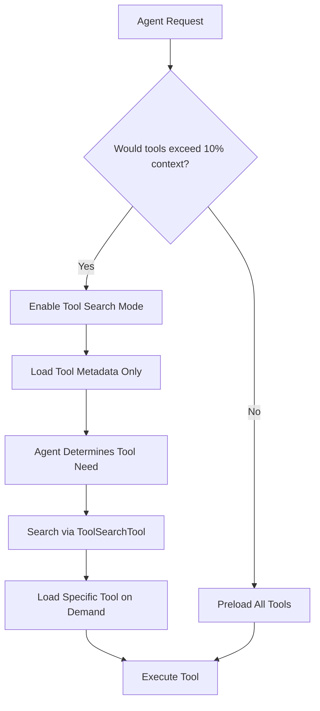

tool: fetch raw
url: https://www.agentic-patterns.com/patterns/tool-search-lazy-loading
date: 2026-08-06
source: fetch

Content type text/html; charset=utf-8 cannot be simplified to markdown, but here is the raw content:
Contents of https://www.agentic-patterns.com/patterns/tool-search-lazy-loading:
<!DOCTYPE html><html lang="en"> <head><meta charset="utf-8"><meta name="viewport" content="width=device-width"><link rel="canonical" href="https://agentic-patterns.com/patterns/tool-search-lazy-loading/"><link rel="icon" type="image/svg+xml" href="/favicon.svg"><!-- Primary Meta Tags --><title>Tool Search Lazy Loading - Pattern</title><meta name="title" content="Tool Search Lazy Loading - Pattern"><meta name="description" content="Dynamically load tools via search instead of preloading all available tools to reduce context usage"><!-- Open Graph / Facebook --><meta property="og:type" content="article"><meta property="og:url" content="https://agentic-patterns.com/patterns/tool-search-lazy-loading/"><meta property="og:title" content="Tool Search Lazy Loading - Pattern"><meta property="og:description" content="Dynamically load tools via search instead of preloading all available tools to reduce context usage"><meta property="og:image" content="https://agentic-patterns.com/og-image.svg"><!-- Twitter --><meta property="twitter:card" content="summary_large_image"><meta property="twitter:url" content="https://agentic-patterns.com/patterns/tool-search-lazy-loading/"><meta property="twitter:title" content="Tool Search Lazy Loading - Pattern"><meta property="twitter:description" content="Dynamically load tools via search instead of preloading all available tools to reduce context usage"><meta property="twitter:image" content="https://agentic-patterns.com/og-image.svg"><!-- Theme Color --><meta name="theme-color" content="#c24331" media="(prefers-color-scheme: light)"><meta name="theme-color" content="#ec745f" media="(prefers-color-scheme: dark)"><link rel="preconnect" href="https://fonts.googleapis.com"><link rel="preconnect" href="https://fonts.gstatic.com" crossorigin><link rel="stylesheet" href="https://fonts.googleapis.com/css2?family=IBM+Plex+Mono:wght@400;500;600&family=IBM+Plex+Sans:wght@400;500;600;700&family=Space+Grotesk:wght@500;700&display=swap"><!-- Theme Initialization --><script>
  (function() {
    try {
      const stored = localStorage.getItem('theme');
      const prefersDark = window.matchMedia('(prefers-color-scheme: dark)').matches;
      const theme = stored || (prefersDark ? 'dark' : 'light');
      document.documentElement.setAttribute('data-theme', theme);
    } catch {
      const prefersDark = window.matchMedia('(prefers-color-scheme: dark)').matches;
      document.documentElement.setAttribute('data-theme', prefersDark ? 'dark' : 'light');
    }
  })();
</script><link rel="stylesheet" href="/_astro/BaseLayout.psfFluJ8.css">
<link rel="stylesheet" href="/_astro/_slug_@_@astro.B4PwnAvd.css">
<style>.pattern-card[data-astro-cid-oyphue5v]{position:relative;overflow:hidden;border-radius:var(--radius-lg);background:#fffaf2b8;border:1px solid rgba(182,164,143,.5);box-shadow:var(--shadow-sm);backdrop-filter:blur(12px)}.pattern-card[data-astro-cid-oyphue5v]:before{content:"";position:absolute;inset:0 auto auto 0;width:100%;height:4px;background:linear-gradient(90deg,var(--category-color),transparent 78%)}.pattern-card[data-astro-cid-oyphue5v]:hover{transform:translateY(-2px);border-color:var(--category-color);box-shadow:var(--shadow-md)}.pattern-card-link[data-astro-cid-oyphue5v]{display:block;padding:1.35rem;min-height:100%}.pattern-card-topline[data-astro-cid-oyphue5v]{display:flex;align-items:center;justify-content:space-between;gap:var(--spacing-sm);margin-bottom:var(--spacing-md)}.pattern-card-category[data-astro-cid-oyphue5v],.pattern-card-status[data-astro-cid-oyphue5v]{font-size:.72rem;font-weight:700;letter-spacing:.08em;text-transform:uppercase}.pattern-card-category[data-astro-cid-oyphue5v]{color:var(--category-color)}.pattern-card-status[data-astro-cid-oyphue5v]{color:var(--status-color);text-align:right}.pattern-card-title[data-astro-cid-oyphue5v]{font-size:clamp(1.2rem,2vw,1.45rem);line-height:1.1}.pattern-card-summary[data-astro-cid-oyphue5v]{margin:var(--spacing-md) 0 var(--spacing-lg);color:var(--color-text-muted);font-size:.94rem;line-height:1.65;display:-webkit-box;-webkit-line-clamp:4;-webkit-box-orient:vertical;overflow:hidden}.pattern-card-footer[data-astro-cid-oyphue5v]{display:flex;align-items:center;justify-content:space-between;gap:var(--spacing-md);margin-top:auto}.pattern-card-readmore[data-astro-cid-oyphue5v]{color:var(--color-text);font-weight:600}.pattern-card-tags[data-astro-cid-oyphue5v]{display:flex;gap:var(--spacing-xs);flex-wrap:wrap;justify-content:flex-end}.pattern-card-tag[data-astro-cid-oyphue5v]{padding:.18rem .5rem;border-radius:999px;background:#325d9614;color:var(--color-text-muted);font-size:.74rem}:root[data-theme=dark] .pattern-card[data-astro-cid-oyphue5v]{background:#241d18f0;border-color:#685445eb}:root[data-theme=dark] .pattern-card-summary[data-astro-cid-oyphue5v],:root[data-theme=dark] .pattern-card-tag[data-astro-cid-oyphue5v]{color:#d4c9bb}:root[data-theme=dark] .pattern-card-tag[data-astro-cid-oyphue5v]{background:#77a0d729}@media(prefers-color-scheme:dark){:root:not([data-theme]) .pattern-card[data-astro-cid-oyphue5v]{background:#241d18f0;border-color:#685445eb}:root:not([data-theme]) .pattern-card-summary[data-astro-cid-oyphue5v],:root:not([data-theme]) .pattern-card-tag[data-astro-cid-oyphue5v]{color:#d4c9bb}:root:not([data-theme]) .pattern-card-tag[data-astro-cid-oyphue5v]{background:#77a0d729}}@media(max-width:640px){.pattern-card-footer[data-astro-cid-oyphue5v],.pattern-card-topline[data-astro-cid-oyphue5v]{flex-direction:column;align-items:flex-start}.pattern-card-tags[data-astro-cid-oyphue5v]{justify-content:flex-start}}
</style>
<link rel="stylesheet" href="/_astro/NewsletterCTA.nA16pq9O.css"></head> <body> <!-- Skip Navigation for Keyboard Users --> <a href="#main-content" class="skip-link">Skip to main content</a> <header class="header" data-astro-cid-3ef6ksr2> <div class="header-container" data-astro-cid-3ef6ksr2> <a href="/" class="logo" data-astro-cid-3ef6ksr2> <svg width="32" height="32" viewBox="0 0 32 32" fill="none" xmlns="http://www.w3.org/2000/svg" aria-hidden="true" data-astro-cid-3ef6ksr2> <rect width="32" height="32" rx="6" fill="currentColor" data-astro-cid-3ef6ksr2></rect> <path d="M10 16L14 12L18 16L22 12" stroke="white" stroke-width="2" stroke-linecap="round" stroke-linejoin="round" data-astro-cid-3ef6ksr2></path> <path d="M10 22L14 18L18 22L22 18" stroke="white" stroke-width="2" stroke-linecap="round" stroke-linejoin="round" data-astro-cid-3ef6ksr2></path> </svg> <span data-astro-cid-3ef6ksr2>Agentic Patterns</span> </a> <nav class="nav" aria-label="Main navigation" data-astro-cid-3ef6ksr2> <ul class="nav-list" data-astro-cid-3ef6ksr2> <li class="nav-item" data-astro-cid-3ef6ksr2> <a href="/" class="nav-link" data-astro-cid-3ef6ksr2> Home </a> </li><li class="nav-item" data-astro-cid-3ef6ksr2> <a href="/patterns" class="nav-link" data-astro-cid-3ef6ksr2> Patterns </a> </li><li class="nav-item" data-astro-cid-3ef6ksr2> <a href="/graph" class="nav-link" data-astro-cid-3ef6ksr2> Graph </a> </li><li class="nav-item" data-astro-cid-3ef6ksr2> <a href="/guides" class="nav-link" data-astro-cid-3ef6ksr2> Guides </a> </li> </ul> </nav> <div class="header-actions" data-astro-cid-3ef6ksr2> <a class="repo-link" href="https://github.com/nibzard/awesome-agentic-patterns" target="_blank" rel="noreferrer" aria-label="Open GitHub repository" data-astro-cid-3ef6ksr2> <svg width="18" height="18" viewBox="0 0 64 64" fill="currentColor" aria-hidden="true" data-astro-cid-3ef6ksr2><path d="M32.029,8.345c-13.27,0 -24.029,10.759 -24.029,24.033c0,10.617 6.885,19.624 16.435,22.803c1.202,0.22 1.64,-0.522 1.64,-1.16c0,-0.569 -0.02,-2.081 -0.032,-4.086c-6.685,1.452 -8.095,-3.222 -8.095,-3.222c-1.093,-2.775 -2.669,-3.514 -2.669,-3.514c-2.182,-1.492 0.165,-1.462 0.165,-1.462c2.412,0.171 3.681,2.477 3.681,2.477c2.144,3.672 5.625,2.611 6.994,1.997c0.219,-1.553 0.838,-2.612 1.526,-3.213c-5.336,-0.606 -10.947,-2.669 -10.947,-11.877c0,-2.623 0.937,-4.769 2.474,-6.449c-0.247,-0.608 -1.072,-3.051 0.235,-6.36c0,0 2.018,-0.646 6.609,2.464c1.917,-0.533 3.973,-0.8 6.016,-0.809c2.041,0.009 4.097,0.276 6.017,0.809c4.588,-3.11 6.602,-2.464 6.602,-2.464c1.311,3.309 0.486,5.752 0.239,6.36c1.54,1.68 2.471,3.826 2.471,6.449c0,9.232 -5.62,11.263 -10.974,11.858c0.864,0.742 1.632,2.208 1.632,4.451c0,3.212 -0.029,5.804 -0.029,6.591c0,0.644 0.432,1.392 1.652,1.157c9.542,-3.185 16.421,-12.186 16.421,-22.8c0,-13.274 -10.76,-24.033 -24.034,-24.033" data-astro-cid-3ef6ksr2></path></svg> <span class="repo-link-count" aria-label="4.8K GitHub stars" data-astro-cid-3ef6ksr2> 4.8K </span> </a> <button id="search-toggle" class="search-toggle" aria-label="Search" data-astro-cid-3ef6ksr2> <svg width="20" height="20" viewBox="0 0 20 20" fill="none" xmlns="http://www.w3.org/2000/svg" data-astro-cid-3ef6ksr2> <path d="M9 17A8 8 0 1 0 9 1A8 8 0 0 0 9 17Z" stroke="currentColor" stroke-width="2" stroke-linecap="round" stroke-linejoin="round" data-astro-cid-3ef6ksr2></path> <path d="M19 19L13.5 13.5" stroke="currentColor" stroke-width="2" stroke-linecap="round" stroke-linejoin="round" data-astro-cid-3ef6ksr2></path> </svg> <span data-astro-cid-3ef6ksr2>Search</span> </button> <button id="theme-toggle" class="theme-toggle" aria-label="Toggle theme" type="button" data-astro-cid-x3pjskd3> <svg class="sun-icon" width="20" height="20" viewBox="0 0 20 20" fill="none" xmlns="http://www.w3.org/2000/svg" data-astro-cid-x3pjskd3> <circle cx="10" cy="10" r="4" stroke="currentColor" stroke-width="2" data-astro-cid-x3pjskd3></circle> <path d="M10 2V4M10 16V18M18 10H16M4 10H2M15.66 15.66L14.24 14.24M5.76 5.76L4.34 4.34M15.66 4.34L14.24 5.76M5.76 14.24L4.34 15.66" stroke="currentColor" stroke-width="2" stroke-linecap="round" data-astro-cid-x3pjskd3></path> </svg> <svg class="moon-icon" width="20" height="20" viewBox="0 0 20 20" fill="none" xmlns="http://www.w3.org/2000/svg" data-astro-cid-x3pjskd3> <path d="M17.293 13.293A8 8 0 1 1 6.707 2.707a8.001 8.001 0 0 0 10.586 10.586Z" stroke="currentColor" stroke-width="2" stroke-linecap="round" stroke-linejoin="round" data-astro-cid-x3pjskd3></path> </svg> </button>  <script type="module">const l=document.getElementById("theme-toggle"),t=document.querySelector(".sun-icon"),o=document.querySelector(".moon-icon");function n(){if(typeof localStorage<"u"){const e=localStorage.getItem("theme");if(e)return e}return window.matchMedia("(prefers-color-scheme: dark)").matches?"dark":"light"}function c(e){typeof localStorage<"u"&&localStorage.setItem("theme",e),document.documentElement.setAttribute("data-theme",e),s(e)}function s(e){e==="dark"?(t?.style.setProperty("display","block"),o?.style.setProperty("display","none")):(t?.style.setProperty("display","none"),o?.style.setProperty("display","block"))}c(n());l?.addEventListener("click",()=>{const r=(document.documentElement.getAttribute("data-theme")||n())==="dark"?"light":"dark";c(r)});</script> </div> <!-- Mobile Menu Toggle --> <button id="mobile-menu-toggle" class="mobile-menu-toggle" aria-label="Open navigation menu" aria-expanded="false" aria-controls="mobile-menu" data-astro-cid-3ef6ksr2> <span class="hamburger" data-astro-cid-3ef6ksr2> <span class="hamburger-line" data-astro-cid-3ef6ksr2></span> <span class="hamburger-line" data-astro-cid-3ef6ksr2></span> <span class="hamburger-line" data-astro-cid-3ef6ksr2></span> </span> </button> <!-- Search Modal --> <div id="search-modal" class="search-modal" hidden inert aria-hidden="true" role="dialog" aria-modal="true" aria-label="Search patterns" data-astro-cid-3ef6ksr2> <div class="search-backdrop" data-astro-cid-3ef6ksr2></div> <div class="search-container" data-astro-cid-3ef6ksr2> <button type="button" class="search-close" aria-label="Close search" data-astro-cid-3ef6ksr2> <svg width="16" height="16" viewBox="0 0 16 16" fill="none" xmlns="http://www.w3.org/2000/svg" data-astro-cid-3ef6ksr2> <path d="M3 3L13 13M13 3L3 13" stroke="currentColor" stroke-width="2" stroke-linecap="round" data-astro-cid-3ef6ksr2></path> </svg> </button> <div class="search-input-wrapper" data-astro-cid-3ef6ksr2> <svg width="20" height="20" viewBox="0 0 20 20" fill="none" xmlns="http://www.w3.org/2000/svg" class="search-icon" data-astro-cid-3ef6ksr2> <path d="M9 17A8 8 0 1 0 9 1A8 8 0 0 0 9 17Z" stroke="currentColor" stroke-width="2" stroke-linecap="round" stroke-linejoin="round" data-astro-cid-3ef6ksr2></path> <path d="M19 19L13.5 13.5" stroke="currentColor" stroke-width="2" stroke-linecap="round" stroke-linejoin="round" data-astro-cid-3ef6ksr2></path> </svg> <input id="search-input" type="text" placeholder="Search patterns..." autocomplete="off" aria-label="Search patterns" aria-describedby="search-instructions" role="searchbox" aria-autocomplete="list" data-astro-cid-3ef6ksr2> <kbd id="search-shortcut" data-astro-cid-3ef6ksr2>⌘K</kbd> </div> <div id="search-results" class="search-results" role="region" aria-live="polite" aria-atomic="true" data-astro-cid-3ef6ksr2></div> <div class="search-footer" id="search-instructions" data-astro-cid-3ef6ksr2> <span data-astro-cid-3ef6ksr2>Use <kbd data-astro-cid-3ef6ksr2>↑</kbd> <kbd data-astro-cid-3ef6ksr2>↓</kbd> to navigate</span> <span data-astro-cid-3ef6ksr2><kbd data-astro-cid-3ef6ksr2>↵</kbd> to select</span> <span data-astro-cid-3ef6ksr2><kbd data-astro-cid-3ef6ksr2>esc</kbd> to close</span> </div> </div> </div> <script type="module" src="/_astro/Header.astro_astro_type_script_index_0_lang.B9QDizEs.js"></script> </div> <!-- Mobile Menu --> <div id="mobile-menu" class="mobile-menu" hidden aria-hidden="true" role="dialog" aria-modal="true" aria-label="Navigation menu" data-astro-cid-3ef6ksr2> <div class="mobile-menu-backdrop" data-astro-cid-3ef6ksr2></div> <div class="mobile-menu-container" data-astro-cid-3ef6ksr2> <nav class="mobile-menu-nav" aria-label="Mobile navigation" data-astro-cid-3ef6ksr2> <ul class="mobile-menu-list" data-astro-cid-3ef6ksr2> <li data-astro-cid-3ef6ksr2> <a href="/" class="mobile-menu-link" data-astro-cid-3ef6ksr2> Home </a> </li><li data-astro-cid-3ef6ksr2> <a href="/patterns" class="mobile-menu-link" data-astro-cid-3ef6ksr2> Patterns </a> </li><li data-astro-cid-3ef6ksr2> <a href="/graph" class="mobile-menu-link" data-astro-cid-3ef6ksr2> Graph </a> </li><li data-astro-cid-3ef6ksr2> <a href="/guides" class="mobile-menu-link" data-astro-cid-3ef6ksr2> Guides </a> </li> </ul> </nav> <div class="mobile-menu-footer" data-astro-cid-3ef6ksr2> <a class="repo-link repo-link--mobile" href="https://github.com/nibzard/awesome-agentic-patterns" target="_blank" rel="noreferrer" aria-label="Open GitHub repository" data-astro-cid-3ef6ksr2> <svg width="18" height="18" viewBox="0 0 64 64" fill="currentColor" aria-hidden="true" data-astro-cid-3ef6ksr2><path d="M32.029,8.345c-13.27,0 -24.029,10.759 -24.029,24.033c0,10.617 6.885,19.624 16.435,22.803c1.202,0.22 1.64,-0.522 1.64,-1.16c0,-0.569 -0.02,-2.081 -0.032,-4.086c-6.685,1.452 -8.095,-3.222 -8.095,-3.222c-1.093,-2.775 -2.669,-3.514 -2.669,-3.514c-2.182,-1.492 0.165,-1.462 0.165,-1.462c2.412,0.171 3.681,2.477 3.681,2.477c2.144,3.672 5.625,2.611 6.994,1.997c0.219,-1.553 0.838,-2.612 1.526,-3.213c-5.336,-0.606 -10.947,-2.669 -10.947,-11.877c0,-2.623 0.937,-4.769 2.474,-6.449c-0.247,-0.608 -1.072,-3.051 0.235,-6.36c0,0 2.018,-0.646 6.609,2.464c1.917,-0.533 3.973,-0.8 6.016,-0.809c2.041,0.009 4.097,0.276 6.017,0.809c4.588,-3.11 6.602,-2.464 6.602,-2.464c1.311,3.309 0.486,5.752 0.239,6.36c1.54,1.68 2.471,3.826 2.471,6.449c0,9.232 -5.62,11.263 -10.974,11.858c0.864,0.742 1.632,2.208 1.632,4.451c0,3.212 -0.029,5.804 -0.029,6.591c0,0.644 0.432,1.392 1.652,1.157c9.542,-3.185 16.421,-12.186 16.421,-22.8c0,-13.274 -10.76,-24.033 -24.034,-24.033" data-astro-cid-3ef6ksr2></path></svg> <span class="repo-link-count" aria-label="4.8K GitHub stars" data-astro-cid-3ef6ksr2> 4.8K </span> <span aria-hidden="true" data-astro-cid-3ef6ksr2>↗</span> </a> </div> </div> </div> </header> <main id="main-content" tabindex="-1">  <div class="pattern-page" data-astro-cid-pjne7374> <section class="pattern-hero" data-astro-cid-pjne7374> <div class="pattern-hero-main" data-astro-cid-pjne7374> <div class="pattern-meta" data-astro-cid-pjne7374> <span class="section-label" data-astro-cid-pjne7374>Pattern Reference</span> <span class="pattern-pill pattern-pill--category" data-astro-cid-pjne7374>Context &amp; Memory</span> <span class="pattern-pill pattern-pill--status" data-astro-cid-pjne7374>emerging</span> <span class="pattern-pill pattern-pill--neutral" data-astro-cid-pjne7374>medium</span> <span class="pattern-pill pattern-pill--neutral" data-astro-cid-pjne7374>maturing</span> </div> <h1 data-astro-cid-pjne7374>Tool Search Lazy Loading</h1> <p class="pattern-summary" data-astro-cid-pjne7374>Dynamically load tools via search instead of preloading all available tools to reduce context usage</p> <div class="pattern-authors" data-astro-cid-pjne7374> <span class="pattern-authors-label" data-astro-cid-pjne7374>By</span> <span class="author" data-astro-cid-pjne7374>Niko</span> </div> <div class="pattern-actions" data-astro-cid-3u5a4cme> <button class="action-button" data-copy="markdown" data-content="# Tool Search Lazy Loading

Dynamically load tools via search instead of preloading all available tools to reduce context usage

**Status:** emerging
**Category:** Context &#38; Memory
**Complexity:** medium
**Maturity:** maturing
**Impact:** high
**Authors:** Niko
**Tags:** mcp, tool-discovery, context-optimization, lazy-loading, search, dynamic-loading
**Source:** https://x.com/trq212/status/2011523109871108570
**Updated:** 2026-01-14


## Problem

As the Model Context Protocol (MCP) has grown, MCP servers may expose 50+ tools that consume significant context space. Documented setups with 7+ servers have been documented consuming 67k+ tokens just for tool descriptions. This creates a fundamental scalability issue:

* **Context bloat**: Preloading all tool descriptions consumes tokens that could be used for the actual task
* **Latency**: More tools means more processing overhead on every request
* **Discovery challenges**: Agents must scan through many irrelevant tools to find relevant ones
* **Memory pressure**: Large tool catalogs can exceed practical context limits

## Solution

Implement Tool Search: a lazy-loading mechanism where tools are dynamically loaded into context via search only when needed, rather than preloaded on initialization.

The pattern works by:

1. **Threshold detection**: Monitor when tool descriptions would exceed a context threshold (e.g., 10% of context window)
2. **Search interface**: Provide a ToolSearchTool that allows agents to search tool metadata and selectively load tools
3. **Server instructions**: Leverage MCP server instruction fields to guide the agent on when to search for specific tools
4. **Agentic search**: Use intelligent search rather than basic RAG to find relevant tools



**Implementation approach:**

```pseudo
function initialize_mcp_servers(servers) {
    total_tool_tokens = calculate_tool_tokens(servers)

    if (total_tool_tokens > CONTEXT_THRESHOLD) {
        // Lazy loading mode
        tool_registry = load_tool_metadata_only(servers)
        return ToolSearchTool(tool_registry)
    } else {
        // Traditional preload mode
        return preload_all_tools(servers)
    }
}

function tool_search(query: string, tool_registry) {
    // Agentic search - not basic RAG
    relevant_tools = agentically_search(tool_registry, query)
    return load_tool_definitions(relevant_tools)
}
```

## How to use it

**For MCP server creators:**

* **Enhance server instructions**: The &#34;server instructions&#34; field becomes more critical with tool search enabled. It helps the agent know when to search for your tools.
* **Descriptive metadata**: Include rich descriptions and tags to improve searchability
* **Logical grouping**: Organize related tools to make discovery more intuitive

**For MCP client creators:**

* **Implement ToolSearchTool**: Provide a search interface for tool discovery
* **Use agentic search**: Implement intelligent search rather than basic vector RAG
* **Set appropriate thresholds**: Choose context thresholds based on your use case (Claude Code uses 10%)
* **Provide opt-out**: Allow users to disable search if they prefer preloading

**Usage scenarios:**

* Development environments with many specialized tools (file operations, git, database access, API clients)
* Multi-server setups where each server provides domain-specific capabilities
* Agents that only need a subset of available tools for any given task

## Trade-offs

* **Pros:**
  * Dramatically reduces baseline context usage (67k+ tokens to just metadata)
  * Enables scaling to 100+ tools without context issues
  * Faster cold-start times when tools aren't needed
  * Better tool discovery through intentional search
  * Allows more MCP servers to be enabled simultaneously

* **Cons:**
  * Adds latency when tools need to be dynamically loaded
  * Requires search infrastructure and metadata management
  * May miss serendipitous tool discovery that happens when browsing full catalogs
  * Server instructions become more critical and require careful authoring
  * Additional complexity in client implementation

## References

* [Original announcement tweet](https://x.com/trq212/status/2011523109871108570) by Thariq (@trq212)
* [MCP Documentation](https://modelcontextprotocol.io/) for implementation details
* GitHub issue references on lazy loading for MCP servers

## Variations

**Toggle-based forcing**: Allow users to force enable tool search even under the 10% threshold, for consistency or testing purposes.

**Caching strategies**: Implement LRU caching for recently used tools to minimize reload overhead.

**Progressive loading**: Load commonly-used tools upfront while keeping long-tail tools in search-only mode.

**Programmatic composition**: Future direction allowing tools to be composed with each other via code (experimented with but deferred for tool search priority).

## Pitfalls

* **Poor server instructions**: Without clear guidance on when to search, agents may miss relevant tools
* **Inadequate search**: Basic RAG may not capture tool capabilities effectively; agentic search is preferred
* **Metadata neglect**: Failing to maintain rich, searchable tool descriptions defeats the purpose
* **Threshold tuning**: Setting the context threshold too low or too high can negate benefits or create unnecessary overhead
" aria-label="Copy as Markdown" data-astro-cid-3u5a4cme> <svg xmlns="http://www.w3.org/2000/svg" width="16" height="16" viewBox="0 0 24 24" fill="none" stroke="currentColor" stroke-width="2" stroke-linecap="round" stroke-linejoin="round" data-astro-cid-3u5a4cme> <path d="M14 2H6a2 2 0 0 0-2 2v16a2 2 0 0 0 2 2h12a2 2 0 0 0 2-2V8z" data-astro-cid-3u5a4cme></path> <polyline points="14 2 14 8 20 8" data-astro-cid-3u5a4cme></polyline> <line x1="16" y1="13" x2="8" y2="13" data-astro-cid-3u5a4cme></line> <line x1="16" y1="17" x2="8" y2="17" data-astro-cid-3u5a4cme></line> <polyline points="10 9 9 9 8 9" data-astro-cid-3u5a4cme></polyline> </svg>
Copy as Markdown
</button> <button class="action-button" data-copy="json" data-content="{
  &#34;id&#34;: &#34;tool-search-lazy-loading&#34;,
  &#34;slug&#34;: &#34;tool-search-lazy-loading&#34;,
  &#34;title&#34;: &#34;Tool Search Lazy Loading&#34;,
  &#34;status&#34;: &#34;emerging&#34;,
  &#34;authors&#34;: [
    &#34;Niko&#34;
  ],
  &#34;based_on&#34;: [
    &#34;Thariq (@trq212) - Anthropic&#34;
  ],
  &#34;category&#34;: &#34;Context &#38; Memory&#34;,
  &#34;source&#34;: &#34;https://x.com/trq212/status/2011523109871108570&#34;,
  &#34;tags&#34;: [
    &#34;mcp&#34;,
    &#34;tool-discovery&#34;,
    &#34;context-optimization&#34;,
    &#34;lazy-loading&#34;,
    &#34;search&#34;,
    &#34;dynamic-loading&#34;
  ],
  &#34;summary&#34;: &#34;Dynamically load tools via search instead of preloading all available tools to reduce context usage&#34;,
  &#34;maturity&#34;: &#34;maturing&#34;,
  &#34;complexity&#34;: &#34;medium&#34;,
  &#34;impact&#34;: &#34;high&#34;,
  &#34;signals&#34;: [
    &#34;MCP servers with 20+ tools&#34;,
    &#34;Tool descriptions consuming >10% of context window&#34;,
    &#34;Multiple MCP servers enabled simultaneously&#34;
  ],
  &#34;anti_signals&#34;: [
    &#34;Single tool or small tool sets&#34;,
    &#34;Tools always needed in every interaction&#34;
  ],
  &#34;prerequisites&#34;: [
    &#34;MCP server implementation&#34;,
    &#34;Search infrastructure for tool metadata&#34;
  ],
  &#34;related&#34;: [
    &#34;context-minimization-pattern&#34;,
    &#34;progressive-tool-discovery&#34;,
    &#34;dynamic-context-injection&#34;
  ],
  &#34;anti_patterns&#34;: [
    &#34;preload-all-tools&#34;
  ],
  &#34;tools&#34;: [
    &#34;mcp-servers&#34;,
    &#34;tool-search-api&#34;
  ],
  &#34;domains&#34;: [
    &#34;tool-use&#34;,
    &#34;context-optimization&#34;
  ],
  &#34;updated_at&#34;: &#34;2026-01-14&#34;,
  &#34;body&#34;: &#34;\n## Problem\n\nAs the Model Context Protocol (MCP) has grown, MCP servers may expose 50+ tools that consume significant context space. Documented setups with 7+ servers have been documented consuming 67k+ tokens just for tool descriptions. This creates a fundamental scalability issue:\n\n* **Context bloat**: Preloading all tool descriptions consumes tokens that could be used for the actual task\n* **Latency**: More tools means more processing overhead on every request\n* **Discovery challenges**: Agents must scan through many irrelevant tools to find relevant ones\n* **Memory pressure**: Large tool catalogs can exceed practical context limits\n\n## Solution\n\nImplement Tool Search: a lazy-loading mechanism where tools are dynamically loaded into context via search only when needed, rather than preloaded on initialization.\n\nThe pattern works by:\n\n1. **Threshold detection**: Monitor when tool descriptions would exceed a context threshold (e.g., 10% of context window)\n2. **Search interface**: Provide a ToolSearchTool that allows agents to search tool metadata and selectively load tools\n3. **Server instructions**: Leverage MCP server instruction fields to guide the agent on when to search for specific tools\n4. **Agentic search**: Use intelligent search rather than basic RAG to find relevant tools\n\n```mermaid\ngraph TD\n    A[Agent Request] --> B{Would tools exceed 10% context?}\n    B -->|No| C[Preload All Tools]\n    B -->|Yes| D[Enable Tool Search Mode]\n    D --> E[Load Tool Metadata Only]\n    E --> F[Agent Determines Tool Need]\n    F --> G[Search via ToolSearchTool]\n    G --> H[Load Specific Tool on Demand]\n    H --> I[Execute Tool]\n    C --> I\n```\n\n**Implementation approach:**\n\n```pseudo\nfunction initialize_mcp_servers(servers) {\n    total_tool_tokens = calculate_tool_tokens(servers)\n\n    if (total_tool_tokens > CONTEXT_THRESHOLD) {\n        // Lazy loading mode\n        tool_registry = load_tool_metadata_only(servers)\n        return ToolSearchTool(tool_registry)\n    } else {\n        // Traditional preload mode\n        return preload_all_tools(servers)\n    }\n}\n\nfunction tool_search(query: string, tool_registry) {\n    // Agentic search - not basic RAG\n    relevant_tools = agentically_search(tool_registry, query)\n    return load_tool_definitions(relevant_tools)\n}\n```\n\n## How to use it\n\n**For MCP server creators:**\n\n* **Enhance server instructions**: The \&#34;server instructions\&#34; field becomes more critical with tool search enabled. It helps the agent know when to search for your tools.\n* **Descriptive metadata**: Include rich descriptions and tags to improve searchability\n* **Logical grouping**: Organize related tools to make discovery more intuitive\n\n**For MCP client creators:**\n\n* **Implement ToolSearchTool**: Provide a search interface for tool discovery\n* **Use agentic search**: Implement intelligent search rather than basic vector RAG\n* **Set appropriate thresholds**: Choose context thresholds based on your use case (Claude Code uses 10%)\n* **Provide opt-out**: Allow users to disable search if they prefer preloading\n\n**Usage scenarios:**\n\n* Development environments with many specialized tools (file operations, git, database access, API clients)\n* Multi-server setups where each server provides domain-specific capabilities\n* Agents that only need a subset of available tools for any given task\n\n## Trade-offs\n\n* **Pros:**\n  * Dramatically reduces baseline context usage (67k+ tokens to just metadata)\n  * Enables scaling to 100+ tools without context issues\n  * Faster cold-start times when tools aren't needed\n  * Better tool discovery through intentional search\n  * Allows more MCP servers to be enabled simultaneously\n\n* **Cons:**\n  * Adds latency when tools need to be dynamically loaded\n  * Requires search infrastructure and metadata management\n  * May miss serendipitous tool discovery that happens when browsing full catalogs\n  * Server instructions become more critical and require careful authoring\n  * Additional complexity in client implementation\n\n## References\n\n* [Original announcement tweet](https://x.com/trq212/status/2011523109871108570) by Thariq (@trq212)\n* [MCP Documentation](https://modelcontextprotocol.io/) for implementation details\n* GitHub issue references on lazy loading for MCP servers\n\n## Variations\n\n**Toggle-based forcing**: Allow users to force enable tool search even under the 10% threshold, for consistency or testing purposes.\n\n**Caching strategies**: Implement LRU caching for recently used tools to minimize reload overhead.\n\n**Progressive loading**: Load commonly-used tools upfront while keeping long-tail tools in search-only mode.\n\n**Programmatic composition**: Future direction allowing tools to be composed with each other via code (experimented with but deferred for tool search priority).\n\n## Pitfalls\n\n* **Poor server instructions**: Without clear guidance on when to search, agents may miss relevant tools\n* **Inadequate search**: Basic RAG may not capture tool capabilities effectively; agentic search is preferred\n* **Metadata neglect**: Failing to maintain rich, searchable tool descriptions defeats the purpose\n* **Threshold tuning**: Setting the context threshold too low or too high can negate benefits or create unnecessary overhead\n&#34;
}" aria-label="Copy as JSON" data-astro-cid-3u5a4cme> <svg xmlns="http://www.w3.org/2000/svg" width="16" height="16" viewBox="0 0 24 24" fill="none" stroke="currentColor" stroke-width="2" stroke-linecap="round" stroke-linejoin="round" data-astro-cid-3u5a4cme> <polyline points="16 18 22 12 16 6" data-astro-cid-3u5a4cme></polyline> <polyline points="8 6 2 12 8 18" data-astro-cid-3u5a4cme></polyline> </svg>
Copy as JSON
</button> <details class="pack-details" data-pack-action data-pattern-slug="tool-search-lazy-loading" data-pattern-title="Tool Search Lazy Loading" data-astro-cid-3u5a4cme> <summary class="action-button" aria-label="Add this pattern to a pack" data-astro-cid-3u5a4cme>Add to Pack</summary> <div class="pack-panel" data-astro-cid-3u5a4cme> <div class="pack-row" data-astro-cid-3u5a4cme> <label class="pack-label" for="pack-select-tool-search-lazy-loading" data-astro-cid-3u5a4cme>Choose pack</label> <select class="pack-select" id="pack-select-tool-search-lazy-loading" aria-label="Select a pack" data-astro-cid-3u5a4cme> <option value="" data-astro-cid-3u5a4cme>No packs yet</option> </select> <button class="pack-add" type="button" data-pack-add data-astro-cid-3u5a4cme>Add</button> </div> <div class="pack-divider" data-astro-cid-3u5a4cme>or</div> <div class="pack-row" data-astro-cid-3u5a4cme> <label class="pack-label" for="pack-new-tool-search-lazy-loading" data-astro-cid-3u5a4cme>New pack</label> <input class="pack-input" id="pack-new-tool-search-lazy-loading" type="text" placeholder="Name your pack" data-astro-cid-3u5a4cme> <button class="pack-create" type="button" data-pack-create data-astro-cid-3u5a4cme>Create</button> </div> <p class="pack-hint" data-astro-cid-3u5a4cme>Saved locally in this browser for now.</p> <span class="pack-feedback" aria-live="polite" data-astro-cid-3u5a4cme></span> </div> </details> <details class="citation-details" data-astro-cid-3u5a4cme> <summary class="action-button" aria-label="Cite this pattern" data-astro-cid-3u5a4cme>Cite This Pattern</summary> <div class="citation-panel" data-astro-cid-3u5a4cme> <div class="citation-row" data-astro-cid-3u5a4cme> <div class="citation-header" data-astro-cid-3u5a4cme> <span class="citation-label" data-astro-cid-3u5a4cme>APA</span> <button class="copy-button" data-copy-content="Niko (2026). Tool Search Lazy Loading. In *Awesome Agentic Patterns*. Retrieved July 23, 2026, from https://agentic-patterns.com/patterns/tool-search-lazy-loading" aria-label="Copy APA citation" type="button" data-astro-cid-74lkg7sv> <svg class="copy-icon" width="16" height="16" viewBox="0 0 16 16" fill="none" xmlns="http://www.w3.org/2000/svg" data-astro-cid-74lkg7sv> <rect x="2" y="2" width="12" height="12" rx="2" stroke="currentColor" stroke-width="1.5" data-astro-cid-74lkg7sv></rect> <path d="M5 6H11M5 8H11M5 10H8" stroke="currentColor" stroke-width="1.5" stroke-linecap="round" data-astro-cid-74lkg7sv></path> </svg> <svg class="check-icon" width="16" height="16" viewBox="0 0 16 16" fill="none" xmlns="http://www.w3.org/2000/svg" data-astro-cid-74lkg7sv> <path d="M13 5L5.5 12.5L2 9" stroke="currentColor" stroke-width="2" stroke-linecap="round" stroke-linejoin="round" data-astro-cid-74lkg7sv></path> </svg> </button>  <script type="module">document.querySelectorAll(".copy-button").forEach(e=>{e.addEventListener("click",async()=>{const t=e.getAttribute("data-copy-content");if(t)try{await navigator.clipboard.writeText(t),e.classList.add("copied"),setTimeout(()=>{e.classList.remove("copied")},2e3)}catch(c){console.error("Failed to copy:",c)}})});</script> </div> <pre class="citation-text" data-astro-cid-3u5a4cme>Niko (2026). Tool Search Lazy Loading. In *Awesome Agentic Patterns*. Retrieved July 23, 2026, from https://agentic-patterns.com/patterns/tool-search-lazy-loading</pre> </div> <div class="citation-row" data-astro-cid-3u5a4cme> <div class="citation-header" data-astro-cid-3u5a4cme> <span class="citation-label" data-astro-cid-3u5a4cme>BibTeX</span> <button class="copy-button" data-copy-content="@misc{agentic_patterns_tool-search-lazy-loading,
  title = {Tool Search Lazy Loading},
  author = {Niko},
  year = {2026},
  howpublished = {\url{https://agentic-patterns.com/patterns/tool-search-lazy-loading}},
  note = {Awesome Agentic Patterns}
}" aria-label="Copy BibTeX citation" type="button" data-astro-cid-74lkg7sv> <svg class="copy-icon" width="16" height="16" viewBox="0 0 16 16" fill="none" xmlns="http://www.w3.org/2000/svg" data-astro-cid-74lkg7sv> <rect x="2" y="2" width="12" height="12" rx="2" stroke="currentColor" stroke-width="1.5" data-astro-cid-74lkg7sv></rect> <path d="M5 6H11M5 8H11M5 10H8" stroke="currentColor" stroke-width="1.5" stroke-linecap="round" data-astro-cid-74lkg7sv></path> </svg> <svg class="check-icon" width="16" height="16" viewBox="0 0 16 16" fill="none" xmlns="http://www.w3.org/2000/svg" data-astro-cid-74lkg7sv> <path d="M13 5L5.5 12.5L2 9" stroke="currentColor" stroke-width="2" stroke-linecap="round" stroke-linejoin="round" data-astro-cid-74lkg7sv></path> </svg> </button>   </div> <pre class="citation-text citation-text--code" data-astro-cid-3u5a4cme>@misc{agentic_patterns_tool-search-lazy-loading,
  title = {Tool Search Lazy Loading},
  author = {Niko},
  year = {2026},
  howpublished = {\url{https://agentic-patterns.com/patterns/tool-search-lazy-loading}},
  note = {Awesome Agentic Patterns}
}</pre> </div> </div> </details> <span class="copy-feedback" aria-live="polite" data-astro-cid-3u5a4cme></span> </div> <script type="module">const m=document.querySelectorAll("[data-copy]"),u=document.querySelector(".copy-feedback"),o=document.querySelector("[data-pack-action]"),k="aap:user-packs";m.forEach(t=>{t.addEventListener("click",async()=>{const e=t.getAttribute("data-content"),a=t.getAttribute("data-copy");if(e)try{await navigator.clipboard.writeText(e),u.textContent=`Copied as ${a}!`,setTimeout(()=>{u.textContent=""},2e3)}catch{u.textContent="Failed to copy",setTimeout(()=>{u.textContent=""},2e3)}})});const l=()=>{try{const t=localStorage.getItem(k),e=t?JSON.parse(t):[];return Array.isArray(e)?e.map(a=>({...a,patterns:Array.isArray(a.patterns)?a.patterns:[]})):[]}catch{return[]}},f=t=>{try{localStorage.setItem(k,JSON.stringify(t))}catch{s("Unable to save packs in this browser.",!0)}},s=(t,e=!1)=>{if(!o)return;const a=o.querySelector(".pack-feedback");a&&(a.textContent=t,a.classList.toggle("pack-feedback--error",e),setTimeout(()=>{a.textContent="",a.classList.remove("pack-feedback--error")},2400))},p=(t,e,a)=>{if(t){if(t.innerHTML="",a.length===0){const r=document.createElement("option");r.value="",r.textContent="No packs yet",t.appendChild(r),t.disabled=!0,e&&(e.disabled=!0);return}t.disabled=!1,e&&(e.disabled=!1),a.forEach(r=>{const n=document.createElement("option");n.value=r.id,n.textContent=`${r.name} (${r.patterns.length})`,t.appendChild(n)})}},g=()=>`pack-${Date.now().toString(36)}-${Math.random().toString(36).slice(2,7)}`,S=(t,e,a)=>{const r=t.find(n=>n.id===e);return r?r.patterns.includes(a)?{packs:t,status:"exists",pack:r}:(r.patterns.push(a),r.updatedAt=new Date().toISOString(),{packs:t,status:"added",pack:r}):{packs:t,status:"missing"}};if(o){const t=o.getAttribute("data-pattern-slug")||"",e=o.querySelector(".pack-select"),a=o.querySelector("[data-pack-add]"),r=o.querySelector("[data-pack-create]"),n=o.querySelector(".pack-input"),y=l();p(e,a,y),a?.addEventListener("click",()=>{const i=e?.value;if(!i){s("Create a pack first.",!0);return}const d=l(),c=S(d,i,t);if(c.status==="missing"){s("Pack not found.",!0);return}if(c.status==="exists"){s("Already in that pack.");return}f(c.packs),p(e,a,c.packs),s(`Added to ${c.pack.name}.`)}),r?.addEventListener("click",()=>{const i=n?.value.trim();if(!i){s("Add a pack name.",!0);return}const d=l(),c={id:g(),name:i,patterns:t?[t]:[],createdAt:new Date().toISOString(),updatedAt:new Date().toISOString()};d.unshift(c),f(d),p(e,a,d),e&&(e.value=c.id),n&&(n.value=""),s(`Created "${i}".`)})}</script> </div> <aside class="pattern-summary-panel surface-panel" data-astro-cid-pjne7374> <p class="pattern-kicker" data-astro-cid-pjne7374>At a glance</p> <div class="pattern-fact-grid" data-astro-cid-pjne7374> <div class="pattern-fact" data-astro-cid-pjne7374> <span class="pattern-fact-label" data-astro-cid-pjne7374>Category</span> <span class="pattern-fact-value" data-astro-cid-pjne7374>Context &amp; Memory</span> </div><div class="pattern-fact" data-astro-cid-pjne7374> <span class="pattern-fact-label" data-astro-cid-pjne7374>Status</span> <span class="pattern-fact-value" data-astro-cid-pjne7374>emerging</span> </div><div class="pattern-fact" data-astro-cid-pjne7374> <span class="pattern-fact-label" data-astro-cid-pjne7374>Complexity</span> <span class="pattern-fact-value" data-astro-cid-pjne7374>medium</span> </div><div class="pattern-fact" data-astro-cid-pjne7374> <span class="pattern-fact-label" data-astro-cid-pjne7374>Maturity</span> <span class="pattern-fact-value" data-astro-cid-pjne7374>maturing</span> </div><div class="pattern-fact" data-astro-cid-pjne7374> <span class="pattern-fact-label" data-astro-cid-pjne7374>Impact</span> <span class="pattern-fact-value" data-astro-cid-pjne7374>high</span> </div><div class="pattern-fact" data-astro-cid-pjne7374> <span class="pattern-fact-label" data-astro-cid-pjne7374>Updated</span> <span class="pattern-fact-value" data-astro-cid-pjne7374>Jan 14, 2026</span> </div> </div> <div class="pattern-tag-cluster" data-astro-cid-pjne7374> <p class="pattern-kicker" data-astro-cid-pjne7374>Tags</p> <div class="pattern-tags" data-astro-cid-pjne7374> <span class="tag" data-astro-cid-pjne7374>mcp</span><span class="tag" data-astro-cid-pjne7374>tool-discovery</span><span class="tag" data-astro-cid-pjne7374>context-optimization</span><span class="tag" data-astro-cid-pjne7374>lazy-loading</span><span class="tag" data-astro-cid-pjne7374>search</span><span class="tag" data-astro-cid-pjne7374>dynamic-loading</span> </div> </div> </aside> </section> <section class="pattern-body-layout" data-astro-cid-pjne7374> <aside class="pattern-rail" data-astro-cid-pjne7374> <div class="pattern-nav surface-panel" data-astro-cid-pjne7374> <p class="pattern-kicker" data-astro-cid-pjne7374>On this page</p> <nav aria-label="Pattern sections" data-astro-cid-pjne7374> <a href="#problem" class="pattern-nav-link" data-astro-cid-pjne7374> <span class="pattern-nav-number" data-astro-cid-pjne7374>01</span> <span data-astro-cid-pjne7374>Problem</span> </a><a href="#solution" class="pattern-nav-link" data-astro-cid-pjne7374> <span class="pattern-nav-number" data-astro-cid-pjne7374>02</span> <span data-astro-cid-pjne7374>Solution</span> </a><a href="#how-to-use-it" class="pattern-nav-link" data-astro-cid-pjne7374> <span class="pattern-nav-number" data-astro-cid-pjne7374>03</span> <span data-astro-cid-pjne7374>How to use it</span> </a><a href="#tradeoffs" class="pattern-nav-link" data-astro-cid-pjne7374> <span class="pattern-nav-number" data-astro-cid-pjne7374>04</span> <span data-astro-cid-pjne7374>Trade-offs</span> </a><a href="#references" class="pattern-nav-link" data-astro-cid-pjne7374> <span class="pattern-nav-number" data-astro-cid-pjne7374>06</span> <span data-astro-cid-pjne7374>References</span> </a> </nav> </div> <div class="pattern-rail-source" data-astro-cid-pjne7374> <div class="pattern-source-block" data-astro-cid-7bmmsmqf><div class="pattern-source-header" data-astro-cid-7bmmsmqf><svg width="16" height="16" viewBox="0 0 16 16" fill="none" xmlns="http://www.w3.org/2000/svg" class="pattern-source-icon" data-astro-cid-7bmmsmqf><path d="M8 0L3 5V11C3 11.5523 3.44772 12 4 12H12C12.5523 12 13 11.5523 13 11V5L8 0Z" stroke="currentColor" stroke-width="1.5" stroke-linecap="round" stroke-linejoin="round" data-astro-cid-7bmmsmqf></path><path d="M6 16H10" stroke="currentColor" stroke-width="1.5" stroke-linecap="round" data-astro-cid-7bmmsmqf></path><path d="M8 12V16" stroke="currentColor" stroke-width="1.5" stroke-linecap="round" data-astro-cid-7bmmsmqf></path></svg><span class="pattern-source-label" data-astro-cid-7bmmsmqf>Source</span></div><a href="https://x.com/trq212/status/2011523109871108570" target="_blank" rel="noopener noreferrer" class="pattern-source-link" data-astro-cid-7bmmsmqf>https://x.com/trq212/status/2011523109871108570<svg width="12" height="12" viewBox="0 0 12 12" fill="none" xmlns="http://www.w3.org/2000/svg" class="external-link-icon" data-astro-cid-7bmmsmqf><path d="M1 6H11M6 1L11 6L6 11" stroke="currentColor" stroke-width="2" stroke-linecap="round" stroke-linejoin="round" data-astro-cid-7bmmsmqf></path></svg></a></div> </div> </aside> <article class="pattern-content" data-astro-cid-pjne7374> <section id="problem" class="pattern-section surface-panel" data-astro-cid-pjne7374> <div class="pattern-section-header" data-astro-cid-pjne7374> <span class="pattern-section-number" data-astro-cid-pjne7374>01</span> <h2 data-astro-cid-pjne7374>Problem</h2> </div> <div class="pattern-section-body" data-astro-cid-pjne7374><p>As the Model Context Protocol (MCP) has grown, MCP servers may expose 50+ tools that consume significant context space. Documented setups with 7+ servers have been documented consuming 67k+ tokens just for tool descriptions. This creates a fundamental scalability issue:</p>
<ul>
<li><strong>Context bloat</strong>: Preloading all tool descriptions consumes tokens that could be used for the actual task</li>
<li><strong>Latency</strong>: More tools means more processing overhead on every request</li>
<li><strong>Discovery challenges</strong>: Agents must scan through many irrelevant tools to find relevant ones</li>
<li><strong>Memory pressure</strong>: Large tool catalogs can exceed practical context limits</li>
</ul>
</div> </section><section id="solution" class="pattern-section surface-panel" data-astro-cid-pjne7374> <div class="pattern-section-header" data-astro-cid-pjne7374> <span class="pattern-section-number" data-astro-cid-pjne7374>02</span> <h2 data-astro-cid-pjne7374>Solution</h2> </div> <div class="pattern-section-body" data-astro-cid-pjne7374><p>Implement Tool Search: a lazy-loading mechanism where tools are dynamically loaded into context via search only when needed, rather than preloaded on initialization.</p>
<p>The pattern works by:</p>
<ol>
<li><strong>Threshold detection</strong>: Monitor when tool descriptions would exceed a context threshold (e.g., 10% of context window)</li>
<li><strong>Search interface</strong>: Provide a ToolSearchTool that allows agents to search tool metadata and selectively load tools</li>
<li><strong>Server instructions</strong>: Leverage MCP server instruction fields to guide the agent on when to search for specific tools</li>
<li><strong>Agentic search</strong>: Use intelligent search rather than basic RAG to find relevant tools</li>
</ol>
<div class="mermaid">graph TD
    A[Agent Request] --&gt; B{Would tools exceed 10% context?}
    B --&gt;|No| C[Preload All Tools]
    B --&gt;|Yes| D[Enable Tool Search Mode]
    D --&gt; E[Load Tool Metadata Only]
    E --&gt; F[Agent Determines Tool Need]
    F --&gt; G[Search via ToolSearchTool]
    G --&gt; H[Load Specific Tool on Demand]
    H --&gt; I[Execute Tool]
    C --&gt; I
</div><p><strong>Implementation approach:</strong></p>
<pre><code class="language-pseudo">function initialize_mcp_servers(servers) {
    total_tool_tokens = calculate_tool_tokens(servers)

    if (total_tool_tokens &gt; CONTEXT_THRESHOLD) {
        // Lazy loading mode
        tool_registry = load_tool_metadata_only(servers)
        return ToolSearchTool(tool_registry)
    } else {
        // Traditional preload mode
        return preload_all_tools(servers)
    }
}

function tool_search(query: string, tool_registry) {
    // Agentic search - not basic RAG
    relevant_tools = agentically_search(tool_registry, query)
    return load_tool_definitions(relevant_tools)
}
</code></pre>
</div> </section><section id="how-to-use-it" class="pattern-section surface-panel" data-astro-cid-pjne7374> <div class="pattern-section-header" data-astro-cid-pjne7374> <span class="pattern-section-number" data-astro-cid-pjne7374>03</span> <h2 data-astro-cid-pjne7374>How to use it</h2> </div> <div class="pattern-section-body" data-astro-cid-pjne7374><p><strong>For MCP server creators:</strong></p>
<ul>
<li><strong>Enhance server instructions</strong>: The &quot;server instructions&quot; field becomes more critical with tool search enabled. It helps the agent know when to search for your tools.</li>
<li><strong>Descriptive metadata</strong>: Include rich descriptions and tags to improve searchability</li>
<li><strong>Logical grouping</strong>: Organize related tools to make discovery more intuitive</li>
</ul>
<p><strong>For MCP client creators:</strong></p>
<ul>
<li><strong>Implement ToolSearchTool</strong>: Provide a search interface for tool discovery</li>
<li><strong>Use agentic search</strong>: Implement intelligent search rather than basic vector RAG</li>
<li><strong>Set appropriate thresholds</strong>: Choose context thresholds based on your use case (Claude Code uses 10%)</li>
<li><strong>Provide opt-out</strong>: Allow users to disable search if they prefer preloading</li>
</ul>
<p><strong>Usage scenarios:</strong></p>
<ul>
<li>Development environments with many specialized tools (file operations, git, database access, API clients)</li>
<li>Multi-server setups where each server provides domain-specific capabilities</li>
<li>Agents that only need a subset of available tools for any given task</li>
</ul>
</div> </section><section id="tradeoffs" class="pattern-section surface-panel" data-astro-cid-pjne7374> <div class="pattern-section-header" data-astro-cid-pjne7374> <span class="pattern-section-number" data-astro-cid-pjne7374>04</span> <h2 data-astro-cid-pjne7374>Trade-offs</h2> </div> <div class="pattern-section-body" data-astro-cid-pjne7374><ul>
<li>
<p><strong>Pros:</strong></p>
<ul>
<li>Dramatically reduces baseline context usage (67k+ tokens to just metadata)</li>
<li>Enables scaling to 100+ tools without context issues</li>
<li>Faster cold-start times when tools aren't needed</li>
<li>Better tool discovery through intentional search</li>
<li>Allows more MCP servers to be enabled simultaneously</li>
</ul>
</li>
<li>
<p><strong>Cons:</strong></p>
<ul>
<li>Adds latency when tools need to be dynamically loaded</li>
<li>Requires search infrastructure and metadata management</li>
<li>May miss serendipitous tool discovery that happens when browsing full catalogs</li>
<li>Server instructions become more critical and require careful authoring</li>
<li>Additional complexity in client implementation</li>
</ul>
</li>
</ul>
</div> </section><section id="references" class="pattern-section surface-panel" data-astro-cid-pjne7374> <div class="pattern-section-header" data-astro-cid-pjne7374> <span class="pattern-section-number" data-astro-cid-pjne7374>06</span> <h2 data-astro-cid-pjne7374>References</h2> </div> <div class="pattern-section-body" data-astro-cid-pjne7374><ul>
<li><a href="https://x.com/trq212/status/2011523109871108570">Original announcement tweet</a> by Thariq (@trq212)</li>
<li><a href="https://modelcontextprotocol.io/">MCP Documentation</a> for implementation details</li>
<li>GitHub issue references on lazy loading for MCP servers</li>
</ul>
</div> </section> </article> </section> <section class="pattern-dispatch" data-astro-cid-pjne7374> <div class="newsletter-cta newsletter-cta--default" data-astro-cid-6zkp5hrb> <div class="newsletter-cta-content" data-astro-cid-6zkp5hrb> <h3 class="newsletter-cta-title" data-astro-cid-6zkp5hrb>Follow the library as it sharpens</h3> <p class="newsletter-cta-description" data-astro-cid-6zkp5hrb>Get notified when this pattern improves or when related entries are added.</p> </div> <form class="newsletter-cta-form" data-newsletter-form data-nonce="4zg6ft" data-astro-cid-6zkp5hrb>  <div class="newsletter-cta-input-group" data-astro-cid-6zkp5hrb> <input type="email" name="email" placeholder="your@email.com" required class="newsletter-cta-input" aria-label="Email address" data-astro-cid-6zkp5hrb> <button type="submit" class="newsletter-cta-button" data-astro-cid-6zkp5hrb> <span class="newsletter-cta-button-text" data-astro-cid-6zkp5hrb>Subscribe</span> <svg class="newsletter-cta-spinner" width="16" height="16" viewBox="0 0 16 16" fill="none" xmlns="http://www.w3.org/2000/svg" data-astro-cid-6zkp5hrb> <circle cx="8" cy="8" r="6" stroke="currentColor" stroke-width="2" stroke-linecap="round" stroke-dasharray="16 10" stroke-dashoffset="0" class="spinner-circle" data-astro-cid-6zkp5hrb></circle> </svg> </button> </div> <div class="newsletter-cta-message" role="status" aria-live="polite" data-astro-cid-6zkp5hrb></div> </form> </div> <script type="module">async function b(r){try{return await r.json()}catch{return{}}}document.querySelectorAll("[data-newsletter-form]").forEach(r=>{const s=r,a=s.querySelector('input[type="email"]'),t=s.querySelector('button[type="submit"]'),n=t?.querySelector(".newsletter-cta-button-text"),o=t?.querySelector(".newsletter-cta-spinner"),e=s.querySelector(".newsletter-cta-message"),c=n?.textContent?.trim()||"Subscribe";s.addEventListener("submit",async d=>{d.preventDefault();const i=a?.value.trim();if(!(!i||!t||!n||!e)){e.textContent="",e.className="newsletter-cta-message",t.disabled=!0,n.textContent="Subscribing...",o?.classList.add("spinner-spinning");try{const l=await fetch("/api/subscribe",{method:"POST",headers:{"Content-Type":"application/json"},body:JSON.stringify({email:i})}),u=await b(l);l.ok?(e.textContent=u.message||"Thanks for subscribing.",e.classList.add("newsletter-cta-message--success"),a.value="",n.textContent="Subscribed"):(e.textContent=u.error||"Something went wrong. Please try again.",e.classList.add("newsletter-cta-message--error"),t.disabled=!1,n.textContent=c)}catch{e.textContent="Network error. Please check your connection and try again.",e.classList.add("newsletter-cta-message--error"),t.disabled=!1,n.textContent=c}finally{o?.classList.remove("spinner-spinning")}}})});</script> </section> <section class="pattern-related-grid" data-astro-cid-pjne7374> <section class="pattern-related-panel" data-astro-cid-pjne7374> <div class="pattern-related-header" data-astro-cid-pjne7374> <span class="section-label" data-astro-cid-pjne7374>Next Reads</span> <h2 data-astro-cid-pjne7374>Related patterns</h2> </div> <div class="pattern-list pattern-list--grid" data-astro-cid-6i2eqpdo><article class="pattern-card" style="--status-color: var(--color-accent-blue); --category-color: var(--color-accent-moss)" data-astro-cid-oyphue5v> <a href="/patterns/context-minimization-pattern" class="pattern-card-link" data-astro-cid-oyphue5v> <div class="pattern-card-topline" data-astro-cid-oyphue5v> <span class="pattern-card-category" data-astro-cid-oyphue5v>Context &amp; Memory</span> <span class="pattern-card-status" data-astro-cid-oyphue5v>emerging</span> </div> <h3 class="pattern-card-title" data-astro-cid-oyphue5v>Context-Minimization Pattern</h3>  <div class="pattern-card-footer" data-astro-cid-oyphue5v> <span class="pattern-card-readmore" data-astro-cid-oyphue5v>Open pattern</span> <div class="pattern-card-tags" data-astro-cid-oyphue5v> <span class="pattern-card-tag" data-astro-cid-oyphue5v>context-hygiene</span><span class="pattern-card-tag" data-astro-cid-oyphue5v>taint-removal</span> </div> </div> </a> </article><article class="pattern-card" style="--status-color: var(--color-primary); --category-color: var(--color-accent-amber)" data-astro-cid-oyphue5v> <a href="/patterns/progressive-tool-discovery" class="pattern-card-link" data-astro-cid-oyphue5v> <div class="pattern-card-topline" data-astro-cid-oyphue5v> <span class="pattern-card-category" data-astro-cid-oyphue5v>Tool Use &amp; Environment</span> <span class="pattern-card-status" data-astro-cid-oyphue5v>established</span> </div> <h3 class="pattern-card-title" data-astro-cid-oyphue5v>Progressive Tool Discovery</h3> <p class="pattern-card-summary" data-astro-cid-oyphue5v>TODO: Add a concise summary for &quot;Progressive Tool Discovery&quot; describing the pattern&#39;s purpose and key benefits.</p> <div class="pattern-card-footer" data-astro-cid-oyphue5v> <span class="pattern-card-readmore" data-astro-cid-oyphue5v>Open pattern</span> <div class="pattern-card-tags" data-astro-cid-oyphue5v> <span class="pattern-card-tag" data-astro-cid-oyphue5v>mcp</span><span class="pattern-card-tag" data-astro-cid-oyphue5v>tool-discovery</span> </div> </div> </a> </article><article class="pattern-card" style="--status-color: var(--color-primary); --category-color: var(--color-accent-moss)" data-astro-cid-oyphue5v> <a href="/patterns/dynamic-context-injection" class="pattern-card-link" data-astro-cid-oyphue5v> <div class="pattern-card-topline" data-astro-cid-oyphue5v> <span class="pattern-card-category" data-astro-cid-oyphue5v>Context &amp; Memory</span> <span class="pattern-card-status" data-astro-cid-oyphue5v>established</span> </div> <h3 class="pattern-card-title" data-astro-cid-oyphue5v>Dynamic Context Injection</h3>  <div class="pattern-card-footer" data-astro-cid-oyphue5v> <span class="pattern-card-readmore" data-astro-cid-oyphue5v>Open pattern</span> <div class="pattern-card-tags" data-astro-cid-oyphue5v> <span class="pattern-card-tag" data-astro-cid-oyphue5v>context management</span><span class="pattern-card-tag" data-astro-cid-oyphue5v>dynamic context</span> </div> </div> </a> </article></div> </section>  </section> </div>  </main> <footer class="footer" data-astro-cid-sz7xmlte> <div class="footer-container" data-astro-cid-sz7xmlte> <div class="footer-intro" data-astro-cid-sz7xmlte> <h2 class="footer-headline" data-astro-cid-sz7xmlte>A reference surface for teams building agent products.</h2> <p class="footer-copy" data-astro-cid-sz7xmlte>
Browse patterns, compare trade-offs, and move from first prototype to production-grade agent
        systems with fewer blind spots.
</p> <div class="footer-actions" data-astro-cid-sz7xmlte> <a href="/patterns" class="button button--primary" data-astro-cid-sz7xmlte>Browse the Library</a> <a href="https://github.com/nibzard/awesome-agentic-patterns" target="_blank" rel="noreferrer" class="footer-inline-link" data-astro-cid-sz7xmlte>
View repository ↗
</a> </div> </div> <div class="footer-links" data-astro-cid-sz7xmlte> <div class="footer-section" data-astro-cid-sz7xmlte> <h3 class="footer-section-title" data-astro-cid-sz7xmlte>Library</h3> <ul class="footer-section-links" data-astro-cid-sz7xmlte> <li data-astro-cid-sz7xmlte> <a href="/patterns" class="footer-link" data-astro-cid-sz7xmlte> Browse Patterns </a> </li><li data-astro-cid-sz7xmlte> <a href="/graph" class="footer-link" data-astro-cid-sz7xmlte> Pattern Graph </a> </li><li data-astro-cid-sz7xmlte> <a href="/decision" class="footer-link" data-astro-cid-sz7xmlte> Decision Guide </a> </li><li data-astro-cid-sz7xmlte> <a href="/guides" class="footer-link" data-astro-cid-sz7xmlte> Guides </a> </li> </ul> </div><div class="footer-section" data-astro-cid-sz7xmlte> <h3 class="footer-section-title" data-astro-cid-sz7xmlte>Project</h3> <ul class="footer-section-links" data-astro-cid-sz7xmlte> <li data-astro-cid-sz7xmlte> <a href="/contribute" class="footer-link" data-astro-cid-sz7xmlte> Contribute </a> </li><li data-astro-cid-sz7xmlte> <a href="https://github.com/nibzard/awesome-agentic-patterns" class="footer-link" data-astro-cid-sz7xmlte> GitHub </a> </li><li data-astro-cid-sz7xmlte> <a href="https://x.com/nibzard" class="footer-link" data-astro-cid-sz7xmlte> Twitter </a> </li> </ul> </div><div class="footer-section" data-astro-cid-sz7xmlte> <h3 class="footer-section-title" data-astro-cid-sz7xmlte>Policy</h3> <ul class="footer-section-links" data-astro-cid-sz7xmlte> <li data-astro-cid-sz7xmlte> <a href="/privacy" class="footer-link" data-astro-cid-sz7xmlte> Privacy Policy </a> </li><li data-astro-cid-sz7xmlte> <a href="/terms" class="footer-link" data-astro-cid-sz7xmlte> Terms of Service </a> </li> </ul> </div> </div> </div> <div class="footer-bottom" data-astro-cid-sz7xmlte> <p class="footer-copyright" data-astro-cid-sz7xmlte>
&copy; 2026 Awesome Agentic Patterns. Built as an open reference for shipping AI agents.
</p> </div> </footer> </body></html> <script type="module" src="/_astro/_slug_.astro_astro_type_script_index_0_lang.Dynw_3PF.js"></script>