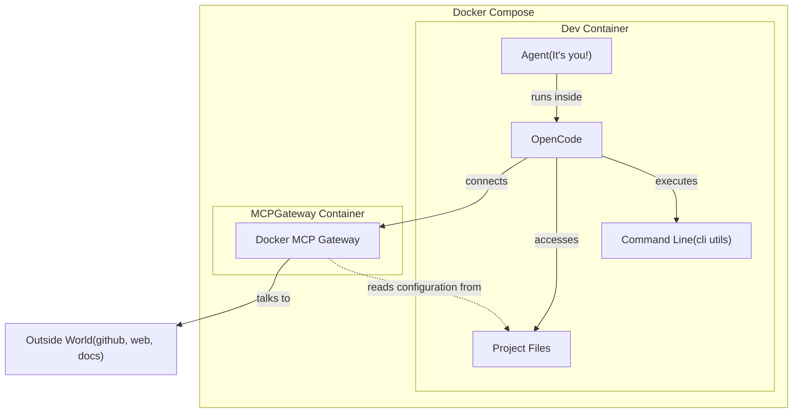

# PROJECT KNOWLEDGE BASE (edgent-smith)

**Generated:** 2026-06-20
**Commit:** a7ce51d
**Branch:** main

## World Model

Use this world model to effectively navigate any task.



## OVERVIEW
edgent-smith is a Python 3.13 agentic system built on pydantic-ai, featuring an issue-driven experiment loop and DevContainer-first development. It utilizes a multi-agent architecture involving GitHub Copilot custom agents, OpenCode subagents, and runtime edge agents.

## PROJECT STRUCTURE
```text
/workspace/
├── .devcontainer/      # Python 3.13 + Ollama sidecar configuration
├── .github/            # CI (DevContainer), Custom Agents, Prompt Templates, & Instructions
├── .opencode/          # OpenCode agent framework (agents, commands, skills, plugins - has scoped typescript ecosystem)
├── .agents/skills/    # Project-specific custom skills for pydantic-ai and other domains
├── agents/             # Core runtime agents (e.g., edge_agent.py) with inline tools
├── agent_utils/        # Utility scripts and tools for common agent tasks (e.g., notifications)
├── cli/                # Click-backed modular CLI entry point & command routing
│   ├── commands/       # Command logic modules
│   └── services/       # Shared stateless service layer
├── evals/              # Evaluation infrastructure and runner orchestration
├── experiments/        # State storage for manual/scripted experiment runs
├── scripts/            # Automation, CI helpers, and specialized task runners
├── tests/             # Comprehensive test suite covering CLI, agents, and evals
└── justfile           # Task execution interface (dev workflows, testing, linting)
```

## WHERE TO LOOK
| Task | Location | Notes |
|------|----------|-------|
| Core Agent Logic | `agents/` | runtime implementations of pydantic-ai agents. |
| CLI Commands | `cli/commands/` | All user-facing command logic and routing via Click. |
| Evaluation Setup | `evals/` | Runner configuration, smoke tests, and baseline data. |
| Workflow Config | `.github/workflows/` | CI automation and auto-research experiment triggers. |

## CODE MAP (Core)
The system is architected around high-centrality components in the following modules:

| Component | Type | Location | Role |
|-----------|------|----------|------|
| `edge_agent` | Agent Runtime | `agents/edge.py` | Primary agent executor with built-in tool access. |
| CLI Entrypoint | Interface | `cli/main.py` | Main Click entry point and command routing hub. |
| Evaluator | Test Runner | `evals/runner.py` | Orchestrates model benchmarks and baseline comparisons. |

## CONVENTIONS
- **Python 3.13**: Uses modern type annotations (e.g., `from __future__ import annotations`) and standard library features.
- **Click Architecture**: Strict separation between command routing (`cli/main.py`), logic (`commands/*.py`), and services (`services/*.py`).
- **Task Runner**: All primary workflows are exposed via the `just` CLI tool.
- **Environment Management**: Heavy reliance on DevContainers for consistent execution across local and CI environments.

## ANTI-PATTERNS (THIS PROJECT)
- **No `src/` layout**: Packages like `agents`, `cli`, and `evals` reside at the project root to simplify import resolution in certain runtimes.
- **Avoid manual venv activation**: Prefer `uv run <command>` or `just <recipe>` for all Python execution.
- **Do not duplicate command logic**: Shared setup must be moved to `cli/services/`.
- **No generic instructions**: Avoid adding standard documentation (e.g., "how to install python") in project files; use established standards if needed.

## UNIQUE STYLES
- **Instruction Files as Code**: Detailed development guidelines are codified in `.github/instructions/*.md` for strict compliance check by agents and contributors.
- **Dual Experiment Registry**: Distinct handling of CLI-managed experiments (`experiments/index.json`) versus script-run state files (`experiments/<issue>.state.json`).

## COMMANDS

just is the primary task runner for the project. There are multiple justfiles in the project scoped to different directories. Search for `find justfile **/justfile .*/justfile -maxdepth 3` to find them all and use `just --list` to see available recipes. The following are the most commonly used commands(for the root justfile):

```bash
# Core Workflows
just test                # Run the full unit test suite
just lint                 # Static analysis and formatting checks
just format               # Code auto-formatting (Ruff)
just typecheck            # Python type checking (Mypy/Pyright)

just --list                # List all available justfile recipes from directory where justfile is located
```

Use justfile that is located closer to the target directory for more specific commands. For example, `justfile` in `agent_utils/` contains recipes for executing agentic helpers.

## AGENT & WORKFLOW TAXONOMY

### Agents
- **pydantic-ai Agents (Runtime)**: Core execution agents implemented in `agents/` (e.g., `edge_agent`). They utilize the pydantic-ai framework for high-level reasoning and tool use.
- **OpenCode Agents (Framework)**: Framework-level agents managed by the `.opencode/` framework. They provide specialized agentic capabilities, including custom commands and skills, integrated with developer environments.

### Workflows
- **GitHub Workflows (CI/CD)**: Automated CI automation and research triggers defined in `.github/workflows/`. These handle continuous integration, linting, testing, and automated experiment triggers on GitHub's infrastructure.
- **Conductor Workflows (Orchestration)**: Complex, multi-stage orchestration workflows managed by the `scripts/conductor/` module. These coordinate specialized workers (Design, Discovery, Execution) to manage advanced agentic tasks and long-running processes.