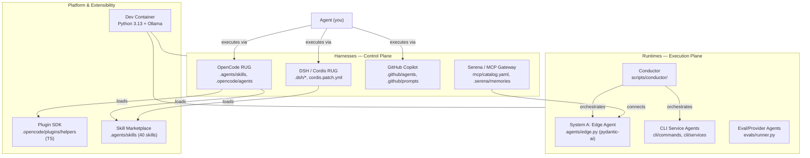

# PROJECT KNOWLEDGE BASE (edgent-smith)

**Generated:** 2026-06-20
**Commit:** a7ce51d
**Branch:** main
**Last verified:** 2026-09-05

## World Model

Use this world model to effectively navigate any task.


```mermaid
flowchart TB
    subgraph harnesses["Harnesses — Control Plane"]
        OpenCode["OpenCode RUG\n.agents/skills, .opencode/agents"]
        DSH["DSH / Cordis RUG\n.dsh/*, cordis.patch.yml"]
        Copilot["GitHub Copilot\n.github/agents, .github/prompts"]
        Serena["Serena / MCP Gateway\nmcp/catalog.yaml, .serena/memories"]
    end
    subgraph runtimes["Runtimes — Execution Plane"]
        EdgeA["System A: Edge Agent\nagents/edge.py (pydantic-ai)"]
        CLI["CLI Service Agents\ncli/commands, cli/services"]
        Evals["Eval/Provider Agents\nevals/runner.py"]
        Conductor["Conductor\nscripts/conductor/"]
    end
    subgraph platform["Platform & Extensibility"]
        DevContainer["Dev Container\nPython 3.13 + Ollama"]
        PluginSDK["Plugin SDK\n.opencode/plugins/helpers (TS)"]
        Skills["Skill Marketplace\n.agents/skills (40 skills)"]
    end
    Agent["Agent (you)"] -- executes via --> OpenCode
    Agent -- executes via --> DSH
    Agent -- executes via --> Copilot
    Conductor -- orchestrates --> EdgeA
    Conductor -- orchestrates --> CLI
    OpenCode -- loads --> PluginSDK
    OpenCode -- loads --> Skills
    DSH -- loads --> Skills
    Serena -- connects --> EdgeA
    DevContainer --- harnesses
    DevContainer --- runtimes
    DevContainer --- platform
```

## OVERVIEW

edgent-smith is a Python 3.13 agentic system built on pydantic-ai, featuring an issue-driven experiment loop and DevContainer-first development. It spans 10 distinct agent/workflow systems across 4 harness planes and 3 runtime planes — see Taxonomy and System Boundaries below for ownership. The architecture separates harness-free execution (System A) from harness-native orchestration (System B), with shared platform services (MCP, skills, plugins) mediating both.

## PROJECT STRUCTURE

```text
/workspace/
├── .devcontainer/      # Python 3.13 + Ollama sidecar configuration
├── .dsh/               # DeepSeek harness: agent-presets, child-runtime/cordis.yml, cordis.patch.yml, settings.yaml
├── .github/            # CI (DevContainer), Custom Agents (.github/agents/*.agent.md), Prompts, Instructions
├── .opencode/          # OpenCode RUG framework: agents/rug.md, plugins/helpers (TS SDK), instructions, skills-loader
├── .agents/skills/     # Skill marketplace — 40 skills (pydantic-ai, testing, docker, etc.)
├── .serena/memories/   # Serena persistent typed memories (gateway-mediated)
├── mcp/catalog.yaml    # MCP Gateway catalog — 9 servers (tavily, serena, github, fetch, etc.)
├── agents/             # System A: Custom Pydantic Orchestrator — edge.py (harness-free)
├── config.py           # System A config — env + model settings (root)
├── agent_utils/        # Utility scripts for agent tasks (notifications)
├── cli/                # CLI Service Agents — main.py, commands/, services/ (stateless layer)
├── evals/              # Evaluation/Provider Agents — runner.py, baselines, smoke tests
├── experiments/        # State storage: index.json (CLI) + <issue>.state.json (script)
├── scripts/conductor/  # Conductor scaffold — Python workers (YAML planned)
├── tests/              # Comprehensive test suite covering CLI, agents, and evals
└── justfile            # Task execution interface (dev workflows, testing, linting)
```

## WHERE TO LOOK

| Task | Location | Notes |
|------|----------|-------|
| System A — Edge Agent (pydantic-ai) | `agents/edge.py`, `config.py` (root) | Harness-free runtime; pyproject.toml pydantic-ai dep |
| System B — DSH / Cordis RUG | `.dsh/`, `cordis.patch.yml`, `child-runtime/cordis.yml` | Harness-native; DeepSeek RUG profiles |
| OpenCode RUG Framework | `.opencode/agents/rug.md`, `.opencode/plugins/` | RUG orchestration + TS plugin SDK |
| GitHub Copilot Agents | `.github/agents/*.agent.md`, `.github/prompts/` | Custom agents + prompt templates |
| Conductor Workflows | `scripts/conductor/` | Scaffold — Python workers (YAML planned) |
| CLI Service Agents | `cli/main.py`, `cli/commands/`, `cli/services/` | Click routing → logic → stateless services |
| Evaluation / Providers | `evals/runner.py` | Benchmarks, baselines, smoke tests |
| Serena / MCP Gateway | `mcp/catalog.yaml`, `.serena/memories/` | 9 MCP servers; gateway-mediated memories |
| Plugin SDK (TS Harness) | `.opencode/plugins/helpers/`, `*.ts` | Harness internals; not runtime code |
| Skill Marketplace | `.agents/skills/` | 40 skills; use `find-skills` before creating |

## CODE MAP (Core)

The system is architected around high-centrality components in the following modules:

| Component | Type | Location | Role |
|-----------|------|----------|------|
| `edge_agent` | Agent Runtime (A) | `agents/edge.py` | Primary pydantic-ai executor with inline tools |
| `edge_config` | Config | `config.py` (root) | System A settings; env + model config |
| CLI Entrypoint | Interface | `cli/main.py` | Click entry point and command routing hub |
| CLI Services | Service Layer | `cli/services/` | Shared stateless services for commands |
| Evaluator | Test Runner | `evals/runner.py` | Orchestrates model benchmarks and baselines |
| Conductor Orchestrator | Workflow Engine | `scripts/conductor/` | Scaffold — Python workers (YAML planned) |
| MCP Gateway | Platform | `mcp/catalog.yaml` | 9-server catalog; Docker MCP Gateway config |

## CONVENTIONS

- **Python 3.13**: Uses modern type annotations (`from __future__ import annotations`) and standard library features.
- **Click Architecture**: Strict separation between command routing (`cli/main.py`), logic (`commands/*.py`), and services (`services/*.py`).
- **Task Runner**: All primary workflows are exposed via the `just` CLI tool.
- **Environment Management**: Heavy reliance on DevContainers for consistent execution across local and CI environments.
- **Serena Gateway:** Snapshot 2 KB before every `gateway_mcp-exec`; on empty `content:[]` fall back immediately to `bash cat .serena/memories/<id>.md` with 0 retries; every `list_memories` must be followed by `read_memory` before responding — see `.opencode/instructions/serena-gateway.instructions.md`.

## ANTI-PATTERNS (THIS PROJECT)

- **No `src/` layout**: Packages like `agents`, `cli`, and `evals` reside at the project root to simplify import resolution in certain runtimes.
- **Avoid manual venv activation**: Prefer `uv run <command>` or `just <recipe>` for all Python execution.
- **Do not duplicate command logic**: Shared setup must be moved to `cli/services/`.
- **No generic instructions**: Avoid adding standard documentation (e.g., "how to install python") in project files; use established standards if needed.

## UNIQUE STYLES

- **Instruction Files as Code**: Detailed development guidelines are codified in `.github/instructions/*.md` for strict compliance check by agents and contributors.
- **Dual Experiment Registry**: Distinct handling of CLI-managed experiments (`experiments/index.json`) versus script-run state files (`experiments/<issue>.state.json`).

## COMMANDS

just is the primary task runner for the project. There are multiple justfiles in the project scoped to different directories. Search for `find justfile **/justfile .*/justfile -maxdepth 3` to find them all and use `just --list` to see available recipes. The following are the most commonly used commands(for the root justfile):

```bash
# Core Workflows
just test                # Run the full unit test suite
just lint                 # Static analysis and formatting checks
just format               # Code auto-formatting (Ruff)
just typecheck            # Python type checking (Mypy/Pyright)

just --list                # List all available justfile recipes from directory where justfile is located
```

Use justfile that is located closer to the target directory for more specific commands. For example, `justfile` in `agent_utils/` contains recipes for executing agentic helpers.

## AGENT & WORKFLOW TAXONOMY

10 distinct systems across harnesses, runtimes, and platform layers.

### Agents (6)

- **System A — Custom Pydantic Orchestrator (harness-free)**: `agents/edge.py`, `config.py` (root); pyproject.toml `pydantic-ai`; no harness config; direct Python execution.
- **System B — DeepSeek Harness / Cordis RUG (harness-native)**: `.dsh/*`, `cordis.patch.yml`, `child-runtime/cordis.yml`; RUG profiles via DSH.
- **OpenCode RUG Framework**: `.opencode/agents/rug.md`, `rug-swe.md`, `rug-team-coach.md`; plugins + instructions; harness-native.
- **GitHub Copilot Custom Agents**: `.github/agents/*.agent.md` (`brainstorm`, `edge-architect`, `implement`); prompt templates in `.github/prompts/`.
- **CLI Service Agents**: `cli/main.py`, `cli/commands/`, `cli/services/`; Click-based; stateless service layer.
- **Evaluation / Provider Agents**: `evals/runner.py`; benchmark and baseline comparison runners.

### Workflows & Platforms (4)

- **Conductor Multi-Agent Workflows**: `scripts/conductor/`; scaffold — Python workers (YAML planned); human-in-the-loop gates.
- **Serena / MCP Gateway Ecosystem**: `mcp/catalog.yaml` (9 servers), `.serena/memories/`; symbol search, gateway-mediated memory.
- **OpenCode Plugin SDK**: `.opencode/plugins/helpers/`, `*.ts`; TypeScript harness internals; quality-gate enforcers, loaders.
- **Skill Marketplace**: `.agents/skills/` (40 skills); modular capabilities; discover via `find-skills` before creating.

## SYSTEM BOUNDARIES & OWNERSHIP

| # | System | Harness? | Config Root | Delegates via | Forbidden |
|---|--------|----------|-------------|---------------|-----------|
| 1 | Custom Pydantic Orchestrator (A) | No | `agents/`, `pyproject.toml` | Direct Python import | Do not add `.dsh` or `.opencode` config |
| 2 | DeepSeek / Cordis RUG (B) | Yes — DSH | `.dsh/`, `cordis.patch.yml` | `dsh` CLI + Cordis RUG | Do not edit `agents/` for harness logic |
| 3 | OpenCode RUG Framework | Yes — OpenCode | `.opencode/agents/`, `.opencode/plugins/` | `opencode` CLI + plugins | Do not duplicate DSH profiles here |
| 4 | GitHub Copilot Agents | Yes — Copilot | `.github/agents/`, `.github/prompts/` | Copilot Chat agent picker | Do not add runtime code; prompts only |
| 5 | Conductor Workflows | Yes — Conductor | `scripts/conductor/` | `conductor` YAML + CLI | Do not bypass via direct `agents/` calls |
| 6 | CLI Service Agents | No | `cli/` | `click` + `just` recipes | Do not duplicate logic; use `cli/services/` |
| 7 | Evaluation / Provider | No | `evals/` | `evals/runner.py` | Do not mix with `agents/` runtime |
| 8 | Serena / MCP Gateway | Yes — Gateway | `mcp/catalog.yaml`, `.serena/` | `gateway_mcp-*` tools | Never `read`/`ls` `.serena/memories/*` directly |
| 9 | OpenCode Plugin SDK | Yes — OpenCode | `.opencode/plugins/helpers/` | TypeScript plugin API | Do not import into Python runtime |
| 10 | Skill Marketplace | No (shared) | `.agents/skills/` | `skill` loader | Do not create skill without `find-skills` |

## TERMINOLOGY

| Term | Definition |
|------|------------|
| **Harness** | Control-plane framework that loads, scopes, and enforces agent behavior (e.g., OpenCode, DSH/Cordis, Copilot, Conductor). |
| **Runtime** | Execution-plane code that runs outside a harness (e.g., System A `agents/edge.py`); imported directly. |
| **RUG** | Reusable agent workflow — a harness-native orchestration pattern; always qualify which harness. |
| **System A** | Custom Pydantic Orchestrator — harness-free; `agents/`, `pydantic-ai` in `pyproject.toml`. |
| **System B** | DeepSeek Harness / Cordis RUG — harness-native; `.dsh/`, `cordis.patch.yml`. |
| **Edge Agent** | System A runtime agent (`agents/edge.py`) with inline pydantic-ai tools. |
| **Serena Memory** | Typed persistent memory in `.serena/memories/`; access only via `serena` MCP gateway. |
| **Skill** | Modular capability in `.agents/skills/<name>/`; loaded via skill loader; not an agent. |

**Anti-confusion rules:**

- Always qualify **RUG** — say `OpenCode RUG` vs `DSH RUG (Cordis)`; never bare "RUG".
- Always qualify **System** — say `System A (harness-free)` vs `System B (harness-native)`; never bare "system".
- Always qualify **Agent** — say `runtime agent` vs `harness agent` vs `Copilot agent`; never bare "agent" when ownership matters.

## VALIDATION

Verify AGENTS.md topology stays in sync with the repo. Run these grep gates from `/workspace`:

```bash
# 1. System A exists (harness-free runtime)
grep -R "pydantic-ai" pyproject.toml && ls agents/edge.py config.py
# 2. System B exists (harness-native DSH)
ls .dsh/cordis.patch.yml .dsh/child-runtime/cordis.yml 2>/dev/null || ls .dsh/*.yml
# 3. OpenCode RUG exists
ls .opencode/agents/rug.md .opencode/plugins/helpers
# 4. Copilot agents exist
ls .github/agents/*.agent.md
# 5. Conductor exists
ls scripts/conductor/
# 6. MCP catalog + Serena memories (gateway only)
ls mcp/catalog.yaml && grep -c "  type:" mcp/catalog.yaml  # expect 9 servers
# 7. Skill marketplace count
ls .agents/skills/ | wc -l  # expect 40
```
