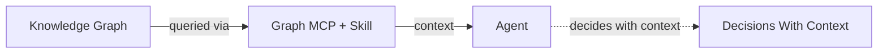
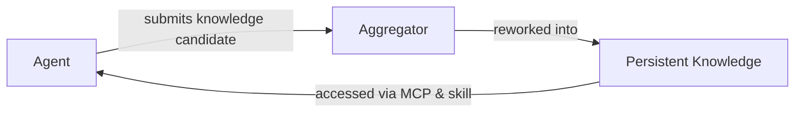
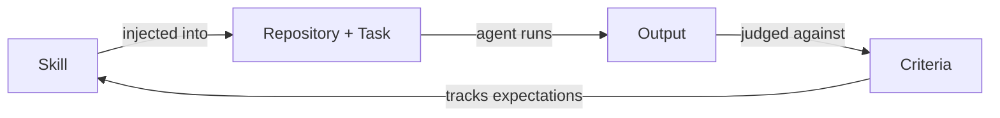
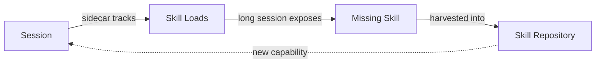
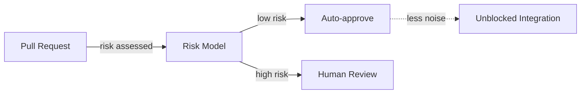
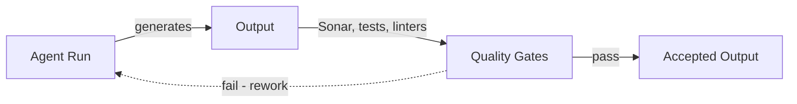
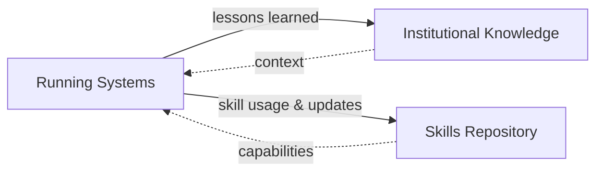
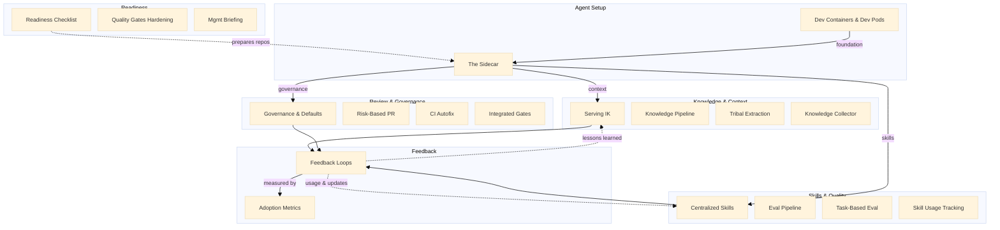

# AI Adoption

*Making AI Adoption Work*

> **Disclaimer**
>
> - Content may not reflect [Company]'s complete context.
> - I made it to explore how to scale AI adoption and help increase the ROI from it.

---

## Where [Company] Stands

*Current State Snapshot*

### Middle Management

- Do middle managers understand their role in AI adoption?

### Signals & Measurements

- What is the direction of eNPS?
- What is the current change lead time?

### Adoption Horizon

- What is the current top prio/initiative?
- Who champions the adoption?

---

## Observations & Risks Found

*What slows AI adoption at [Company] down*

| Observation | What it looks like | How it's proven | Why it matters |
|---|---|---|---|
| **PR Review Noise** | Each PR collects peer review, SonarCloud audit, non-actionable AWS security-agent feedback, lint, and tests | Alerts and bot comments per PR keep climbing; change lead time grows while reviewers approve unread and click resolve to unblock merges | Integration slows down; resolving becomes the path of least resistance, so compliance checks stop meaning anything |
| **Slop** | PRs and task requirements carry slop: low-quality AI-generated content, growing volume, growing size | Average PR size trends above baseline; comment counts land at extremes, near-zero or flooded; eNPS drifts down as cleanup piles up | Output quality declines; fighting slop daily feeds resistance to AI adoption |
| **No Agent Portability & Isolation** | Agents run only where someone manually configured them, on individual developer machines; every agent needs hands-on setup | Environments take days to build, reproduce, install, and configure; no two developers' setups match; zero agent runs outside laptops | Agents cannot scale beyond developer machines; unguarded machines risk runaway agents |
| **Silos** | Teams sit at visibly different adoption stages; each picks its own pace and tooling, and nobody shares a bar for progress | Teams rebuild the same tools, MCP configs, and skills across the org | Nobody builds the paved road; effort is duplicated, and lessons do not travel between teams |
| **One-Off Agent Environments** | Agent environments are one-offs — they do not represent a system | Everyone configures own agentic env | Hard to maintain, learn from mistakes, evolve, audit and fix |
| **Missing Unified Roadmap** | No roadmap tells teams the next step, how far they have come, or whether they move the right way | Adoption activity spikes during workshops and dies right after; people switch to passive mode, and skills appear only when a workshop forces them | Effort does not compound; momentum dies between events, so today's PR and quality bottlenecks persist |
| **Decisions Without Knowledge** | Institutional knowledge doesn't power better decisions — agents can't validate plans against the architecture or judge architectural decisions | ADRs exist but aren't integrated with agents | Plans drift from the architecture; architectural decisions go unjudged |
| **Cross-Domain Ownership Blur** | AI lowers the bar to jump between stacks — frontend, backend, Jenkins, and infra land in the same PRs, and no one owns the boundaries | Mixed PRs with cross-stack changes; confusion about who owns major codebase areas | Blurred responsibility — PRs get merged by people who don't fully understand every part they touch |
| **AI Fatigue & Social Erosion** | The push to "use AI" is wearing people down — AI-generated ad-hoc text, project stories, and automated replies clutter channels and erode trust | Devs report being tired of the AI message; channel signal is drowning in AI-generated noise | Noise drowns signal — trust and collaboration norms erode, and the adoption message stops landing |
| **Technology & Language Inequality** | AI value is uneven across stacks — big wins in TypeScript and Python; legacy, specialized, and low-level stacks see little of it | AI assisted coding receives negative estimate from non-mainstream langs devs; active resistance from older, experienced engineers | Uneven adoption — the engineers with the deepest context resist a change AI can't serve |

---

## Ideas

*Components of systematic AI adoption*

### Knowledge and Context

| Idea | Addresses | Implementation | Outcome |
|---|---|---|---|
| **Serving Institutional Knowledge** | Decisions Without Knowledge | • Knowledge graph parses ADRs, post-mortems, lessons; Agents query via graph MCP + navigation skill | Every decision carries the institution's context |
| **Knowledge Pipeline** | Decisions Without Knowledge | • Agents submit knowledge candidates in real time; Aggregator reworks them into persistent knowledge; Returned to agents via MCP & skill | The knowledge base never goes stale |
| **Tribal Knowledge Extraction** | Decisions Without Knowledge | • Sidecar aggregates sessions, extracts lessons; Splits project-local vs exportable knowledge | Tribal knowledge leaves heads and enters the loop |
| **Knowledge Collector** | Decisions Without Knowledge | • Scans PRs, distill discussions, documents for improvement ideas; Gathers from project management and running agents | Knowledge grows from PRs, discussions, and agent sessions |

Serving Institutional Knowledge:

Knowledge Pipeline:

### Agent Setup

| Idea | Addresses | Implementation | Outcome |
|---|---|---|---|
| 📌 **Agent Infrastructure — the Sidecar** | Silos · One-Off Agent Environments · Plugin Distribution & Adoption Gap | • Sidecar is the shared optimization layer; Synchronizes installs, governs config, injects context; Tracks and updates skills; optional PII filter | The same baseline, everywhere, maintained as a system |
| 📌 **Dev Containers & Dev Pods** | No Agent Portability & Isolation | • Dev containers — reproducible, stateless local env; Dev pods run the same env in the cloud | Agents run and scale beyond dev machines — isolated, full tool access |

### Skills & Quality

| Idea | Addresses | Implementation | Outcome |
|---|---|---|---|
| **Centralized Skills Repository** | Slop · Technology & Language Inequality | • Crawls existing skills into one overview; Surfaces duplication; skills keep scoped isolation | Every skill in one place — current, visible, no duplicates |
| 📌 **Skill Evaluation Pipeline** | Slop | • Every skill and skill change runs evaluations; Linters, task-based evals, performance vs expectations | Slop never ships — every skill change runs the gates |
| **Task-Based Skill Evaluation** | Slop | • Inject skill into repository + task; Run agent, judge output against criteria | Every skill proves itself on real tasks |
| 📌 **Skill Usage Tracking & Harvesting** | Slop | • Sidecar tracks which skills load and how often; Mines long sessions for missing skills, harvests them | The toolbox grows from real usage |

Task-Based Skill Evaluation:

Skill Usage Tracking & Harvesting:

### Readiness

| Idea | Addresses | Implementation | Outcome |
|---|---|---|---|
| 📌 **Repository Readiness Checklist** | Missing Unified Roadmap | • Checklist: assess, containers, skill sync & CI, agents, knowledge; Supplied as an evolving skill — starts small, grows | Every repo ends ready for agents — path spelled out |
| 📌 **Quality Gates Hardening** | Missing Unified Roadmap | Tests & coverage, mutation tests, linters tracking complexity | Adopted AI meets the same bar as shipped code |
| 📌 **Middle Management Briefing** | Missing Roadmap · AI Fatigue & Social Erosion | • Briefings on system, roadmap, evals & skills; Dev containers & dev pods — how agent environments work; Retrospectives to improve DX; guidance for high-value adoption | Managers understand the system — and back it |

### Review & Governance

| Idea | Addresses | Implementation | Outcome |
|---|---|---|---|
| **Governance & Defaults** | PR Review Noise · Cross-Domain Ownership Blur | • Sidecar regulates actions — which run, which need permission; Learns acceptable risk per project; prompts only when needed | Safe by default — humans step in only when it matters |
| **Risk-Based PR Review** | PR Review Noise | Auto-approve low-risk changes; flag high-risk for proper review | Reviewers see only what needs human eyes |
| 📌 **CI Autofix** | PR Review Noise | Standalone dev pod agent reacts to CI messages, applies fixes | CI failures fix themselves — no human round-trip |
| **Integrated Quality Gates** | PR Review Noise · Spec-Driven Trajectory Deviation | • Sonar, tests, linters run inside every agent run; Unavoidable — pre-commit hook on every generation | Every agent output runs the gates — no skipping |

Risk-Based PR Review:

Integrated Quality Gates:

### Feedback

| Idea | Addresses | Implementation | Outcome |
|---|---|---|---|
| 🚧 **Feedback Loops** | Ties Ideas Together | • Skill usage & updates feed the repository; Lessons learned feed institutional knowledge | Every run feeds knowledge and skills |
| **Adoption Metrics** | Ties Ideas Together | • Rework rate, acceptance rate, PR lead time & velocity; Attention & friction balance — fewest clicks, block only high risk | Adoption is measured — metrics prove the ideas work |

Feedback Loops:

### Closing

#### How It All Fits Together

Every subsystem feeds the others — the loop closes.

Environments → Infrastructure → Knowledge, Skills & automation → Feedback → back to Knowledge & Skills.

#### Prioritized Roadmap

*Highest value first:*

1. Agent Environments — dev pods & dev containers
2. Agent Infrastructure — the sidecar
3. Institutional Knowledge — knowledge graph & tribal extraction
4. Skills Subsystem — centralized repository & evaluation
5. Repository Readiness — onboarding checklist
6. Supporting Subsystems — CI Autofix · Governance & PR Review
7. Feedback Loops

---

## Share your thoughts!

- What applies to [Company]?
- What blockers you see?

---

## System Diagram

```mermaid
%%{init: { "theme": "base", "themeVariables": { "fontSize": "16px" } } }%%
flowchart TB

classDef risk fill:#7f1d1d,stroke:#fca5a5,color:#fef2f2
classDef issue fill:#7f1d1d,stroke:#fca5a5,stroke-dasharray:5 5,color:#fef2f2
classDef solution fill:#14532d,stroke:#86efac,color:#f0fdf4
classDef default fill:#123f7a,stroke:#64b5f6,color:#eaf2ff
classDef resource fill:#4a148c,stroke:#ce93d8,color:#f3e5f5
classDef action fill:#006064,stroke:#4dd0e1,color:#e0f7fa
classDef gate fill:#b45309,stroke:#fcd34d,color:#fffbeb
classDef gap fill:#37474f,stroke:#90a4ae,color:#eceff1,stroke-dasharray:5 5
classDef chain fill:#f9c74f,stroke:#b45309,stroke-width:3px,color:#1f2937

subgraph risks [Bottlenecks and Risks Found]
    risk-silos{{"Silos"}}:::risk
    risk-slop{{"Slop"}}:::risk
    risk-pr-bottleneck{{"PR Review Noise"}}:::risk
    risk-oneoff{{"One-off environments"}}:::risk
    risk-unisolated{{"No Agent Portability & Isolation"}}:::chain
    risk-ownership{{"Cross-Domain Ownership Blur"}}:::risk
    risk-fatigue{{"AI Fatigue & Social Erosion"}}:::risk
    risk-inequality{{"Technology & Language Inequality"}}:::risk
    risk-spec{{"Spec-Driven Trajectory Deviation"}}:::risk
    risk-plugin-dist{{"Plugin Distribution & Adoption Gap"}}:::risk
    shared-defaults(["Shared defaults"]):::solution
end

subgraph people [People and Adoption Drivers]
    coding-agents(("Coding agents")):::gap
    people-dev(("Developers")):::gap
    people-stakeholders(("Non-technical stakeholders")):::gap
    people-managers(("Middle managers")):::gap
    people-champions(("AI champions")):::gap
end

subgraph envs [1. Agent Environments]
    dev-containers("Dev containers"):::chain
    dev-pods("Dev pods (remote)"):::chain
end

subgraph infra [2. Agent Infrastructure - Sidecar]
    sidecar(["Sidecar / CLI"]):::solution
    sync-install("Sync and install")
    gov-defaults("Governance and defaults")
    agent-hooks("Agent hooks")
end

subgraph ik [3. Institutional Knowledge]
    knowledge-graph("Knowledge graph")
    ik-mcp("MCP access")
    ik-skill("IK navigation skill")
    aggregator("Aggregator")
    persistent-knowledge[("Persistent knowledge")]:::resource
    tribal-extraction("Tribal knowledge extraction")
end

subgraph skills [4. Skills Subsystem]
    skills-repo("Skills repository")
    crawler("Crawler")
    skill-isolation("Isolation and scoping")
    eval-pipeline("Evaluation pipeline")
    eval-skill[("Skill")]:::resource
    eval-repo-task("Repository and task")
    eval-output[/"Output"/]:::action
    eval-criteria[("Criteria")]:::resource
end

subgraph readiness [5. Repository Readiness]
    step-assess[/"1 Assess current state"\]:::gate
    step-devcontainers[/"2 Set up dev containers"\]:::gate
    step-sync-ci[/"3 Sync skills and CI"\]:::gate
    step-configure-agents[/"4 Configure coding agents"\]:::gate
    step-integrate-ik[/"5 Integrate institutional knowledge"\]:::gate
    gate-tests[/"Tests and coverage"\]:::gate
    gate-mutation[/"Mutation tests"\]:::gate
    gate-linters[/"Linters"\]:::gate
end

subgraph support [6. Supporting Subsystems]
    ci-autofix("CI autofix"):::chain
    governance("Governance"):::chain
    pr-review("PR review"):::chain
    ci-messages[("CI messages")]:::resource
end

subgraph feedback [7. Feedback Loops]
    feedback-hub(["Feedback loops"]):::solution
end

outcome-auto-pr[/"Automatic PR reviews and fixes"/]:::chain

risk-unisolated == partially isolated by ==> dev-containers
risk-unisolated == partially isolated by ==> dev-pods
dev-containers == no manual setup ==> people-dev
dev-pods == remote access ==> people-stakeholders
dev-pods == hosts ==> ci-autofix
ci-autofix == enables ==> outcome-auto-pr
pr-review == enables ==> outcome-auto-pr
governance == enables ==> outcome-auto-pr

dev-containers -->|foundation| sidecar
sidecar -->|context| knowledge-graph
sidecar -->|skills| skills-repo
sidecar -->|automation| ci-autofix
knowledge-graph --> feedback-hub
skills-repo --> feedback-hub
ci-autofix --> feedback-hub

step-assess --> step-devcontainers
step-devcontainers --> step-sync-ci
step-sync-ci --> step-configure-agents
step-configure-agents --> step-integrate-ik

eval-skill -->|injected into| eval-repo-task
eval-repo-task -->|agent runs| eval-output
eval-output -->|judged against| eval-criteria
eval-criteria -->|tracks expectations| eval-skill

coding-agents -->|submits candidates| aggregator
aggregator -->|reworked into| persistent-knowledge
persistent-knowledge -->|accessed via MCP and skill| coding-agents

risk-silos -->|solved by| shared-defaults
shared-defaults -->|includes| skills-repo
shared-defaults -->|includes| sidecar
shared-defaults -->|includes| step-assess
risk-slop -->|solved by task-based evaluation| eval-pipeline
risk-pr-bottleneck -->|solved by risk-based review| pr-review
risk-oneoff -->|solved by shared baseline| sidecar
risk-ownership -->|solved by permissioned defaults| governance
risk-fatigue -->|solved by measured adoption| feedback-hub
risk-inequality -->|solved by per-stack skills| skills-repo
risk-spec -->|solved by evaluated output| eval-pipeline
risk-plugin-dist -->|solved by synchronized installs| sidecar

sidecar -->|synchronizes MCP| ik-mcp
sidecar -->|sets up required skills| ik-skill
sidecar -->|extracts from sessions| tribal-extraction
sync-install -->|updates and syncs skills| skills-repo
agent-hooks -->|inject checks and context| coding-agents
gov-defaults -->|provides effective defaults| coding-agents
crawler -->|crawls and surfaces duplication| skills-repo
skills-repo -->|evaluates every change| eval-pipeline
skill-isolation -->|isolates and scopes| eval-pipeline

feedback-hub -.->|lessons learned| knowledge-graph
feedback-hub -.->|skill usage and updates| skills-repo

risk-silos -.->|lessons don't travel| knowledge-graph
risk-oneoff -.->|hinders learning from mistakes| knowledge-graph
governance -.->|learns acceptable risk| pr-review
ci-messages -.->|trigger| ci-autofix
persistent-knowledge -.->|stored in| knowledge-graph
tribal-extraction -.->|feeds| knowledge-graph
feedback-hub -.->|updated expectations| eval-criteria
feedback-hub -.->|evolves checklist| step-assess
feedback-hub -.->|evolves infrastructure| sidecar
gate-mutation -.->|same bar| eval-criteria
step-devcontainers -.->|activates| dev-containers
step-sync-ci -.->|activates| sync-install
step-configure-agents -.->|configures| coding-agents
step-integrate-ik -.->|integrates with| knowledge-graph
```

---

## Tech Stack — Open-Source Foundations

*One paved road for every team — agent-neutral picks, org-wide governance · verified against GitHub, Aug 2026.*

Method note: five research tracks; every repo checked live (license, stars, maintenance) on 2026-08-24; picks favor what the org already runs (GitHub + Copilot, DevContainers) and stay agent-neutral where team stacks differ — project-specific tools appear only as per-team options. Key caveats: Docker alone does not stop a prompt-injected agent holding credentials (a gVisor/microVM boundary is needed); Daytona went closed-source (2026-06) — avoid; cross-agent permission/hook compilers have no healthy OSS yet (checked Aug 2026); KùzuDB archived, Zep CE discontinued, Microsoft GraphRAG batch-shaped; openai/evals shuts down Nov 2026 — do not adopt; no healthy OSS CodeRabbit-class reviewer exists.

### Agent Environments

| Area | Pick |
|---|---|
| Local environments | Dev Container spec + Features — already the org baseline; devenv/Nix optional hermetic layer |
| Cloud dev pods | Coder (AGPL-3.0 · ~14k★ · very active) — self-hosted on [Company] infra; alt: DevPod (MPL-2.0 · ~15k★ · maintenance stalled) |
| Runaway-agent isolation | gVisor on Kubernetes (Apache-2.0 · ~19k★); alt: E2B sandboxes (Apache-2.0 · ~13k★) for untrusted-code APIs |
| One environment contract | Prebuilt OCI image via devcontainer CLI — one artifact consumed by VS Code, Coder templates, and CI |

### Sidecar — Infrastructure & Governance

| Area | Pick |
|---|---|
| Toolchain sync | devcontainer Features + mise pins inside the image — extends, not replaces, current setup |
| Config governance | Copilot org settings — org-wide custom instructions, custom agents served from /agents/*.md in the org .github repo, model policies; Claude Code managed-settings.json floors; AGENTS.md carries the shared baseline |
| Context & check injection | Git-carried AGENTS.md baseline (+ CLAUDE.md shim for Claude Code); per-agent hooks enforce checks — Claude Code managed deny rules are non-overridable; lefthook for git-level gates |
| Action regulation | Docker MCP Gateway interceptors (+ Cedar policy evaluator) — digest-pinned MCP catalog (catalog.yaml) + --block-secrets, deployed org-wide |
| Skill distribution | OCI artifacts with digest lockfile + cosign signing — mirrors gateway pinning discipline; SKILL.md reads natively in Copilot and Codex |
| PII filtering | Presidio (MIT · ~10k★) as a gateway after-interceptor |

### Institutional Knowledge

| Area | Pick |
|---|---|
| Knowledge graph + MCP | Graphiti (Apache-2.0 · ~30k★) over Neo4j CE (GPLv3) — built-in MCP server; both deployable via mcp/catalog.yaml; alt: LightRAG (MIT · ~39k★) |
| ADR source format | Current MADR-conformant ADR layout — frontmatter already machine-parseable; adr-tools/log4brains dormant, skip |
| Knowledge pipeline | Lightweight aggregation service merges candidates into the central graph-backed store via MCP — dedupe/merge is a bespoke build; implementation stack follows the platform team |
| Tribal extraction | Mine agent-session exports for lessons — project-local vs exportable split; session-mining OSS is early-stage everywhere |
| PR/discussion collector | github-mcp-server ingestion + PR-Agent distillation, both through the Gateway |

### Skills & Quality

| Area | Pick |
|---|---|
| Central repository | Org-level skills monorepo synced into repos by git — SKILL.md reads natively in Copilot and Codex; scoped isolation preserved |
| Duplication detection | Embedding-overlap scan (NVIDIA SkillEvaluator Tier-2 pattern, Apache-2.0) — tooling young; treat as recipe, not dependency |
| Skill linting | Spec/frontmatter lint in CI + bespoke negation-word rule — negation-heavy steering measured as top external-skill gap; no mature SKILL.md linter exists |
| Task-based evaluation | inspect-ai (Apache-2.0 · ~2.6k★) docker sandboxes + mini-swe-agent loop for Python-heavy teams; promptfoo (MIT · ~24k★) rubric gating for JS-heavy CI — output judged against versioned criteria either way |
| Usage tracking & harvesting | Langfuse (core MIT · ~33k★) self-hosted + thin per-agent plugins emitting skill-load spans; harvest missing-skill candidates from long-session queries |

Additional caveats: OTel GenAI semantic conventions still Development status mid-2026 — pin attribute names internally; pydantic-evals stays pilot-only until the first internal eval lands.

### Review, Automation & Metrics

| Area | Pick |
|---|---|
| Risk-based PR review | PR-Agent (MIT core · ~12k★) + CODEOWNERS/rulesets — low-risk paths auto-approved, high-risk paths force human review; alt: claude-code-action (MIT · ~8k★) |
| CI autofix | claude-code-action wired to failed workflow_run events; strategic end state: webhook-triggered agent on a dev pod |
| Always-on quality gates | pre-commit + per-agent file-write hook gates (Claude Code PreToolUse/PostToolUse hooks, Copilot review config, OpenCode plugins) — Sonar, tests, linters run on every generation, not just CI |
| Gate hardening | mutmut + StrykerJS (mutation), ruff PL/C90 + eslint complexity rules, coverage.py + vitest |
| Adoption metrics | Apache DevLake (Apache-2.0, graduated) — DORA, rework rate, lead time on self-hosted Grafana; Copilot metrics API supplies AI acceptance rates |
| Feedback loop wiring | Langfuse traces + DevLake metrics feed the aggregator → knowledge graph & skills repo |

Dead ends verified this round: Sweep (stale), four-keys (archived 2024), llm-guard (archived 2026), Phoenix license caveat (Elastic v2).
