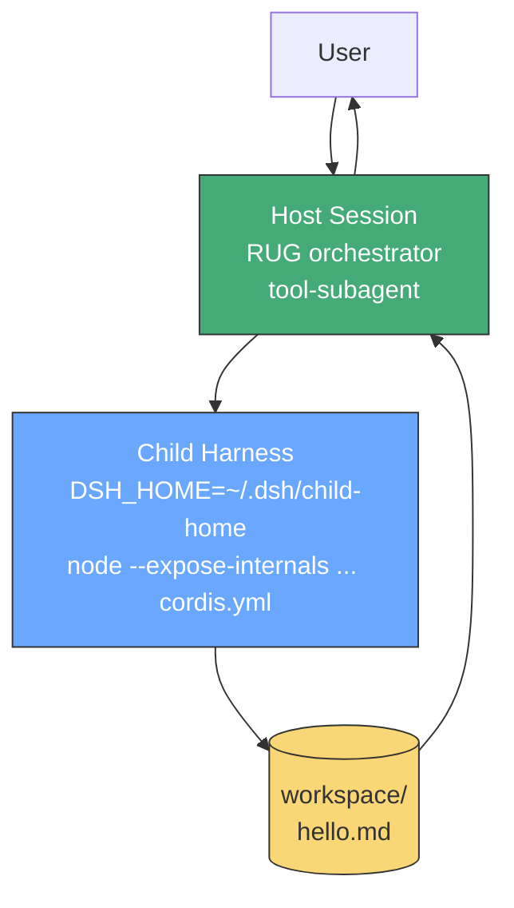

> Part of [DeepSeek Harness Guide](index.md) — L1 · 5-min run

# Quickstart — 5 Minutes to First Worker

> L1 · Run a worker without reading the rest.

Host = orchestrator (RUG preset). Child = worker (child-runtime). Handoff = `workspace/*.md`.

---

## Trimmed diagram



Full diagram → [02-architecture.md](02-architecture.md).

---

## Day-0 — 5 steps (harness-native)

```bash
# 1. Verify bind + child-runtime pinned
ls .dsh/cordis.patch.yml .dsh/child-runtime/cordis.yml .dsh/.agent-presets/rug/
cat .dsh/child-runtime/package.json  # pinned @deepseek-ai/dsh-sdk-jsonrpc-demo

# 2. Child-runtime + provider register automatically via container postStart (no manual pnpm needed; runtime is ~/.dsh/ after first boot, DSH_HOME default ~/.dsh)
# Restart host so subagent-dsh-sdk provider registers — automatic on container start (container rebuild or host restart)
# Note: provider ships in web profile; headless lacks it by default

# 3. Verify preset (orchestrator = host session)
ls .dsh/.agent-presets/rug/  # DOT USER_PRESET_DIR per lib/index.js:851 + includeUserRoot:true — dsh --dump-config registers it
dsh --profile web --dump-config | grep -E "agent-presets|subagent-dsh-sdk"
dsh --profile web --help  # --profile is required; shows web app flags

# 4. Dry run: orchestrator delegates, not implements (web works today)
dsh --profile web "Create workspace/hello.md with 'hello' via a worker. Do not implement yourself."
# Headless alternative requires provider install:
# pnpm --dir ~/.dsh/profiles/headless add @deepseek-ai/dsh-subagent-dsh-sdk@0.1.1-rc.2
# dsh --profile headless "Create workspace/hello.md with 'hello' via a worker. Do not implement yourself."

# 5. Inspect handoff (both use harness tool-fs / tool-bash)
ls workspace/hello.md
ls ~/.dsh/sessions/  # per-session dirs under HOME (not repo .dsh/)
ls ~/.dsh/storages/  # attachment persistence under HOME
```

> Repo `.dsh/` is template; runtime writes to `~/.dsh/` via `DSH_HOME` default `~/.dsh`. See [02-architecture.md](02-architecture.md) §2.4.

---

## Exit criteria

| Check | Must be true |
|-------|--------------|
| Orchestrator surface | `subagent` via persona, no direct `tool-bash` |
| Worker write | `workspace/hello.md` via child `tool-fs` |
| Validation | Separate validation worker judges gaps |
| Persistence | Per-session dirs under `~/.dsh/sessions/` |
| Isolation | Sandbox denies outside `workspace/` |

All checks pass → proceed to [02-architecture.md](02-architecture.md).

---

## What next

- Architecture detail → [02-architecture.md](02-architecture.md)
- Tools + models → [03-tool-separation.md](03-tool-separation.md)
- Workflows → [04-workflows.md](04-workflows.md)

---

← [Index](index.md) · [Next: Architecture →](02-architecture.md)
