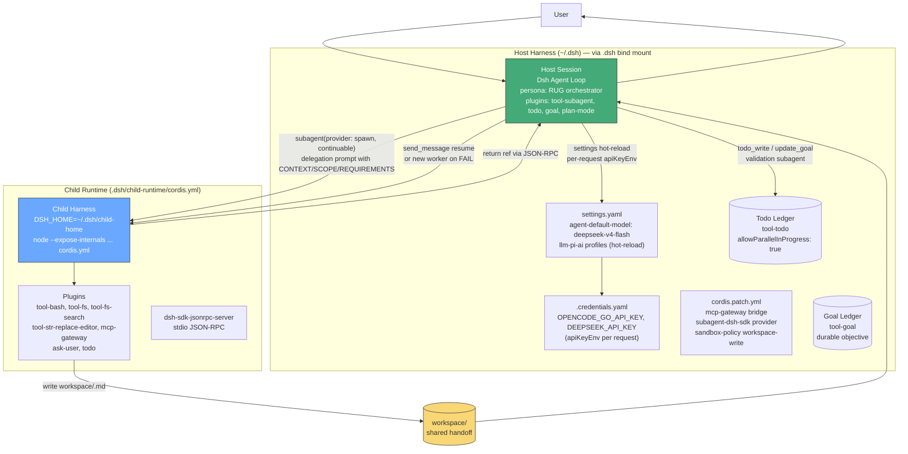

> Part of [DeepSeek Harness Guide](index.md) — L2 · Architecture

# Architecture — Host + Child

> L2 · Full harness composition.

Both agents run inside DeepSeek Harness. Tools are Cordis plugin IDs only.

---

## 2.1 Diagram — full Host + Child

No Python process, no external factory. Isolation = persona + process boundary + Landlock.

Excerpt version → [01-quickstart.md](01-quickstart.md).

---

## 2.2 Roles

| Role | Harness entity | Process | Cordis source | Delegation primitive |
|------|---------------|---------|---------------|----------------------|
| Orchestrator | Host session | Host DSH agent loop | `.dsh/.agent-presets/rug/agent.cordis.yml` + `cordis.patch.yml` | `subagent` (`provider: spawn`, `backgroundMode: continuable`) |
| Worker | Child harness | `node --expose-internals .../dsh-sdk-jsonrpc-demo/lib/bin.js ... cordis.yml` | `.dsh/child-runtime/cordis.yml` | `dsh-sdk-jsonrpc-server` stdio |

---

## 2.3 Shared surface

File-based handoff only. Workers publish `workspace/<task_id>.md` (atomic `tmp + rename` via `tool-fs`); orchestrator reads `artefact_ref` + summary lazily; consolidator writes `workspace/final.md`. Long runs persist `experiments/<id>.state.json` with `{goal, specs, results, consolidated_ref, gaps}` — both roles use same schema via `tool-fs`.

Env and gateway shared via harness plugins: `apiKeyEnv` per request, `mcp-gateway` plugin `@deepseek-ai/dsh-mcp-client` at `http://mcp_gateway:8080/mcp`.

See model wiring → [03-tool-separation.md](03-tool-separation.md) §5.3 host routing.

---

## 2.4 File inventory — `.dsh/*` template vs `~/.dsh/*` runtime

Repo `.dsh/` is template; runtime writes to `~/.dsh/` via `DSH_HOME` default `~/.dsh` (bind `../.dsh:/home/vscode/.dsh` in `.devcontainer/docker-compose.yml`).

| Path | Lines / Notes | Role |
|------|---------------|------|
| `.dsh/settings.yaml` | 71L — `llm-pi-ai.providers` (opencode-go, openrouter, local), `agent-default-model: {provider: opencode-go, model: deepseek-v4-flash}`, hot-reloaded | Model routing; web Models page writes here |
| `.dsh/cordis.patch.yml` | 95L — home patch: `tool-bash`/`tool-fs`/`tool-fs-search`/`tool-str-replace-editor` enabled, `mcp-gateway` insert, `subagent-dsh-sdk` provider (`node --expose-internals .../dsh-sdk-jsonrpc-demo/lib/bin.js ... cordis.yml`, `DSH_HOME=~/.dsh/child-home`) | Host composition |
| `.dsh/child-runtime/cordis.yml` | 465L — full child: `dsh-llm`, `dsh-session`, `dsh-session-persistence-jsonl` (`root: sessions`), `dsh-attachment-local`, `sandbox-policy` (`mode: workspace-write`), `bash-sandbox`/`fs-sandbox`, `dsh-tool-bash`/`dsh-tool-fs`/`dsh-tool-fs-search`, `dsh-mcp-client`, `dsh-sdk-jsonrpc-server` | Child composition; pinned via `.dsh/child-runtime/package.json` + `pnpm-lock.yaml` (no repo-root package.json) |
| `.dsh/.agent-presets/rug/preset.yml` | 6L — `name: RUG Mode`, `description: Repeat Until Good ...`, `order: 5` | Preset identity (DOT USER_PRESET_DIR, PRIMARY authority: lib/index.js:851) |
| `.dsh/.agent-presets/rug/agent.cordis.yml` | 351L — persona cardinal rule, `tool-todo`/`tool-goal`/`plan-mode`/`tool-subagent` (`provider: spawn`, `continuable`), `skill-filesystem`, compaction | RUG doctrine (DOT USER_PRESET_DIR, PRIMARY authority: lib/index.js:851) |
| `.dsh/.credentials.yaml` | 117B gitignored — `OPENCODE_GO_API_KEY`, `DEEPSEEK_API_KEY` | Secrets; `apiKeyEnv` per request |
| `.dsh/.env` | `LOCAL_GATEWAY_API_KEY=local` dummy | Local gateway |
| `.dsh/child-runtime/package.json` + `pnpm-lock.yaml` | Pin `@deepseek-ai/dsh-sdk-jsonrpc-demo`, `dsh-mcp-client` | Reproducible child |
| `.devcontainer/docker-compose.yml` | Single bind `../.dsh:/home/vscode/.dsh` + `opencode_data` volume | Live `~/.dsh` without `EBUSY` |
| `~/.dsh/sessions/<id>/` / `~/.dsh/storages/` | Gitignored under HOME (not repo `.dsh/sessions/`); per-session dirs, no flat `sessions.jsonl` | Session persistence |

Web vs headless: `subagent-dsh-sdk` provider ships in `web` profile and installs automatically via container postStart. Headless still requires `pnpm --dir ~/.dsh/profiles/headless add @deepseek-ai/dsh-subagent-dsh-sdk@0.1.1-rc.2` before `dsh --profile headless "task"` works; use `dsh --profile web` by default.

No `agents/` or Python factory in this inventory. Provider canonical → [03-tool-separation.md](03-tool-separation.md) §5.3.

---

← [Index](index.md) · [Next: Tool Separation →](03-tool-separation.md)
