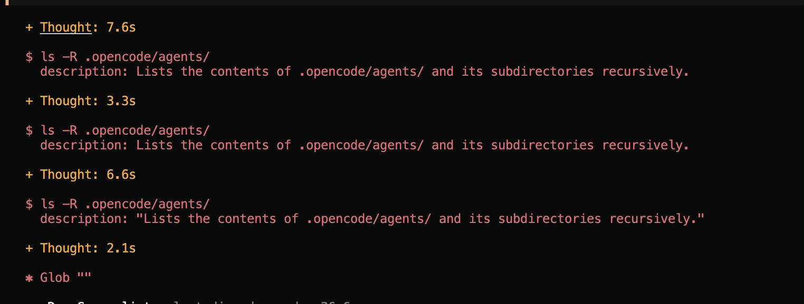

# Challenges

## Plugins conflict

oh my opencode and dcp(context manager) make a cicrle:

## Clean up

devcontainers allow to avoid uninstalling by simply rebuilding clean state.

## OhMyOpencode

Has great plugins, but bloats context as crazy. It extends tools descriptions, confuses agents, and causes it go all the wrong paths.

## Tweeks

As the model is often lazy the system requires a bit of pushes. Like make sure todos are done, or make sure to use skills. Or use correct filepaths.

I had to create a plugin, to fix some of the issues.

### Frequent tool failures

Model suffers following tools description.

# Harness design 

- Cap output with token generation - no good change can be produced by 2000 token stream.
- cap number of agent steps
- Embed deterministic checks to automatically become part of the loop.
- Local models don't follow the system prompt strictly, if user used UPPERCASE this takes priority over system message.

## Agentic system

Specialized minimalistic agents - start faster, fail faster. Keep tuning.