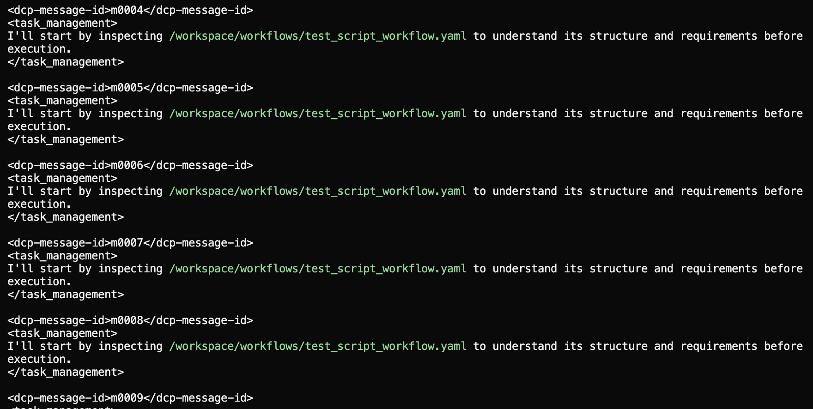

# Challenges

## Plugins conflict

oh my opencode and dcp(context manager) make a cicrle:

## Clean up

devcontainers allow to avoid uninstalling by simply rebuilding clean state.

## OhMyOpencode

Has great plugins, but bloats context as crazy. It extends tools descriptions, confuses agents, and causes it go all the wrong paths.

## Tweeks

As the model is often lazy the system requires a bit of pushes. Like make sure todos are done, or make sure to use skills. Or use correct filepaths.

I had to create a plugin, to fix some of the issues.