# Conductor Workflow Design (Discovery -> Design -> Execution)

Date: 2026-06-04  
Scope: planning artifact only (no runtime code changes)

## 1) End-to-End Flow (Mermaid)

```mermaid
flowchart TD
    A[Trigger: manual or scheduled run] --> B[Load workflow config profile]
    B --> C{Loop mode}

    C -->|one-shot| D[Run discovery stage]
    C -->|continuous| D

  D --> D1[Iterate trusted_sources one-by-one]
  D1 --> D2[Extract normalized findings + source attribution]
  D2 --> D3[Apply dedupe and merge rules]
  D3 --> D4[Atomic save docs ideas output]
  D4 --> D5[Verify completion digests counters semantic guard]
  D5 -->|pass| D6[Run discovery_complete hook]
  D6 --> D7{changed_flag and discovery_auto_commit}
  D7 -->|yes| D8[Run discovery_commit hook]
  D7 -->|no| E[Run design stage]
  D8 --> E
  D5 -->|fail| X1[Fail run with discovery_did_not_complete]

  E --> E1[Load design instructions and merged ideas]
  E1 --> E2[Select one or more ideas by policy]
  E2 --> E3[Generate one or more experiments per selection or cycle strategy]
  E3 --> E4[Write registry entries default draft status]
  E4 --> E5[Run design_complete hook]
  E5 --> E6[Queue selected drafts to pending]
  E6 --> F[Queue execution batch]

  F --> F1[Select up to execution_batch_size pending experiments]
  F1 --> G[Execution loop per selected experiment]

  G --> G1[Pick pending mark started run experiment_started hook]
  G1 --> G2{Baseline exists}
  G2 -->|no| G3[Bootstrap baseline]
  G2 -->|yes| G4[Execute attempt]
  G3 --> G3a[Run baseline_changed hook]
  G3a --> G4
  G4 --> G5[Recompute baseline snapshot and compare]
  G5 --> G6{Candidate improved}

  G6 -->|yes| G7[Mark success run experiment_success hook]
  G6 -->|no| G8{Attempts less than followup_max_attempts}
  G8 -->|yes| G4
  G8 -->|no| G9[Mark failed run experiment_failed hook]

  G7 --> H{More experiments in batch}
  G9 --> H1{continue_next_on_failure}
  H1 -->|yes| H
  H1 -->|no| X3[Stop run with execution_failed]
    H -->|yes| G
    H -->|no| I{continuous mode?}

    I -->|no| J[Stop: one-shot complete]
  I -->|yes| K{Queue empty after terminalization}
    K -->|yes| L[Replenishment: create exactly one new auto-research issue]
    K -->|no| M[Continue with next cycle]
    L --> M
    M --> D
```

## 2) Hook Lifecycle and Payload Contracts

The design keeps hook semantics aligned with current local loop contracts in scripts/experiment.py and hooks/local while making stage-level contracts explicit.

### Hook events

| Event | Lifecycle point | Producer | Required payload | Optional payload | Failure behavior |
|---|---|---|---|---|---|
| discovery_complete | After discovery completion checks pass | Discovery stage worker | ideas_before_digest, ideas_after_digest, changed_flag, source_stats, merge_stats | semantic_guard_passed, trusted_sources_count | Fatal for discovery stage when non-zero exit |
| discovery_commit | After discovery_complete, only when discovery_auto_commit=true and changed_flag=true | Discovery stage worker | ideas_before_digest, ideas_after_digest, changed_flag, source_stats, merge_stats | commit_message, commit_sha | Fatal for discovery stage when enabled and non-zero exit |
| design_complete | After design writes registry updates | Design stage worker | created_experiment_ids, registry_delta, selected_idea_ids, selection_policy, generation_strategy | created_count, registry_path | Fatal for design stage when non-zero exit |
| experiment_started | Immediately after pending -> started transition | Execution stage worker | experiment_id, previous_status, new_status, baseline_id | attempt_index, hook_profile | Fatal for that experiment item when non-zero exit |
| baseline_changed | When baseline is bootstrapped or replaced | Execution stage worker | experiment_id, baseline_before_digest, baseline_after_digest, change_reason | baseline_id_before, baseline_id_after | Fatal for that experiment item when non-zero exit |
| experiment_success | On terminal success after improvement verified | Execution stage worker | experiment_id, status, improved, attempts_used | baseline_score, candidate_score, promoted | Non-fatal: log hook error and continue |
| experiment_failed | On terminal fail after max attempts or unrecoverable error | Execution stage worker | experiment_id, status, improved, attempts_used, failure_reason | baseline_score, candidate_score | Non-fatal: log hook error and continue |

Hook failure policy statement:

- Precondition and state-transition hooks are fail-closed (fatal): discovery_complete, discovery_commit (when enabled), design_complete, experiment_started, baseline_changed.
- Terminal notification hooks are fail-open (non-fatal): experiment_success, experiment_failed.

### Payload notes

- EXPERIMENT_IMPROVED is a string boolean: true or false for shell compatibility.
- EXPERIMENT_STATUS should use terminal values already seen in runner flows (for example: succeeded, failed, promotion_failed, candidate_ready).
- Paths should be absolute to preserve behavior of existing shell hooks.
- Hook profile selection maps to a hooks_set basename under hooks/ (same basename constraints as resolve_hook_set_dir).
- Existing local hook scripts can remain the execution mechanism; event names above are orchestration contracts and may be adapted to current script entrypoints.

## 3) Stage Contracts and Completion Checks

### Discovery completion

A discovery stage is complete only if all checks pass.

Discovery contract (explicit):

1. Per-source iteration model:
  - Iterate trusted_sources in deterministic order.
  - For each source, run source-specific fetch/parse step and emit source_stats counters (examined, parsed_ok, parse_failed, findings_extracted).
2. Normalized finding extraction with attribution:
  - Convert raw source output to normalized finding records with stable fields: finding_id, title, summary, tags, source_name, source_ref.
  - Preserve source attribution for every normalized finding.
3. Dedupe and merge rules:
  - Primary dedupe key: normalized title hash plus source-independent semantic fingerprint.
  - Merge strategy: keep highest-confidence summary as canonical, append alternate evidence refs, union tags, and increment merge_stats counters.
4. Atomic save semantics for ideas output:
  - Write merged ideas to a temporary file in the same directory.
  - fsync then atomic rename to target ideas file to avoid partial writes.
5. Completion verification with digests and counters:
  - Record ideas_before_digest and ideas_after_digest.
  - Verify parseable markdown and at least one non-empty idea entry.
  - Verify counters are internally consistent (extracted >= merged >= written).
  - Optional semantic guard: when enabled, require semantic_guard_passed=true before stage success.

Completion checks:

1. docs/ideas.md digest changed from pre-run value.
2. Current git HEAD is unchanged (discover must not create commits).
3. docs/ideas.md remains parseable markdown and contains at least one non-empty idea entry after update.
4. Cached discovery source exists for run provenance: .cache/discover/hf_papers.md.
5. Before/after digests and counters are included in discovery output payload.

Recommended failure code: discovery_did_not_complete.

### Design contract

Design stage input contract:

1. design instructions (prompt/config profile for experiment generation).
2. merged ideas artifact from discovery stage.

Design stage behavior contract:

1. Idea selection policy is configurable and supports selecting one-or-more ideas per cycle.
2. Experiment generation supports one-or-more experiments per selected idea, or one-or-more experiments per cycle strategy.
3. Registry write contract requires every created experiment to default to draft status.
4. design_complete payload must include created_experiment_ids and registry_delta.

Design completion checks:

1. Registry count increased by expected delta.
2. New experiment entries exist with default status=draft.
3. design_complete hook executed with created_experiment_ids and registry_delta.

### Baseline changed/improved checks

Execution stage evaluates two separate outcomes:

1. Candidate improved check (attempt-level):
   - Read baseline and candidate scores.
   - candidate_score > baseline_score is required for improvement.
2. Baseline changed check (promotion-level):
   - Run promotion only when improved=true.
   - Baseline file digest changes after promotion.
   - Baseline provenance fields exist (_provenance.git_sha, _provenance.eval_set_version).

If candidate does not improve after follow-up attempts, mark attempt failed and skip promotion.

### Execution contract (ordered steps)

1. Pick pending experiment, transition to started, and run experiment_started hook.
2. Ensure baseline exists; if missing, bootstrap baseline using baseline_bootstrap_mode.
3. When baseline is created or replaced, emit baseline_changed hook.
4. Execute attempt.
5. Recompute baseline snapshot and candidate comparison.
6. On improvement, mark success and run experiment_success hook.
7. On no improvement, enter follow-up prompt/attempt loop up to followup_max_attempts.
8. After max attempts without improvement, mark failed and run experiment_failed hook.
9. Apply continue_next_on_failure behavior:
  - true: continue with next pending experiment.
  - false: stop orchestrator run on first terminal failure.
10. Continue-next behavior is a config-controlled branch, not a hardcoded default.

## 4) Configurability Matrix

| Setting | Purpose | Type | Default aligned to repo behavior | Stage |
|---|---|---|---|---|
| trusted_sources | Restrict discovery inputs to approved files/domains | list[string] | [docs/ideas.md, .cache/discover/hf_papers.md] | Discovery |
| discovery_auto_commit | Enable optional commit after successful discovery write | boolean | false | Discovery |
| experiments_per_design_cycle | Number of design submissions per cycle | integer >=1 | 1 | Design |
| execution_batch_size | Number of pending experiments executed per cycle | integer >=1 | 1 | Execution |
| followup_max_attempts | Max follow-up revisions when score does not improve | integer >=0 | 1 for CI workflow, 0 for local loop default | Execution |
| continue_next_on_failure | Continue execution batch after terminal failure | boolean | true | Execution |
| baseline_bootstrap_mode | Baseline creation strategy when missing | enum(copy_candidate, run_baseline_eval, fail_if_missing) | run_baseline_eval | Execution |
| loop_mode | Workflow operation mode | enum(one_shot, continuous) | one_shot | Global |
| max_cycles | Hard stop for continuous runs by cycle count | integer >=1 or null | null | Global |
| max_runtime_minutes | Hard stop for continuous runs by elapsed time | integer >=1 or null | null | Global |
| hook_profile | Select hook set under hooks/ | string or null | null (disabled) | Execution |

Validation rules:

- continuous mode requires at least one hard stop guard (max cycles or max minutes).
- trusted_sources must not be empty.
- execution_batch_size must be <= current pending queue count when batch is selected.
- discovery_commit hook can run only when discovery_auto_commit=true and changed_flag=true.
- baseline_bootstrap_mode=fail_if_missing must fail before attempt execution when no baseline exists.

## 5) Gap/Flaw Analysis and Mitigations

### Gap 1: Completion criteria are not uniformly explicit across stages

- Risk: Stage appears successful even when key artifact contracts were not met.
- Mitigation: Promote per-stage completion predicates to first-class workflow checks (discovery digest/head checks, design registry delta checks, execution score checks).

### Gap 2: Discovery can drift to untrusted inputs

- Risk: noisy ideas and low-signal design proposals.
- Mitigation: enforce trusted_sources list in workflow config and include source list in stage payload and logs.

### Gap 3: Design and execution are loosely coupled by convention

- Risk: execution runs stale or incomplete experiment specs.
- Mitigation: require explicit registry transitions (pending -> running -> terminal) and select execution batch only from pending entries created in the active cycle.

### Gap 4: Continuous loop can become unbounded

- Risk: runaway cost and queue churn.
- Mitigation: add loop guards (max cycles/max runtime) and explicit queue-empty replenishment gate.

### Gap 5: Hook behavior asymmetry can be surprising

- Risk: generated-hook failures stop runs, completion-hook failures do not; users may misinterpret this.
- Mitigation: document fatal vs non-fatal hook policy in workflow status output; include hook exit metadata in terminalization payload.

### Gap 6: Baseline promotion correctness depends on provenance checks

- Risk: promoting against stale baseline state yields incorrect quality signal.
- Mitigation: enforce baseline provenance validation before execution; only promote after improved=true and post-promotion digest change.

## 6) Implementation Prep: Conductor YAML and Helper Boundaries

This section maps stages to likely Conductor workflow definitions while preserving existing CLI/script ownership.

### Proposed Conductor workflow files (planning)

1. conductor/workflows/auto_research_orchestrator.yaml
- Parent workflow.
- Handles mode selection (one_shot vs continuous), cycle boundaries, and global stop conditions.

2. conductor/workflows/discovery_stage.yaml
- Calls existing discover command path (autoresearch discover).
- Exposes discovery artifact and completion-check outputs.

3. conductor/workflows/design_stage.yaml
- Runs design loop for experiments_per_design_cycle.
- Exposes created experiment IDs and registry delta.

4. conductor/workflows/execution_stage.yaml
- Runs execution_batch_size experiments.
- Invokes follow-up bounded run and baseline promotion path.
- Emits per-experiment terminal status and score deltas.

5. conductor/workflows/replenishment_stage.yaml
- Optional stage for continuous mode when queue is empty.
- Creates one replenishment issue and returns new issue metadata.

### Stage-to-file mapping (concrete)

| Stage | Conductor workflow file | Primary command/script entrypoints | Expected artifact updates |
|---|---|---|---|
| Discovery | conductor/workflows/discovery_stage.yaml | cli/commands/discover.py | docs/ideas.md, .cache/discover/hf_papers.md |
| Design | conductor/workflows/design_stage.yaml | cli/commands/design.py, cli/commands/experiment.py | experiments/index.json, experiments/experiments/*/meta.json |
| Execution | conductor/workflows/execution_stage.yaml | scripts/experiment.py, scripts/terminalize_experiment.py | experiments/experiments/*/status.json, auto_research.baseline.json |
| Replenishment | conductor/workflows/replenishment_stage.yaml | cli/commands/task_runner.py (or existing issue creation path) | queue metadata / issue linkage |
| Orchestration | conductor/workflows/auto_research_orchestrator.yaml | cli/main.py entry wiring for profile resolution | cycle counters, run summary |

### Script/CLI helper boundaries (keep existing owners)

- Keep these as execution primitives (no redesign):
  - cli/commands/discover.py for discovery content refresh.
  - cli/commands/design.py and cli/commands/experiment.py for design and registry operations.
  - scripts/experiment.py for execution, follow-up, score compare, and baseline promotion integration.
  - scripts/terminalize_experiment.py for final issue/status side effects.
  - hooks/<profile>/experiment_generated.sh and hooks/<profile>/experiment_complete.sh for lifecycle hooks.

- Conductor workers should do orchestration only:
  - pass structured input config to existing commands/scripts,
  - collect outputs and evaluate stage completion predicates,
  - avoid embedding domain logic already implemented in CLI/scripts.

### Suggested stage I/O contracts for Conductor tasks

- discovery_stage output:
  - ideas_before_digest, ideas_after_digest, changed_flag, source_stats, merge_stats, semantic_guard_passed, git_head_before, git_head_after, discovery_completed
- design_stage output:
  - experiments_created_count, experiment_ids, registry_delta, selected_idea_ids, design_completed
- execution_stage output (per item + aggregate):
  - experiment_id, attempts_used, baseline_bootstrapped, baseline_score, candidate_score, improved, promoted, terminal_status
- orchestrator output:
  - cycles_completed, runtime_minutes, total_experiments_executed, terminal_failures, final_status

## 7) Design Decisions Summary

- Preserve current repo command boundaries and state files; Conductor coordinates, existing code executes.
- Make completion checks explicit and machine-verifiable per stage.
- Keep hooks profile-driven and backward compatible with existing environment variable contracts.
- Support one-shot as default with optional continuous mode guarded by hard stop limits.
