# AI Adoption System - Overview

This document maps the AI adoption system described in `docs/new-deck.html`. The deck presents seven subsystems: Agent Environments, Agent Infrastructure, Institutional Knowledge, Skills Subsystem, Repository Readiness, Supporting Subsystems, and Feedback Loops. Together they fix five bottlenecks found in the deck's ch.4 risk table: silos, slop, PR Review Noise, one-off agent environments, and agents without isolation.

This document has three parts. First, a breakdown of element types (what kind of things appear in the system). Second, the bounded contexts (the logical groupings the diagram draws as subgraphs). Third, the relations, split into those documented in the deck and those that exist in content but are not drawn or stated. The Mermaid diagram at the end renders all of it: contexts as subgraphs, element types as distinct node shapes, documented relations as solid edges, inferred relations as dashed edges, and the risk-to-outcome story as thick edges.

## Element Types

| Type | Meaning | Instances |
|---|---|---|
| Risk or bottleneck | A blocker from the ch.4 risk table | Silos, slop, PR Review Noise, one-off agent environments, agents without isolation (the deck calls this the most important bottleneck) |
| Problem statement | A pain point used as chapter framing | Institutional knowledge unused in development and troubleshooting (ch.6); skills scattered and duplicated across repos (ch.7); agent infrastructure installed manually and distributed (ch.8); agents without isolation or reproducibility (ch.9); teams with tools but no adoption path (ch.10); noisy PRs with huge diffs and piling feedback (ch.11) |
| Solution or system | One of the seven subsystems, or the shared-defaults composite | Agent Environments, Agent Infrastructure, Institutional Knowledge, Skills Subsystem, Repository Readiness, Supporting Subsystems, Feedback Loops, Shared Defaults |
| Component | A part of a solution | Dev containers, dev pods, sidecar, sync and install, governance and defaults, agent hooks, knowledge graph, MCP access, IK navigation skill, aggregator, persistent knowledge, tribal extraction, skills repository, crawler, isolation and scoping, evaluation pipeline, CI autofix, governance, PR review, and the task-based eval flow parts (skill, repository plus task, output, criteria) |
| Actor or role | A person or agent type | Coding agents, developers, non-technical stakeholders, middle managers, AI champions |
| Resource or artifact | A stored thing | Institutional knowledge contents (product requirements, customer interviews, post-mortems, ADRs, lessons learned, relations and connections), tribal knowledge, sessions and conversations, skills, repositories, PRs, CI messages, criteria |
| Action or outcome | A process result or capability | Crawling skills, surfacing duplication, evaluating skills and changes, injecting context, synchronizing installs, extracting tribal knowledge, submitting knowledge candidates, auto-approving low-risk PRs, CI autofix, running agents in the cloud, producing artifacts, automatic PR reviews and issue fixing |
| Gate or checklist step | A step or quality bar | Readiness steps 1 to 5, quality gates (tests and coverage, mutation tests, linters) |
| Evidence gap | Placeholder content in the deck | Operational Model and Change chapter, Feedback Loops content, all Evidence / Behavioral Patterns / How Others slides |

Problem statements are folded into their subsystem contexts in the diagram rather than drawn as separate nodes, to keep the diagram readable. The full problem framing lives in this table.

## Bounded Contexts

| Context | Members | Purpose |
|---|---|---|
| Bottlenecks and Risks Found | Silos, slop, PR Review Noise, one-off environments, agents without isolation, shared defaults | The problems the system fixes, plus the shared-defaults composite that answers silos |
| People and Adoption Drivers (inferred grouping) | Coding agents, developers, non-technical stakeholders, middle managers, AI champions | Actors who use, run, or gate the system; grouped from the deck, not drawn as a chapter |
| 1. Agent Environments | Dev containers, dev pods | Reproducible, isolated environments locally and in the cloud |
| 2. Agent Infrastructure - Sidecar | Sidecar, sync and install, governance and defaults, agent hooks | Shared optimization layer: installs, config, context injection |
| 3. Institutional Knowledge | Knowledge graph, MCP access, IK navigation skill, aggregator, persistent knowledge, tribal extraction | Systematize knowledge, give agents access, extract tribal knowledge |
| 4. Skills Subsystem | Skills repository, crawler, isolation and scoping, evaluation pipeline, task-based eval flow | Centralize skills, evaluate every skill and every change |
| 5. Repository Readiness | Checklist steps 1 to 5, quality gates (tests and coverage, mutation tests, linters) | Step-by-step AI adoption guidance, delivered as an executable skill |
| 6. Supporting Subsystems | CI autofix, governance, PR review | Remove manual effort and noise |
| 7. Feedback Loops | Feedback hub (content TBD) | Close the loop between subsystems |
| Operational Model and Change (TBD) | Operational model (placeholder) | Change program that steers the whole system |

People and Operational Model and Change are inferred or placeholder groupings. Their nodes use the gap style (gray, dashed border) so they are not presented as documented content. Subgraph titles numbered 1 to 7 follow the roadmap order in ch.14.

## Relations

### Documented (in the deck)

| Source | Relation | Target | Where |
|---|---|---|---|
| Agent Environments | foundation | Agent Infrastructure | ch.13 "How It All Fits Together" diagram |
| Agent Infrastructure | context | Institutional Knowledge | ch.13 diagram |
| Agent Infrastructure | skills | Skills Subsystem | ch.13 diagram |
| Agent Infrastructure | automation | Supporting Subsystems | ch.13 diagram |
| Institutional Knowledge | feeds | Feedback Loops | ch.13 diagram |
| Skills Subsystem | feeds | Feedback Loops | ch.13 diagram |
| Supporting Subsystems | feeds | Feedback Loops | ch.13 diagram |
| Feedback Loops | lessons learned (dashed in the deck) | Institutional Knowledge | ch.13 diagram |
| Feedback Loops | skill usage and updates (dashed in the deck) | Skills Subsystem | ch.13 diagram |
| Silos | solved by shared defaults | Centralized skills repo, standardized agent infrastructure, readiness checklist | ch.4 risk table |
| Slop | solved by task-based skill evaluation and quality gates | Linters, mutation tests | ch.4 risk table |
| PR Review Noise | solved by risk-based PR review and CI autofix | Auto-approve low-risk, flag high-risk | ch.4 risk table |
| One-off agent environments | solved by shared agent baseline | Sidecar standardizes setup | ch.4 risk table |
| Agents without isolation | solved by dev containers and dev pods | Reproducible, isolated environments; agents in the cloud with the same powers | ch.4 risk table |
| Skill | injected into | Repository plus task | ch.7 task-based eval diagram |
| Repository plus task | agent runs | Output | ch.7 diagram |
| Output | judged against | Criteria | ch.7 diagram |
| Criteria | tracks expectations | Skill | ch.7 diagram |
| Agent | submits knowledge candidate | Aggregator | ch.6 knowledge pipeline diagram |
| Aggregator | reworked into | Persistent knowledge | ch.6 diagram |
| Persistent knowledge | accessed via MCP and skill | Agent | ch.6 diagram |
| Readiness checklist | ordered steps 1 to 5 | Dev containers, skill sync and CI, coding agents, institutional knowledge | ch.10 |
| Sidecar | synchronizes and installs MCP for every agent | Agents | ch.6, ch.8 |
| Sidecar | sets up required skills | IK and tribal skills | ch.8 |
| Sync and install | tracks usage, updates and syncs skills | Skills | ch.8 |
| Agent hooks | inject quality checks and context | Agents | ch.8 |
| Sidecar and plugins | extract tribal knowledge from sessions | Tribal knowledge | ch.6 |
| Crawler | crawls existing skills, surfaces duplication | Central repository | ch.7 |
| Evaluation pipeline | runs on every skill and every change | Skills | ch.7 |
| Governance and defaults | governs config, effective defaults, evolves without manual effort | Agent infrastructure | ch.8 |
| Knowledge graph | keeps indexing over time | Always up to date | ch.6 |
| Dev containers | no manual setup | Developers get a simpler path | ch.9 |
| Dev pods | remote agents | Non-technical stakeholders run agents, produce artifacts | ch.9 |
| CI autofix | standalone dev pod reacts to CI messages | Fixes | ch.11 |
| Governance | learns acceptable risk, minimal approval prompts | Regulates actions | ch.11 |
| PR review | risk-based, highlight high-risk, auto-approve no-risk | PRs | ch.11 |
| Checklist | delivered as executable skill, starts small, evolves | Repositories | ch.10 |

### Inferred (exist but not documented)

| Source | Relation | Target | Evidence |
|---|---|---|---|
| Agents without isolation | partially isolated by | Dev containers and dev pods | ch.4 solution plus ch.9 design; the user's stated chain |
| Dev containers | remove the barrier, no manual setup | Developers can use agents and contribute | ch.9 "simpler path to their environment" |
| Dev pods | give access | Non-technical stakeholders run agents | ch.9 |
| Dev pods | host | CI autofix agent on a standalone dev pod | ch.11 design, not drawn |
| CI autofix, risk-based PR review, governance | jointly enable | Automatic PR reviews and issue fixing without human intervention | ch.11 designs combined; emergent outcome |
| Governance | learns acceptable risk, enables | Risk-based auto-approval | ch.11 |
| Sidecar | syncs MCP, grants agents | Access to institutional knowledge | ch.6 and ch.8 combined |
| Feedback loops | feed updated expectations into | Skill evaluation criteria | ch.13 loop, ch.12 TBD |
| Feedback loops | drive evolution of | Readiness checklist, sidecar | ch.10 "evolves over time", ch.13 |
| Tribal knowledge extraction | feeds | Knowledge graph | ch.6 pipeline |
| Quality gates | set the bar consumed by | Skill evaluation expectations | ch.7 and ch.10 share linters and mutation tests |
| Silos | cause knowledge gap, lessons don't travel | Institutional knowledge deficit | ch.4 impact |
| One-off environments | hinder learning from mistakes | Knowledge | ch.4 impact |
| PR noise (peer review, security agent, SonarCloud, lint, tests) | feeds | PR Review Noise | ch.4 symptoms |
| CI messages | trigger | CI autofix agent | ch.11 |
| Readiness steps 2 to 5 | activate | Environments, skills sync, agents, knowledge | ch.10 steps |
| Operational Model and Change | steers and governs | Whole program | ch.5 placeholder |

## System Diagram

The diagram reads top-down: bottlenecks and risks at the top, the seven numbered roadmap subsystems in the middle, the outcome at the bottom. Solid edges are documented relations, dashed edges are inferred, and thick edges are the user's example chain from the agents-without-isolation risk to automatic PR handling. The two dashed edges leaving Feedback Loops (lessons learned, skill usage and updates) are dashed in the deck itself and stay dashed here.

```mermaid
%%{init: { "theme": "base", "themeVariables": { "primaryColor": "#0d2b52", "primaryTextColor": "#eaf2ff", "primaryBorderColor": "#1f6fb2", "lineColor": "#7fd4ff", "secondaryColor": "#123f7a", "tertiaryColor": "#0a1f3c", "fontSize": "16px", "clusterBkg": "#081a33", "clusterBorder": "#1f6fb2", "titleColor": "#eaf2ff" } } }%%
flowchart TB

classDef risk fill:#7f1d1d,stroke:#fca5a5,color:#fef2f2
classDef issue fill:#7f1d1d,stroke:#fca5a5,stroke-dasharray:5 5,color:#fef2f2
classDef solution fill:#14532d,stroke:#86efac,color:#f0fdf4
classDef default fill:#123f7a,stroke:#64b5f6,color:#eaf2ff
classDef resource fill:#4a148c,stroke:#ce93d8,color:#f3e5f5
classDef action fill:#006064,stroke:#4dd0e1,color:#e0f7fa
classDef gate fill:#b45309,stroke:#fcd34d,color:#fffbeb
classDef gap fill:#37474f,stroke:#90a4ae,color:#eceff1,stroke-dasharray:5 5
classDef chain fill:#f9c74f,stroke:#b45309,stroke-width:3px,color:#1f2937

subgraph risks [Bottlenecks and Risks Found]
    risk-silos{{"Silos"}}:::risk
    risk-slop{{"Slop"}}:::risk
    risk-pr-bottleneck{{"PR Review Noise"}}:::risk
    risk-oneoff{{"One-off environments"}}:::risk
    risk-unisolated{{"Agents without isolation"}}:::chain
    shared-defaults(["Shared defaults"]):::solution
end

subgraph people [People and Adoption Drivers]
    coding-agents(("Coding agents")):::gap
    people-dev(("Developers")):::gap
    people-stakeholders(("Non-technical stakeholders")):::gap
    people-managers(("Middle managers")):::gap
    people-champions(("AI champions")):::gap
end

subgraph envs [1. Agent Environments]
    dev-containers("Dev containers"):::chain
    dev-pods("Dev pods (remote)"):::chain
end

subgraph infra [2. Agent Infrastructure - Sidecar]
    sidecar(["Sidecar / CLI"]):::solution
    sync-install("Sync and install")
    gov-defaults("Governance and defaults")
    agent-hooks("Agent hooks")
end

subgraph ik [3. Institutional Knowledge]
    knowledge-graph("Knowledge graph")
    ik-mcp("MCP access")
    ik-skill("IK navigation skill")
    aggregator("Aggregator")
    persistent-knowledge[("Persistent knowledge")]:::resource
    tribal-extraction("Tribal knowledge extraction")
end

subgraph skills [4. Skills Subsystem]
    skills-repo("Skills repository")
    crawler("Crawler")
    skill-isolation("Isolation and scoping")
    eval-pipeline("Evaluation pipeline")
    eval-skill[("Skill")]:::resource
    eval-repo-task("Repository and task")
    eval-output[/"Output"/]:::action
    eval-criteria[("Criteria")]:::resource
end

subgraph readiness [5. Repository Readiness]
    step-assess[/"1 Assess current state"\]:::gate
    step-devcontainers[/"2 Set up dev containers"\]:::gate
    step-sync-ci[/"3 Sync skills and CI"\]:::gate
    step-configure-agents[/"4 Configure coding agents"\]:::gate
    step-integrate-ik[/"5 Integrate institutional knowledge"\]:::gate
    gate-tests[/"Tests and coverage"\]:::gate
    gate-mutation[/"Mutation tests"\]:::gate
    gate-linters[/"Linters"\]:::gate
end

subgraph support [6. Supporting Subsystems]
    ci-autofix("CI autofix"):::chain
    governance("Governance"):::chain
    pr-review("PR review"):::chain
    ci-messages[("CI messages")]:::resource
end

subgraph feedback [7. Feedback Loops]
    feedback-hub(["Feedback loops"]):::solution
end

subgraph ops [Operational Model and Change - TBD]
    ops-model["Operational model"]:::gap
end

outcome-auto-pr[/"Automatic PR reviews and fixes"/]:::chain

risk-unisolated == partially isolated by ==> dev-containers
risk-unisolated == partially isolated by ==> dev-pods
dev-containers == no manual setup ==> people-dev
dev-pods == remote access ==> people-stakeholders
dev-pods == hosts ==> ci-autofix
ci-autofix == enables ==> outcome-auto-pr
pr-review == enables ==> outcome-auto-pr
governance == enables ==> outcome-auto-pr

dev-containers -->|foundation| sidecar
sidecar -->|context| knowledge-graph
sidecar -->|skills| skills-repo
sidecar -->|automation| ci-autofix
knowledge-graph --> feedback-hub
skills-repo --> feedback-hub
ci-autofix --> feedback-hub

step-assess --> step-devcontainers
step-devcontainers --> step-sync-ci
step-sync-ci --> step-configure-agents
step-configure-agents --> step-integrate-ik

eval-skill -->|injected into| eval-repo-task
eval-repo-task -->|agent runs| eval-output
eval-output -->|judged against| eval-criteria
eval-criteria -->|tracks expectations| eval-skill

coding-agents -->|submits candidates| aggregator
aggregator -->|reworked into| persistent-knowledge
persistent-knowledge -->|accessed via MCP and skill| coding-agents

risk-silos -->|solved by| shared-defaults
shared-defaults -->|includes| skills-repo
shared-defaults -->|includes| sidecar
shared-defaults -->|includes| step-assess
risk-slop -->|solved by task-based evaluation| eval-pipeline
risk-pr-bottleneck -->|solved by risk-based review| pr-review
risk-oneoff -->|solved by shared baseline| sidecar

sidecar -->|synchronizes MCP| ik-mcp
sidecar -->|sets up required skills| ik-skill
sidecar -->|extracts from sessions| tribal-extraction
sync-install -->|updates and syncs skills| skills-repo
agent-hooks -->|inject checks and context| coding-agents
gov-defaults -->|provides effective defaults| coding-agents
crawler -->|crawls and surfaces duplication| skills-repo
skills-repo -->|evaluates every change| eval-pipeline
skill-isolation -->|isolates and scopes| eval-pipeline

feedback-hub-.->|lessons learned|knowledge-graph
feedback-hub-.->|skill usage and updates|skills-repo

risk-silos-.->|lessons don't travel|knowledge-graph
risk-oneoff-.->|hinders learning from mistakes|knowledge-graph
governance-.->|learns acceptable risk|pr-review
ci-messages-.->|trigger|ci-autofix
persistent-knowledge-.->|stored in|knowledge-graph
tribal-extraction-.->|feeds|knowledge-graph
feedback-hub-.->|updated expectations|eval-criteria
feedback-hub-.->|evolves checklist|step-assess
feedback-hub-.->|evolves infrastructure|sidecar
gate-mutation-.->|same bar|eval-criteria
step-devcontainers-.->|activates|dev-containers
step-sync-ci-.->|activates|sync-install
step-configure-agents-.->|configures|coding-agents
step-integrate-ik-.->|integrates with|knowledge-graph
ops-model-.->|steers program|shared-defaults
people-champions-.->|drive adoption|ops-model
people-managers-.->|facilitate adoption|ops-model
```

**Legend**

- Shapes: hexagon = risk or bottleneck; stadium = solution or system; rounded rectangle = component (blue default); circle = actor or role; cylinder = resource or artifact; parallelogram = action or outcome; trapezoid = gate or checklist step; rectangle = evidence gap.
- Colors: red = risk; green = solution; blue = component; purple = resource; cyan = action; orange = gate; gray dashed = inferred grouping or placeholder; gold with thick border = on the user's example chain.
- Edges: solid = documented relation; dashed = inferred relation; thick = user example chain (risk of agents without isolation, through dev containers and dev pods, to automatic PR review and issue fixing). The two dashed edges out of Feedback Loops (lessons learned, skill usage and updates) are dashed in the deck itself and stay dashed here.
- Subgraph titles numbered 1 to 7 follow the roadmap order in ch.14. People and Operational Model and Change are unnumbered: the first is an inferred grouping, the second is placeholder content.
